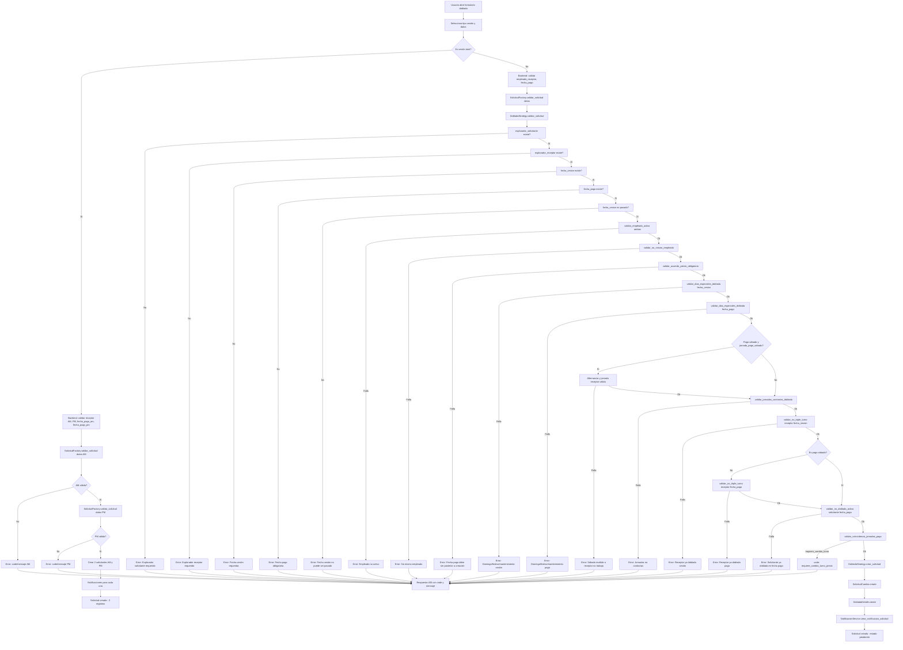
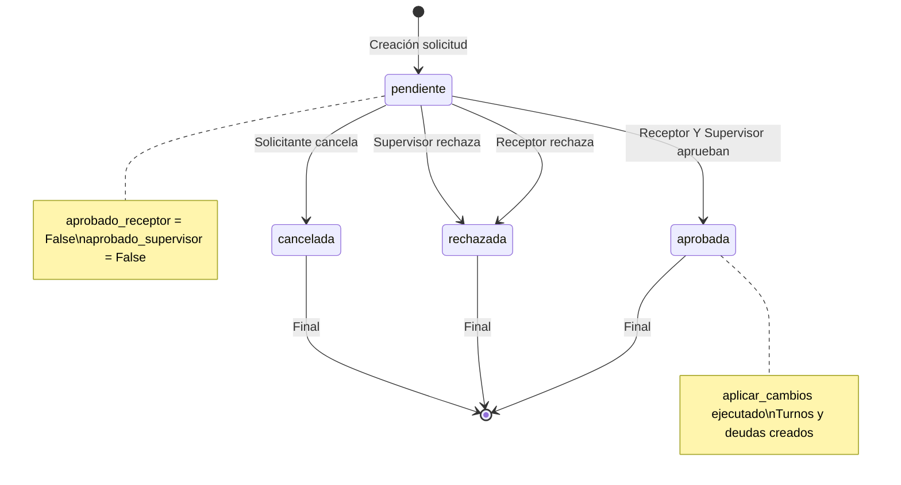
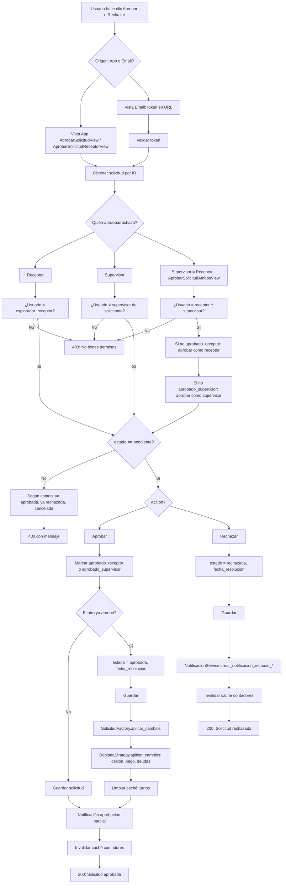
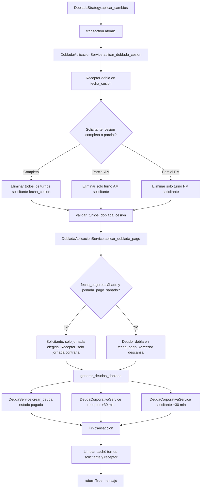

# Diagrama de flujo completo – Solicitud Doblada

Documento de referencia con todos los casos del flujo de solicitud doblada (creación, validaciones, aprobación, rechazo, cancelación y aplicación) para revisar fallos o verificar que el comportamiento sea el esperado.

**Archivos principales:** `solicitudes/views.py`, `solicitudes/services/strategies/doblada_strategy.py`, `solicitudes/services/solicitud_validator.py`, `solicitudes/services/solicitud_aprobacion_service.py`, `solicitudes/services/doblada_aplicacion_service.py`, `static/js/cambio-turno/solicitar_doblada.js`.

---

## 1. Diagrama de flujo principal (creación)

Desde que el usuario abre el formulario hasta que la solicitud queda creada en estado `pendiente` o se devuelve un error con código/mensaje. Incluye la rama de **cesión total** (2 solicitudes AM y PM) y la de **cesión parcial/completa normal** (1 solicitud).

---

## 2. Diagrama de estados de la solicitud

Estados posibles y transiciones al aprobar, rechazar o cancelar.

**Condiciones al intentar aprobar o rechazar de nuevo:**

| Estado actual   | Acción intentada | Resultado |
|-----------------|-------------------|-----------|
| `pendiente`    | Aprobar/Rechazar  | Se procesa (receptor o supervisor según identidad). |
| `aprobada`     | Aprobar/Rechazar  | Mensaje: "Esta solicitud ya fue aprobada". |
| `rechazada`    | Aprobar/Rechazar  | Mensaje: "Esta solicitud ya fue rechazada". |
| `cancelada`    | Aprobar/Rechazar  | Mensaje: "Esta solicitud fue cancelada y ya no puede ser aprobada/rechazada". |

---

## 3. Diagrama de flujo de aprobación y rechazo

Flujo para receptor y supervisor (desde app o desde email). Incluye comprobación de identidad, estado pendiente y, al aprobar, aplicación de cambios cuando ambos han aprobado.

---

## 4. Diagrama de aplicación de la doblada (al aprobar)

Cuando la solicitud pasa a `aprobada`, se ejecuta `DobladaStrategy.aplicar_cambios`, que delega en `DobladaAplicacionService`.

---

## 5. Tabla de validaciones (salidas de error)

Para cada validación se indica la condición de fallo, el mensaje o código devuelto y la acción en frontend cuando aplica.

| Validación | Dónde | Condición de fallo | Mensaje/código devuelto | Acción en frontend |
|------------|--------|--------------------|--------------------------|--------------------|
| Campos requeridos (fecha_cesion, empleado_receptor, fecha_pago) | Backend `ProcesarSolicitudView` | Falta algún campo según tipo (normal vs cesión total) | `missing_fields`, mensaje específico | Swal / mensaje de error |
| Explorador solicitante requerido | `DobladaStrategy.validar_solicitud` | No se envía solicitante | "Explorador solicitante es requerido" | Error genérico |
| Explorador receptor requerido | Idem | No se envía receptor | "Explorador receptor es requerido" | Error genérico |
| Fecha cesión requerida | Idem | `fecha_cesion` vacía | "Fecha de cesión es requerida" | Error genérico |
| Fecha pago obligatoria | Idem | `fecha_pago` vacía | "Fecha de pago es obligatoria. No existen dobladas abiertas." | Error genérico |
| Fecha cesión en pasado | Idem | `fecha_cesion` < hoy | "La fecha de cesión (...) no puede ser en el pasado." | Error genérico |
| Empleado no activo | `validar_empleado_activo` | Solicitante o receptor no activo | "El empleado no está activo" | Error genérico |
| Mismo empleado | `validar_no_mismo_empleado` | Solicitante id = Receptor id | "No puedes solicitar cambio contigo mismo" | Error genérico |
| Acuerdo previo | `validar_acuerdo_previo_obligatorio` | `fecha_pago` <= fecha_creacion_solicitud | "La fecha de pago es obligatoria..." / ValidationError | Datepicker pago: mínimo hoy |
| Días especiales cesión | `validar_dias_especiales_doblada` | Domingo, festivo o mantenimiento en fecha_cesion | "No se puede realizar doblada en domingos" / festivo / mantenimiento | Datepicker cesión: deshabilitar esos días |
| Días especiales pago | Idem | Domingo, festivo o mantenimiento en fecha_pago | Idem | Datepicker pago: deshabilitar esos días |
| Pago sábado (jornada inválida) | `DobladaStrategy.validar_solicitud` | `jornada_pago_sabado` no AM/PM | "Para pagar en sábado debes seleccionar una jornada válida (AM o PM)." | Mostrar opciones AM/PM sábado |
| Pago sábado (alternancia) | Idem | No se determina alternancia sábado | "No se pudo determinar la alternancia para el sábado seleccionado." | Error genérico |
| Pago sábado (receptor sin jornada) | Idem | Receptor sin jornada en fecha_pago | "El receptor no tiene jornada asignada para la fecha de pago (sábado)." | Error genérico |
| Pago sábado (receptor grupo distinto) | Idem | Receptor no es del grupo que trabaja ese sábado | "Para pagar el sábado ..., el receptor debe ser del grupo ..." | Error genérico |
| Jornadas contrarias | `validar_jornadas_contrarias_doblada` | Solicitante y receptor misma jornada en fecha_cesion (o jornada_cedida no contraria) | ValidationError jornadas no contrarias | Filtro empleados disponibles por jornada contraria |
| No triple turno (receptor cesión) | `validar_no_triple_turno` | Receptor ya tiene doblada en fecha_cesion | ValidationError doblada activa | Excluir de lista disponibles |
| No triple turno (receptor pago) | Idem | Receptor ya tiene doblada en fecha_pago (excepto si pago sábado) | Idem | Excluir de lista disponibles |
| No doblada activa (solicitante pago) | `validar_no_doblada_activa` | Solicitante tiene doblada en fecha_pago | ValidationError | Mensaje / deshabilitar esa fecha pago |
| Coincidencia jornadas pago | `validar_coincidencia_jornadas_pago` | Deudor y acreedor misma jornada en fecha_pago | `code: requiere_cambio_turno_previo` + mensaje | Redirigir a CT sencillo con fecha_pago |
| Doblada existente (solicitante fecha pago) | Backend (mensaje contiene "ya tiene una doblada") | Solicitante con doblada en fecha de pago | `code: doblada_existente` | Swal + mensaje fecha conflicto |
| Usuario descansando en fecha cesión | Frontend / API turno | Solicitante sin turno en fecha_cesion | `esta_descansando` / no puede ceder | Deshabilitar envío o mostrar aviso |

---

## 6. Tabla de códigos de error y acción en frontend

Códigos que puede devolver el backend (o que el frontend interpreta) y cómo se comporta la interfaz.

| Código | Mensaje típico | Acción en frontend |
|--------|----------------|--------------------|
| `requiere_cambio_turno_previo` | "No se puede pagar trabajando dos veces la misma jornada. Debes primero realizar un cambio de turno sencillo para tener jornada contraria en la fecha de pago." | Swal con mensaje; botón para redirigir a `/solicitudes/cambio-turno/solicitar/?tipo_id=1&fecha_solicitud={fecha_pago}` |
| `doblada_existente` | "No se puede crear la solicitud porque ya tienes una doblada en la fecha de pago seleccionada." (+ `fecha_conflicto`, `jornada_afectada`) | Swal con mensaje y fecha/jornada afectada |
| `missing_fields` | Mensaje específico según campo (ej. "La fecha de pago es obligatoria...") | Swal / mensaje junto al formulario |
| `invalid_type` | "Tipo de solicitud no válido" | Error genérico |
| `forbidden` | "No tienes permisos para aprobar/rechazar esta solicitud" | Mensaje 403 |
| Estado no pendiente al aprobar/rechazar | "Esta solicitud ya fue aprobada/rechazada" o "fue cancelada" | Mensaje en vista de aprobación/rechazo o en email |
| Error al aplicar cambios | "Error aplicando cambios: {mensaje}" | Mensaje de error tras segunda aprobación |

---

## Referencia rápida de archivos

| Componente | Archivo |
|------------|--------|
| Formulario y submit | `templates/solicitudes/solicitar_doblada.html`, `static/js/cambio-turno/solicitar_doblada.js` |
| Procesar POST | `solicitudes/views.py` → `ProcesarSolicitudView.post` |
| Validar / crear doblada | `solicitudes/services/strategies/doblada_strategy.py` → `validar_solicitud`, `crear_solicitud` |
| Validaciones de negocio | `solicitudes/services/solicitud_validator.py` |
| Aprobar / rechazar | `solicitudes/services/solicitud_aprobacion_service.py` |
| Aplicar doblada (cesión, pago, deudas) | `solicitudes/services/doblada_aplicacion_service.py` |
| Notificaciones y emails | `solicitudes/services/notificacion_service.py` |

Documento generado según el plan de diagrama de flujo completo de la solicitud doblada.
