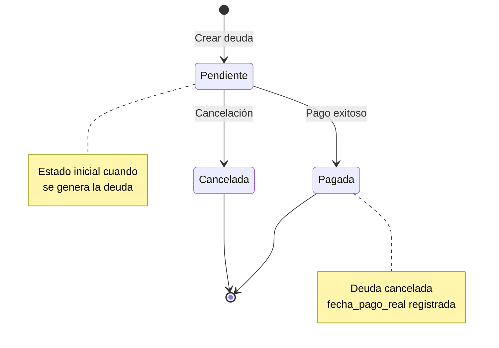

# Plan: Implementación Completa del Sistema de Dobladas

## Objetivo

Implementar el sistema completo de dobladas según las especificaciones del usuario, incluyendo:
- Modelo de deudas entre exploradores
- Solicitud de cesión (que alguien te cubra)
- Pago de deudas con validaciones complejas
- Reglas de visibilidad y carga según jornadas
- Manejo de casos críticos (coincidencia de jornadas) con flujo integrado
- Frontend completo con templates y JavaScript

---

## ⚠️ FLUJO CRÍTICO: Timing de Aplicación de Cambios

### **IMPORTANTE: Dos Procesos Separados**

El sistema de dobladas tiene **DOS procesos distintos** que ocurren en momentos diferentes:

#### **1. Al APROBAR la Solicitud de Cesión (FASE 3)**
**Cuándo**: Cuando AMBOS (receptor Y supervisor) aprueban la solicitud de doblada  
**Qué ocurre INMEDIATAMENTE**:
- ✅ **Turnos se crean/actualizan INMEDIATAMENTE para AMBAS fechas**: 
  - **Fecha de cesión**:
    - Solicitante descansa (NO tiene turno en fecha de cesión)
    - Receptor dobla INMEDIATAMENTE (AM+PM en fecha de cesión) - **NO queda pendiente**
  - **Fecha de pago** (ya está pactada):
    - Deudor dobla INMEDIATAMENTE (AM+PM en fecha de pago) - **NO queda pendiente**
    - Acreedor descansa (NO tiene turno en fecha de pago)
- ✅ **Deuda entre exploradores se genera**: Deudor (solicitante) debe a Acreedor (receptor) - Estado: 'pagada' (porque ambas dobladas ya están aplicadas)
- ✅ **Deudas corporativas se acumulan**:
  - Receptor acumula +30 minutos (por doblada en fecha de cesión)
  - Deudor acumula +30 minutos (por doblada en fecha de pago)
  - Ambas se acumulan permanentemente (no se cancelan)
- ✅ **Solicitud marcada como aprobada**

**⚠️ PUNTO CRÍTICO**: 
- **NO hay "dobladas pendientes"**. Al aprobar, como la fecha de pago ya está pactada, AMBAS dobladas se aplican INMEDIATAMENTE:
  - Receptor dobla en fecha de cesión → INMEDIATO
  - Deudor dobla en fecha de pago → TAMBIÉN INMEDIATO (fecha ya pactada)
- Al aprobar, ambos están de acuerdo con ambas fechas, por lo tanto ambas dobladas se ejecutan en ese momento.
- La deuda entre exploradores queda como registro contable con estado 'pagada' (porque ambas dobladas ya están aplicadas).
- Los **30 minutos de deuda corporativa** se acumulan y permanecen (no se cancelan).

**Resultado**: AMBAS dobladas están activas desde el momento de la aprobación. No queda nada pendiente de dobladas.

#### **2. Al PAGAR la Deuda (FASE 4) - ELIMINADO**
**⚠️ CAMBIO CRÍTICO**: Este proceso ya NO existe como proceso separado.

**Razón**: Como la fecha de pago ya está pactada desde el inicio y ambos están de acuerdo al aprobar, la doblada de pago se aplica INMEDIATAMENTE al aprobar (FASE 3).

**Resultado**: No hay proceso de "pago de deuda" separado. Todo se aplica al aprobar.

### **Ejemplo Completo**

**Escenario**: Manuel (AM) solicita a Ronal (PM) que lo cubra el 18/12/2025, fecha de pago: 25/12/2025

**Paso 1: Solicitud creada (18/12/2025)**
- Manuel crea solicitud → Estado: 'pendiente'
- Ronal recibe notificación

**Paso 2: Aprobación por Receptor (18/12/2025)**
- Ronal aprueba la solicitud como receptor
- Estado: `aprobado_receptor = True`
- Estado general: sigue 'pendiente' (esperando aprobación del supervisor)

**Paso 3: Aprobación por Supervisor (18/12/2025) - FASE 3**
- Supervisor aprueba la solicitud
- Estado: `aprobado_supervisor = True`
- Estado general: cambia a 'aprobada'
- **INMEDIATAMENTE se aplican AMBAS dobladas** (NO quedan pendientes):
  - **Fecha de cesión (18/12/2025)**:
    - Manuel: NO tiene turno (descansa el 18/12/2025)
    - Ronal: Tiene turno AM+PM (doblada el 18/12/2025) - **APLICADA INMEDIATAMENTE**
  - **Fecha de pago (25/12/2025)** - Como ya está pactada, también se aplica:
    - Manuel: Tiene turno AM+PM (doblada el 25/12/2025) - **APLICADA INMEDIATAMENTE**
    - Ronal: NO tiene turno (descansa el 25/12/2025)
  - Deuda creada: Manuel debe a Ronal (estado: 'pagada') - **Estado 'pagada' porque ambas dobladas ya están aplicadas**
  - Ronal acumula +30 minutos de deuda corporativa - **SE ACUMULA PERMANENTEMENTE**
  - Manuel acumula +30 minutos de deuda corporativa - **SE ACUMULA PERMANENTEMENTE**
- Estado solicitud: 'aprobada'
- **Resultado**: AMBAS dobladas están activas desde el momento de la aprobación. NO queda nada pendiente de dobladas.

**Resultado Final**:
- Manuel tiene +30 minutos de deuda corporativa acumulada (permanente, no se cancela)
- Ronal tiene +30 minutos de deuda corporativa acumulada (permanente, no se cancela)
- Deuda entre exploradores: Saldada (estado: 'pagada') - Solo como registro contable
- **Ambas dobladas fueron aplicadas inmediatamente al aprobar** (no quedaron pendientes)

---

## FASE 1: Modelo de Datos - Deudas entre Exploradores

### 1.1 Crear modelo DeudaExplorador
**Archivo**: `AppTurnosExplora/solicitudes/models.py`

**Campos requeridos**:
- `deudor`: ForeignKey(Empleado) - Explorador que debe
- `acreedor`: ForeignKey(Empleado) - Explorador al que se le debe
- `solicitud_origen`: ForeignKey(SolicitudCambio) - Solicitud que generó la deuda
- `fecha_generacion`: Date - Fecha en que se generó la deuda
- `fecha_pago_pactada`: Date - Fecha acordada para pagar
- `fecha_pago_real`: Date (nullable) - Fecha en que se pagó realmente
- `estado`: CharField - 'pendiente', 'pagada', 'cancelada'
- `media_jornada`: BooleanField - True si es media jornada, False si es completa
- `jornada_cedida`: CharField - 'AM' o 'PM' (qué jornada se cedió)
- `historial`: HistoricalRecords

**Índices**:
- `(deudor, estado)`
- `(acreedor, estado)`
- `(fecha_pago_pactada, estado)`

### 1.2 Extender DobladaDetalle
**Archivo**: `AppTurnosExplora/solicitudes/models.py`

**Campos adicionales**:
- `tipo_cesion`: CharField - 'cesion_completa', 'cesion_parcial_am', 'cesion_parcial_pm'
- `jornada_cedida`: CharField - 'AM' o 'PM' (qué jornada se está cediendo)
- `empleado_receptor`: ForeignKey(Empleado, null=True) - Para cesión (NO es self-request)
- `fecha_pago`: Date - Ya existe, pero debe ser obligatorio

**Migración**: Crear migración para los nuevos campos

---

## FASE 2: Refactorización de DobladaStrategy - Validaciones

### 2.1 Validaciones de Solicitud de Cesión
**Archivo**: `AppTurnosExplora/solicitudes/services/strategies/doblada_strategy.py`

**Validaciones a implementar**:

1. **Validar acuerdo previo obligatorio**:
   - `fecha_pago` es obligatoria
   - `fecha_pago` debe ser posterior a la fecha de creación de la solicitud (NO a la fecha de cesión)
   - La fecha de pago puede ser ANTES de la fecha de cesión
   - Ejemplo: Si solicitud se crea el 24/12/2025 para cesión el 10/01/2026, fecha de pago puede ser desde 26/12/2025 en adelante (pero no 24 o 25/12/2025)
   - Si no hay `fecha_pago`, rechazar con mensaje claro

2. **Validar jornadas contrarias**:
   - Si solicitante tiene AM → receptor debe tener PM
   - Si solicitante tiene PM → receptor debe tener AM
   - Si solicitante está en doblada → puede solicitar a AM o PM (según jornada a ceder)

3. **Validar visibilidad y carga**:
   - Si solicitante trabaja AM → solo mostrar exploradores PM (excepto doblados)
   - Si solicitante trabaja PM → solo mostrar exploradores AM (excepto doblados)
   - Si solicitante está en doblada:
     - Para ceder AM → mostrar exploradores PM (excepto doblados)
     - Para ceder PM → mostrar exploradores AM (excepto doblados)
   - Excluir exploradores que ya tienen doblada en esa fecha

4. **Validar no triple turno**:
   - Receptor no puede tener doblada activa en fecha de cesión
   - Receptor no puede tener doblada activa en fecha de pago

5. **Validar fechas**:
   - `fecha_cambio_turno` no puede ser en el pasado
   - `fecha_pago` debe ser posterior a la fecha de creación de la solicitud (puede ser antes de fecha de cesión)
   - `fecha_pago` no puede ser anterior o igual a la fecha de creación de la solicitud

6. **Validar días especiales (RESTRICCIÓN CRÍTICA)**:
   - ❌ **NO se puede hacer doblada en domingos**
   - ❌ **NO se puede hacer doblada en días festivos**
   - ❌ **NO se puede hacer doblada en días de mantenimiento**
   - ✅ Solo se permiten días hábiles (lunes a sábado, excluyendo festivos y mantenimiento)
   - Validar tanto para fecha de cesión como para fecha de pago

### 2.2 Validaciones de Pago de Deuda
**Archivo**: `AppTurnosExplora/solicitudes/services/strategies/doblada_strategy.py`

**Validaciones críticas**:

1. **Validar existencia de deuda**:
   - Debe existir una deuda pendiente entre deudor y acreedor
   - La deuda debe estar en estado 'pendiente'

2. **Validar coincidencia de jornadas (Caso Crítico) - SOLO OPCIÓN B**:
   - Si deudor y acreedor tienen la misma jornada predeterminada en fecha de pago:
     - ❌ **Detectar problema**: "No se puede pagar trabajando dos veces la misma jornada"
     - ✅ **Solución única (Opción B)**: Rechazar pago y redirigir a cambio de turno sencillo
     - **Flujo implementado**:
       1. Sistema detecta coincidencia de jornadas
       2. **Rechazar pago** con mensaje claro y explicativo:
          - Mensaje: "No se puede pagar trabajando dos veces la misma jornada. Debes primero realizar un cambio de turno sencillo para tener jornada contraria en la fecha de pago."
       3. **Mostrar opciones al usuario**:
          - Botón principal: "Ir a Cambio de Turno Sencillo" (redirige con parámetros prellenados)
          - Botón secundario: "Cancelar" (vuelve atrás)
       4. **Redirección inteligente**:
       - URL: `/solicitudes/solicitar-cambio-turno/?tipo_solicitud_id={id_ct}&fecha_solicitud={fecha_pago}`
       - Prellenar formulario con:
         - Tipo: Cambio Turno Sencillo
         - Fecha: Fecha de pago de la doblada
         - Receptor: NO prellenar - el sistema mostrará automáticamente la lista de exploradores disponibles según la jornada contraria del solicitante en esa fecha
     - **Ventajas de esta implementación**:
       - ✅ **Simplicidad**: Código más simple, menos complejidad
       - ✅ **Claridad**: Usuario entiende exactamente qué hacer
       - ✅ **Separación de responsabilidades**: Cada proceso en su lugar
       - ✅ **Mantenibilidad**: Más fácil de mantener y depurar
       - ✅ **Profesionalismo**: Flujo claro y directo
       - ✅ **Menos riesgo**: No mezcla lógicas de diferentes procesos

3. **Validar jornadas contrarias para pago**:
   - Después de cambio de turno (si aplica), verificar que tengan jornadas contrarias
   - Deudor debe trabajar su jornada + jornada del acreedor

4. **Validar que no haya doblada activa**:
   - Deudor no puede tener doblada activa en fecha de pago
   - Acreedor no puede tener doblada activa en fecha de pago

---

## FASE 3: Lógica de Aplicación - Cesión (CUANDO SE APRUEBA LA SOLICITUD)

### 3.1 Aplicar Cesión (Solicitud de Doblada) - AL APROBAR
**Archivo**: `AppTurnosExplora/solicitudes/services/strategies/doblada_strategy.py`
**Método**: `aplicar_cambios` (cuando AMBOS - receptor Y supervisor - aprueban la solicitud)

**⚠️ IMPORTANTE**: Esta lógica se ejecuta **INMEDIATAMENTE cuando AMBOS aprueban la solicitud** (receptor Y supervisor), NO cuando se paga la deuda. Similar a cambio de turno sencillo y cambio de turno permanente.

**Lógica (EJECUTAR AL APROBAR)**:

1. **Determinar jornadas**:
   - Obtener jornada del solicitante en fecha de cesión
   - Obtener jornada del receptor en fecha de cesión
   - Determinar jornada contraria necesaria

2. **Crear turnos INMEDIATAMENTE para AMBAS fechas** (en transacción atómica):
   - **Fecha de cesión**:
     - **Solicitante**: NO crear turno (descansa su jornada en fecha de cesión)
     - **Receptor**: Crear turno con jornada del solicitante (además de su jornada base)
     - Si receptor ya tiene turno, actualizar para incluir ambas jornadas (doblada)
     - **Resultado**: Receptor trabaja AM+PM (doblada) en fecha de cesión
   - **Fecha de pago** (ya está pactada):
     - **Deudor**: Crear turno con jornada del acreedor (además de su jornada base)
     - Si deudor ya tiene turno, actualizar para incluir ambas jornadas (doblada)
     - **Acreedor**: NO crear turno (descansa su jornada en fecha de pago)
     - **Resultado**: Deudor trabaja AM+PM (doblada) en fecha de pago
   - **⚠️ IMPORTANTE**: AMBAS dobladas se aplican INMEDIATAMENTE, NO quedan pendientes. Al aprobar, como la fecha de pago ya está pactada, ambos están de acuerdo con ambas fechas, por lo tanto ambas dobladas se ejecutan en ese momento.

3. **Generar deuda entre exploradores** (solo como registro contable):
   - Crear registro en `DeudaExplorador`:
     - `deudor`: Solicitante (el que cedió)
     - `acreedor`: Receptor (el que cubre)
     - `fecha_generacion`: Fecha de cesión (fecha actual)
     - `fecha_pago_pactada`: Fecha de pago acordada (ya aplicada)
     - `fecha_pago_real`: Fecha de pago acordada (misma que pactada, porque ya se aplicó)
     - `estado`: 'pagada' - **Estado 'pagada' porque ambas dobladas ya están aplicadas**
     - `media_jornada`: True
     - `jornada_cedida`: AM o PM (según lo cedido)
     - `solicitud_origen`: Solicitud de doblada aprobada
   - **⚠️ IMPORTANTE**: La deuda queda como registro contable con estado 'pagada' porque ambas dobladas ya están aplicadas. No queda pendiente de pago.

4. **Generar deudas corporativas INMEDIATAMENTE**:
   - Receptor (el que hace la doblada en fecha de cesión) acumula +30 minutos de deuda corporativa
   - Deudor (el que hace la doblada en fecha de pago) acumula +30 minutos de deuda corporativa
   - Actualizar campo `minutos_deuda` en perfil de ambos (acumulativo)
   - **⚠️ IMPORTANTE**: Estas deudas corporativas se ACUMULAN permanentemente. No se cancelan, no quedan pendientes. Es un acumulativo que crece cada vez que el explorador hace una doblada.

5. **Actualizar solicitud**:
   - Relacionar solicitud con deuda generada
   - Marcar estado como 'aprobada'
   - Guardar fecha de resolución

**Resultado inmediato al aprobar**:
- ✅ Turnos creados/actualizados INMEDIATAMENTE para AMBAS fechas:
  - Fecha de cesión: Solicitante descansa, Receptor dobla - **NO quedan pendientes**
  - Fecha de pago: Deudor dobla, Acreedor descansa - **NO quedan pendientes**
- ✅ Deuda entre exploradores creada (estado: 'pagada') - **Solo como registro contable**
- ✅ Deudas corporativas acumuladas:
  - Receptor: +30 minutos - **SE ACUMULA PERMANENTEMENTE**
  - Deudor: +30 minutos - **SE ACUMULA PERMANENTEMENTE**
- ✅ Solicitud marcada como aprobada

**⚠️ PUNTO CRÍTICO**: 
- AMBAS dobladas se aplican INMEDIATAMENTE al aprobar. NO hay "dobladas pendientes".
- Al aprobar, como la fecha de pago ya está pactada, ambos están de acuerdo con ambas fechas.
- Por lo tanto, ambas dobladas se ejecutan en ese momento:
  - Receptor dobla en fecha de cesión → INMEDIATO
  - Deudor dobla en fecha de pago → TAMBIÉN INMEDIATO (fecha ya pactada)
- La deuda entre exploradores queda como registro contable con estado 'pagada' (porque ambas dobladas ya están aplicadas).
- Las deudas corporativas se acumulan permanentemente (no se cancelan).

### 3.2 Caso Especial: Cesión desde Doblada Existente

**Escenario A: Cesión Parcial (Media Jornada)**
- Solicitante tiene doblada (AM+PM) en fecha X
- Solicita ceder solo AM o solo PM
- Receptor cubre esa media jornada
- Solicitante trabaja la otra media jornada
- Se genera 1 deuda

**Escenario B: Cesión Total (Día Completo)**
- Solicitante tiene doblada (AM+PM) en fecha X
- Solicita ceder ambas jornadas
- Se procesa como 2 solicitudes independientes:
  1. Cesión AM → Buscar receptor PM
  2. Cesión PM → Buscar receptor AM
- Se generan 2 deudas (posiblemente con 2 acreedores diferentes)

---

## FASE 4: Lógica de Aplicación - Pago de Deuda (ELIMINADO - YA NO ES PROCESO SEPARADO)

### 4.1 Aplicar Pago de Deuda - ELIMINADO
**⚠️ CAMBIO CRÍTICO**: Este proceso ya NO existe como proceso separado.

**Razón**: Como la fecha de pago ya está pactada desde el inicio y ambos están de acuerdo al aprobar, la doblada de pago se aplica INMEDIATAMENTE al aprobar (FASE 3).

**Resultado**: No hay proceso de "pago de deuda" separado. Todo se aplica al aprobar.

**Lógica (EJECUTAR AL PAGAR DEUDA)**:

1. **Validar deuda existe y está pendiente**:
   - Verificar que existe `DeudaExplorador` con estado 'pendiente'
   - Verificar que el deudor es quien intenta pagar
   - Verificar que la fecha de pago es válida (no pasada, no domingo/festivo/mantenimiento)

2. **Verificar coincidencia de jornadas (SOLO OPCIÓN B)**:
   - Si deudor y acreedor tienen misma jornada en fecha de pago:
     - ❌ **Rechazar inmediatamente** con mensaje claro:
       - Mensaje: "No se puede pagar trabajando dos veces la misma jornada. Debes primero realizar un cambio de turno sencillo para tener jornada contraria en la fecha de pago."
     - Retornar error con código especial `'requiere_cambio_turno_previo'` para que frontend:
       - Muestre mensaje explicativo
       - Muestre botón "Ir a Cambio de Turno Sencillo" con redirección
       - Prellene formulario de CT solo con fecha de pago (el sistema mostrará automáticamente exploradores disponibles según jornada contraria)
     - **NO crear cambio de turno automáticamente** - el usuario debe hacerlo explícitamente

3. **Crear turnos para el pago** (en transacción atómica):
   - **Deudor**: Crear turno con jornada del acreedor (además de su jornada base)
     - Resultado: Deudor trabaja AM+PM (doblada) en fecha de pago
   - **Acreedor**: NO crear turno (descansa su jornada en fecha de pago)
     - Si acreedor ya tiene turno en esa fecha, eliminarlo o marcarlo como descanso
   - **Nota**: Los turnos de la cesión original (fecha de cesión) NO se modifican

4. **Cancelar deuda entre exploradores**:
   - Actualizar `DeudaExplorador`:
     - `estado`: 'pagada'
     - `fecha_pago_real`: Fecha actual (fecha en que se pagó)

5. **Generar deuda corporativa para el deudor**:
   - Deudor (el que paga haciendo doblada) acumula +30 minutos de deuda corporativa
   - Actualizar campo `minutos_deuda` en perfil del deudor (acumulativo)
   - **⚠️ IMPORTANTE**: Esta deuda corporativa se ACUMULA permanentemente. No se cancela, no queda pendiente. Es un acumulativo que crece cada vez que el explorador hace una doblada.

6. **Invalidar caché**:
   - Invalidar caché de turnos para ambos exploradores (fecha de pago)
   - Invalidar caché de deudas pendientes

**Resultado al pagar deuda**:
- ✅ Turnos creados/actualizados INMEDIATAMENTE (deudor dobla, acreedor descansa) en fecha de pago - **NO quedan pendientes**
- ✅ Deuda entre exploradores cancelada (estado: 'pagada')
- ✅ Deuda corporativa acumulada para deudor (+30 minutos) - **SE ACUMULA PERMANENTEMENTE**
- ✅ Caché invalidado

**⚠️ PUNTO CRÍTICO**: 
- La doblada del deudor se aplica INMEDIATAMENTE al pagar. NO hay "doblada pendiente".
- El deudor está cumpliendo su compromiso al pagar, por lo tanto la doblada se ejecuta en ese momento.
- La deuda corporativa se acumula permanentemente (no se cancela).

### 4.2 Manejo de Coincidencia de Jornadas (SOLO OPCIÓN B - SIN FLUJO INTEGRADO)
**Archivo**: `AppTurnosExplora/solicitudes/services/strategies/doblada_strategy.py`
**Método**: `aplicar_pago_deuda` (dentro del método principal)

**Principio aplicado**: 
- **Separación de responsabilidades**: Cada proceso (CT y pago de doblada) se maneja por separado
- **Simplicidad**: Código más simple y fácil de mantener
- **Claridad**: Usuario entiende exactamente qué hacer

**Lógica (SOLO OPCIÓN B)**:

1. **Detectar coincidencia de jornadas**:
   ```python
   from turnos.services.jornada_service import JornadaService
   
   jornada_deudor = JornadaService.get_jornada_explorador_fecha(deudor.id, fecha_pago)
   jornada_acreedor = JornadaService.get_jornada_explorador_fecha(acreedor.id, fecha_pago)
   
   if jornada_deudor and jornada_acreedor and jornada_deudor.nombre == jornada_acreedor.nombre:
       # Coincidencia detectada - RECHAZAR
       return False, json.dumps({
           'code': 'requiere_cambio_turno_previo',
           'message': 'No se puede pagar trabajando dos veces la misma jornada. Debes primero realizar un cambio de turno sencillo para tener jornada contraria en la fecha de pago.',
           'fecha_pago': fecha_pago.strftime('%Y-%m-%d'),
           'jornada_comun': jornada_deudor.nombre
       })
   ```

2. **Frontend maneja la respuesta**:
   - Si `code == 'requiere_cambio_turno_previo'`:
     - Mostrar mensaje explicativo
     - Mostrar botón "Ir a Cambio de Turno Sencillo"
     - Redirigir a `/solicitudes/solicitar-cambio-turno/` con parámetros:
       - `fecha_solicitud`: Fecha de pago
       - El sistema mostrará automáticamente la lista de exploradores disponibles según la jornada contraria del solicitante en esa fecha

**Ventajas de esta implementación**:
- ✅ **Simplicidad**: Código más simple, menos complejidad
- ✅ **Claridad**: Usuario entiende exactamente qué hacer
- ✅ **Separación de responsabilidades**: Cada proceso en su lugar
- ✅ **Mantenibilidad**: Más fácil de mantener y depurar
- ✅ **Profesionalismo**: Flujo claro y directo
- ✅ **Menos riesgo**: No mezcla lógicas de diferentes procesos
- ✅ **Mejor trazabilidad**: Cada proceso tiene su propia solicitud
- ✅ **Transacción atómica**: Todo dentro de `transaction.atomic()` en el método padre

---

## FASE 5: Frontend - Template de Solicitud

### 5.1 Crear Template de Solicitud de Doblada
**Archivo**: `AppTurnosExplora/templates/solicitudes/solicitar_doblada.html`

**Campos del formulario**:

1. **Tipo de solicitud** (hidden): DOBLADA
2. **Fecha de cesión**: DatePicker con validaciones (excluir domingos, festivos, mantenimiento)
3. **Jornada a ceder** (si está en doblada): Radio buttons AM/PM
4. **Compañero receptor**: Select con filtrado dinámico
5. **Fecha de pago**: DatePicker (obligatorio, excluir domingos, festivos, mantenimiento)
6. **Comentarios**: Textarea opcional
7. **Sección para cambio de turno integrado** (mostrar solo cuando se detecte coincidencia de jornadas):
   - Selector de empleado para cambio de turno
   - Mensaje explicativo

**Características**:
- Indicadores visuales de festivos/mantenimiento
- **Bloqueo de domingos, festivos y mantenimiento** en ambos datepickers
- Validación frontend de campos requeridos
- Vista previa de acuerdo (fecha cesión + fecha pago)
- Mensajes de ayuda contextuales
- **Sección para cambio de turno integrado** (mostrar solo cuando se detecte coincidencia de jornadas)

### 5.2 JavaScript para Solicitud de Doblada
**Archivo**: `AppTurnosExplora/static/js/cambio-turno/solicitar_doblada.js`

**Funcionalidades**:

1. **Carga dinámica de exploradores disponibles**:
   - Filtrar según jornada del solicitante
   - Excluir exploradores con doblada activa
   - Mostrar solo jornadas contrarias

2. **Detección de doblada existente**:
   - Verificar si solicitante tiene doblada en fecha seleccionada
   - Mostrar opción de cesión parcial o total
   - Habilitar selector de jornada a ceder

3. **Validación de fecha de pago**:
   - Debe ser posterior a la fecha de creación de la solicitud (puede ser antes de fecha de cesión)
   - No puede ser en el pasado
   - **Bloquear domingos, festivos y mantenimiento**
   - Mostrar mensaje de error si no cumple

4. **Detección de coincidencia de jornadas (Caso Crítico) - SOLO OPCIÓN B**:
   - Al seleccionar fecha de pago, verificar jornadas de deudor y acreedor
   - Si coinciden, mostrar mensaje y botón de redirección:
     - Mensaje explicativo: "No se puede pagar trabajando dos veces la misma jornada. Debes primero realizar un cambio de turno sencillo."
     - Botón principal: "Ir a Cambio de Turno Sencillo" (redirige con parámetros prellenados)
     - Botón secundario: "Cancelar" (vuelve atrás)
   - **NO mostrar selector de empleado** - el usuario debe ir al formulario de CT
   - **NO incluir `empleado_cambio_turno`** en datos del formulario

5. **Vista previa del acuerdo**:
   - Mostrar resumen: "El día X cedes tu jornada AM/PM a Y. Y te cubrirá el día Z"
   - Si se detecta coincidencia de jornadas, mostrar mensaje de advertencia antes de enviar

6. **Envío de formulario**:
   - Validar todos los campos
   - Enviar datos al backend
   - Manejar respuesta especial si requiere cambio de turno:
     - Si `code == 'requiere_cambio_turno_previo'`:
       - Mostrar mensaje explicativo con SweetAlert
       - Mostrar botón "Ir a Cambio de Turno Sencillo"
       - Redirigir a formulario de CT con parámetros prellenados
   - Mostrar mensajes de éxito/error

### 5.3 Actualizar Validador Frontend
**Archivo**: `AppTurnosExplora/static/js/cambio-turno/validadores_solicitudes.js`

**Agregar validaciones para DOBLADA**:
- `fecha_solicitud` requerida
- `empleado_receptor` requerido (para cesión)
- `fecha_pago` requerida
- `fecha_pago` posterior a fecha de creación de la solicitud (puede ser antes de fecha de cesión)
- `jornada_cedida` requerida (si está en doblada)
- Validar que fecha no sea domingo, festivo o mantenimiento

---

## FASE 6: Backend - Views y Endpoints

### 6.1 Actualizar ProcesarSolicitudView
**Archivo**: `AppTurnosExplora/solicitudes/views.py`

**Cambios para DOBLADA**:

1. **Capturar campos adicionales**:
   - `fecha_pago`: Obligatorio
   - `jornada_cedida`: AM o PM (si aplica)
   - `tipo_cesion`: 'cesion_completa', 'cesion_parcial_am', 'cesion_parcial_pm'
   - `empleado_receptor`: Ya no es self-request, es el que cubre
   - **NO capturar `empleado_cambio_turno`** - el usuario debe hacer CT por separado

2. **Validar acuerdo previo**:
   - Verificar que `fecha_pago` esté presente
   - Validar que sea posterior a la fecha de creación de la solicitud (NO a fecha_cambio_turno)
   - La fecha de pago puede ser ANTES de la fecha de cesión

3. **Manejar respuesta de coincidencia de jornadas**:
   - Si backend retorna error con código 'requiere_cambio_turno_previo':
     - Retornar JSON especial con:
       - `success: false`
       - `code: 'requiere_cambio_turno_previo'`
       - `message: 'No se puede pagar trabajando dos veces la misma jornada. Debes primero realizar un cambio de turno sencillo.'`
       - `fecha_pago`: Fecha donde ocurre el problema
       - `jornada_comun`: 'AM' o 'PM' (jornada que coincide)
     - Frontend mostrará mensaje y botón de redirección

4. **Pasar datos a DobladaStrategy**:
   - Incluir todos los campos nuevos en `datos_solicitud`
   - **NO incluir `empleado_cambio_turno`** - no se implementa flujo integrado

### 6.2 Crear Endpoint para Obtener Exploradores Disponibles
**Archivo**: `AppTurnosExplora/solicitudes/views.py`
**Nuevo**: `ObtenerExploradoresDobladaView`

**Parámetros**:
- `fecha`: Fecha de cesión
- `jornada_cedida`: AM o PM (opcional, si está en doblada)

**Lógica**:
- Obtener jornada del solicitante en esa fecha
- Determinar jornada contraria necesaria
- Filtrar exploradores disponibles según reglas de visibilidad
- Excluir exploradores con doblada activa
- Retornar JSON con lista de exploradores

### 6.3 Crear Endpoint para Verificar Doblada Existente
**Archivo**: `AppTurnosExplora/solicitudes/views.py`
**Nuevo**: `VerificarDobladaExistenteView`

**Parámetros**:
- `fecha`: Fecha a verificar

**Lógica**:
- Verificar si solicitante tiene doblada aprobada en esa fecha
- Retornar información de la doblada (AM, PM, o ambas)
- Retornar JSON con `tiene_doblada`, `jornadas` (['AM', 'PM'])

### 6.4 Crear Endpoint para Verificar Coincidencia de Jornadas
**Archivo**: `AppTurnosExplora/solicitudes/views.py`
**Nuevo**: `VerificarCoincidenciaJornadasView`

**Parámetros**:
- `deudor_id`: ID del deudor
- `jornada_comun`: 'AM' o 'PM' (jornada que coincide - solo informativo)
- `fecha_pago`: Fecha de pago

**Lógica**:
- Obtener jornadas predeterminadas de deudor y acreedor en fecha_pago
- Verificar si coinciden
- Retornar JSON con:
  - `coinciden`: boolean
  - `jornada_comun`: 'AM' o 'PM' (si coinciden)
  - `mensaje`: Mensaje explicativo para mostrar al usuario
  - `url_redireccion`: URL para redirigir a formulario de CT (solo con fecha, sin receptor - el sistema mostrará automáticamente exploradores disponibles según jornada contraria)
  - **NO retornar lista de empleados** - el sistema de CT mostrará automáticamente la lista filtrada según jornada contraria

---

## FASE 7: Refactorización de DobladaStrategy - Métodos Principales

### 7.1 Refactorizar `crear_solicitud`
**Archivo**: `AppTurnosExplora/solicitudes/services/strategies/doblada_strategy.py`

**Cambios**:
- Ya NO es self-request: `empleado_receptor` es el que cubre
- Guardar `fecha_pago` en `DobladaDetalle`
- Guardar `jornada_cedida` y `tipo_cesion`
- Crear notificaciones para receptor Y supervisor

### 7.2 Implementar `aplicar_cambios` completo
**Archivo**: `AppTurnosExplora/solicitudes/services/strategies/doblada_strategy.py`

**Lógica completa**:
1. **Determinar tipo de solicitud**:
   - Si es solicitud de cesión (nueva solicitud aprobada) → aplicar lógica de FASE 3 (cesión)
   - Si es solicitud de pago de deuda (deudor quiere pagar) → aplicar lógica de FASE 4 (pago)
   
2. **Si es cesión (al aprobar solicitud - cuando AMBOS aprueban)**:
   - Aplicar lógica de FASE 3:
     - Crear turnos para AMBAS fechas (solicitante descansa en cesión, receptor dobla en cesión; deudor dobla en pago, acreedor descansa en pago)
     - Generar deuda entre exploradores (estado: 'pagada')
     - Generar deudas corporativas para ambos (+30 minutos cada uno)
   - Todo en transacción atómica
   - **⚠️ IMPORTANTE**: Solo se ejecuta cuando AMBOS (receptor Y supervisor) han aprobado
   
3. **Si es pago de deuda (proceso separado)**:
   - Aplicar lógica de FASE 4:
     - Validar coincidencia de jornadas
     - Crear turnos (deudor dobla, acreedor descansa)
     - Cancelar deuda entre exploradores
     - Generar deuda corporativa para deudor (+30 minutos)
   - Todo en transacción atómica
   
4. **Invalidar caché**:
   - Invalidar caché de turnos para fechas afectadas
   - Invalidar caché de deudas pendientes
   
5. **Crear notificaciones**:
   - Si es cesión: Notificar a receptor que debe aprobar
   - Si es pago: Notificar a acreedor que la deuda fue pagada

### 7.3 Implementar `get_empleados_disponibles`
**Archivo**: `AppTurnosExplora/solicitudes/services/strategies/doblada_strategy.py`

**Lógica**:
- Obtener jornada del solicitante en fecha
- Si está en doblada, usar `jornada_cedida` del parámetro
- Filtrar exploradores con jornada contraria
- Excluir exploradores con doblada activa
- Retornar lista filtrada

### 7.4 Crear método `aplicar_pago_deuda`
**Archivo**: `AppTurnosExplora/solicitudes/services/strategies/doblada_strategy.py`

**Nuevo método para pagar deuda existente**:
- Validar deuda existe
- Validar coincidencia de jornadas:
  - Si hay coincidencia → **RECHAZAR inmediatamente** con código especial
  - **NO crear cambio de turno automáticamente**
  - Retornar error con `code: 'requiere_cambio_turno_previo'` para que frontend redirija
- Si NO hay coincidencia:
  - Aplicar pago (crear turnos, cancelar deuda, generar deuda corporativa)
- Todo dentro de `transaction.atomic()` para garantizar atomicidad

---

## FASE 8: Servicio de Gestión de Deudas

### 8.1 Crear DeudaService
**Archivo**: `AppTurnosExplora/solicitudes/services/deuda_service.py`

**Métodos**:

1. `crear_deuda(deudor, acreedor, solicitud, fecha_generacion, fecha_pago_pactada, jornada_cedida)`:
   - Crear registro de deuda
   - Retornar instancia

2. `obtener_deudas_pendientes(explorador)`:
   - Obtener deudas donde es deudor o acreedor
   - Filtrar por estado 'pendiente'
   - Retornar QuerySet

3. `obtener_deudas_por_pagar(explorador)`:
   - Deudas donde explorador es deudor y estado 'pendiente'
   - Ordenar por `fecha_pago_pactada`

4. `obtener_deudas_por_cobrar(explorador)`:
   - Deudas donde explorador es acreedor y estado 'pendiente'
   - Ordenar por `fecha_pago_pactada`

5. `pagar_deuda(deuda, fecha_pago_real)`:
   - Actualizar estado a 'pagada'
   - Guardar `fecha_pago_real`

---

## FASE 9: Validaciones en SolicitudValidator

### 9.1 Agregar Validaciones Específicas de Doblada
**Archivo**: `AppTurnosExplora/solicitudes/services/solicitud_validator.py`

**Nuevos métodos estáticos**:

1. `validar_acuerdo_previo_obligatorio(fecha_cesion, fecha_pago)`:
   - Validar que `fecha_pago` esté presente
   - Validar que sea posterior a la fecha de creación de la solicitud (puede ser antes de fecha de cesión)

2. `validar_jornadas_contrarias_doblada(solicitante, receptor, fecha, jornada_cedida=None)`:
   - Validar jornadas contrarias según reglas de doblada
   - Considerar si solicitante está en doblada

3. `validar_no_triple_turno(receptor, fecha)`:
   - Validar que receptor no tenga doblada activa

4. `validar_dias_especiales_doblada(fecha)`:
   - ❌ Validar que NO sea domingo
   - ❌ Validar que NO sea día festivo
   - ❌ Validar que NO sea día de mantenimiento
   - Aplicar tanto para fecha de cesión como fecha de pago

5. `validar_coincidencia_jornadas_pago(deudor, acreedor, fecha_pago)`:
   - Validar caso crítico de coincidencia
   - Retornar dict con:
     - `coinciden`: boolean
     - `jornada_comun`: 'AM' o 'PM' (si coinciden)
     - `requiere_cambio_turno`: boolean

---

## FASE 10: Integración con Sistema de Turnos

### 10.1 Actualizar Lógica de Creación de Turnos
**Archivo**: `AppTurnosExplora/solicitudes/services/strategies/doblada_strategy.py`

**Cuando se aplica cesión**:
- Receptor debe tener turno con AM+PM (doblada)
- Si ya tiene turno, actualizar para incluir ambas jornadas
- Si no tiene turno, crear con ambas jornadas

**Cuando se aplica pago**:
- Deudor debe tener turno con AM+PM (doblada)
- Acreedor NO debe tener turno (descansa)

### 10.2 Actualizar Consultas de Turnos
**Archivo**: `AppTurnosExplora/turnos/services/turno_service.py` (si existe)

**Verificar que las consultas consideren**:
- Turnos con doblada (AM+PM en mismo día)
- Filtrado correcto de exploradores disponibles

---

## FASE 11: Testing y Validación

### 11.1 Casos de Prueba

**Caso 1: Solicitud Simple (1 a 1)**
- Manuel (AM) solicita a Ronal (PM) que lo cubra el 18/12/2025
- Fecha de pago: 25/12/2025
- **Al aprobar (18/12/2025)**:
  - ✅ Manuel descansa (no tiene turno)
  - ✅ Ronal dobla (AM+PM)
  - ✅ Se genera deuda: Manuel debe a Ronal
  - ✅ Ronal acumula +30 minutos de deuda corporativa
- **Al pagar (25/12/2025)**:
  - ✅ Manuel dobla (AM+PM)
  - ✅ Ronal descansa (no tiene turno)
  - ✅ Deuda cancelada (estado: 'pagada')
  - ✅ Manuel acumula +30 minutos de deuda corporativa

**Caso 2: Cesión Parcial desde Doblada**
- Explorador X tiene doblada (AM+PM) el 18/12/2025
- Solicita ceder solo AM a Ronal (PM)
- Validar: X trabaja PM, Ronal trabaja AM+PM, se genera 1 deuda

**Caso 3: Cesión Total desde Doblada**
- Explorador X tiene doblada (AM+PM) el 18/12/2025
- Solicita ceder ambas jornadas
- Validar: Se crean 2 solicitudes, X descansa, se generan 2 deudas

**Caso 4: Coincidencia de Jornadas al Pagar - Flujo Integrado**
- Manuel debe pagar a Ronal el 25/12/2025
- Ambos tienen AM ese día
- Validar: Sistema detecta coincidencia, muestra opción integrada
- Manuel selecciona empleado Z (PM) para cambio de turno
- Validar: Cambio de turno se crea automáticamente, luego se procede con pago

**Caso 5: Validación de Días Especiales**
- Intentar solicitar doblada en domingo → Rechazar
- Intentar solicitar doblada en festivo → Rechazar
- Intentar solicitar doblada en mantenimiento → Rechazar

---

## FASE 12: Documentación y Diagramas

### 12.1 Diagrama de Flujo Principal

```mermaid
flowchart TD
    Start([Usuario solicita doblada]) --> ValidarFecha{Validar fecha<br/>no sea domingo/festivo/mantenimiento}
    ValidarFecha -->|Inválida| Error1[Mostrar error:<br/>No se puede en domingo/festivo/mantenimiento]
    ValidarFecha -->|Válida| VerificarDoblada{¿Tiene doblada<br/>existente?}
    
    VerificarDoblada -->|Sí| SeleccionarJornada[Seleccionar jornada a ceder<br/>AM o PM]
    VerificarDoblada -->|No| ObtenerJornada[Obtener jornada del solicitante]
    
    SeleccionarJornada --> FiltrarEmpleados[Filtrar empleados disponibles<br/>según jornada contraria]
    ObtenerJornada --> FiltrarEmpleados
    
    FiltrarEmpleados --> SeleccionarReceptor[Seleccionar receptor]
    SeleccionarReceptor --> ValidarFechaPago{Validar fecha de pago<br/>no sea domingo/festivo/mantenimiento}
    
    ValidarFechaPago -->|Inválida| Error2[Mostrar error]
    ValidarFechaPago -->|Válida| ValidarPosterior{¿Fecha pago<br/>posterior a cesión?}
    
    ValidarPosterior -->|No| Error3[Mostrar error]
    ValidarPosterior -->|Sí| EnviarSolicitud[Enviar solicitud]
    
    EnviarSolicitud --> Aprobar{Supervisor<br/>aprueba?}
    Aprobar -->|No| Rechazar[Rechazar solicitud]
    Aprobar -->|Sí| AplicarCesion[Aplicar cesión:<br/>- Receptor dobla<br/>- Generar deuda<br/>- Generar deuda corporativa]
    
    AplicarCesion --> End1([Cesión aplicada])
    
    %% Flujo de pago de deuda
    Start2([Usuario intenta pagar deuda]) --> ValidarDeuda{¿Deuda existe<br/>y está pendiente?}
    ValidarDeuda -->|No| Error4[Mostrar error]
    ValidarDeuda -->|Sí| ValidarFechaPago2{Validar fecha de pago<br/>no sea domingo/festivo/mantenimiento}
    
    ValidarFechaPago2 -->|Inválida| Error5[Mostrar error]
    ValidarFechaPago2 -->|Válida| VerificarCoincidencia{¿Coinciden<br/>jornadas?}
    
    VerificarCoincidencia -->|No| AplicarPago[Aplicar pago:<br/>- Deudor dobla<br/>- Cancelar deuda<br/>- Generar deuda corporativa]
    VerificarCoincidencia -->|Sí| MostrarOpciones[Mostrar opciones:<br/>A: Cambio turno integrado<br/>B: Cambio turno separado]
    
    MostrarOpciones --> OpcionA{¿Opción A?}
    OpcionA -->|Sí| SeleccionarEmpleadoCT[Seleccionar empleado<br/>para cambio de turno]
    OpcionA -->|No| Error6[Rechazar:<br/>Requiere cambio turno previo]
    
    VerificarCoincidencia -->|Sí| RechazarPago[RECHAZAR pago<br/>Retornar código especial]
    RechazarPago --> MostrarMensaje[Frontend muestra mensaje<br/>explicativo]
    MostrarMensaje --> BotonRedireccion[Botón: "Ir a Cambio<br/>de Turno Sencillo"]
    BotonRedireccion --> RedirigirCT[Redirigir a formulario CT<br/>con parámetros prellenados]
    RedirigirCT --> UsuarioHaceCT[Usuario completa CT<br/>por separado]
    UsuarioHaceCT --> UsuarioVuelve[Usuario vuelve a<br/>intentar pago]
    UsuarioVuelve --> VerificarCoincidencia
    
    AplicarPago --> End2([Deuda pagada])
    
    style Error1 fill:#ffcccc
    style Error2 fill:#ffcccc
    style Error3 fill:#ffcccc
    style Error4 fill:#ffcccc
    style Error5 fill:#ffcccc
    style Error6 fill:#ffcccc
    style Error7 fill:#ffcccc
    style End1 fill:#ccffcc
    style End2 fill:#ccffcc
```

### 12.2 Diagrama de Estados de Deuda



### 12.3 Diagrama de Flujo de Coincidencia de Jornadas

```mermaid
flowchart TD
    Start([Detectar coincidencia<br/>de jornadas]) --> MostrarMensaje[Mostrar mensaje:<br/>"No se puede pagar<br/>trabajando dos veces<br/>la misma jornada"]
    
    MostrarMensaje --> Opciones{Usuario elige}
    
    Opciones -->|Ir a CT| Redirigir[Redirigir a formulario CT<br/>con parámetros prellenados:<br/>- fecha_solicitud<br/>El sistema mostrará automáticamente<br/>exploradores disponibles según<br/>jornada contraria]
    Opciones -->|Cancelar| Cancelar[Cancelar y volver]
    
    Redirigir --> UsuarioCompletaCT[Usuario completa<br/>formulario de CT]
    UsuarioCompletaCT --> UsuarioVuelve[Usuario vuelve a<br/>intentar pago de doblada]
    UsuarioVuelve --> VerificarCoincidencia2{¿Coinciden<br/>jornadas ahora?}
    
    VerificarCoincidencia2 -->|No| AplicarPago[Aplicar pago<br/>de doblada]
    VerificarCoincidencia2 -->|Sí| MostrarMensaje
    
    AplicarPago --> Success([Pago exitoso])
    Cancelar --> End([Fin])
    
    style Success fill:#ccffcc
```

---

## Arquitectura Simplificada (SOLID + Separación de Responsabilidades)

### Principio Aplicado: Separación Clara de Procesos

Cuando se detecta coincidencia de jornadas, el sistema **NO intenta resolverlo automáticamente**. En su lugar, **rechaza el pago** y **redirige al usuario** al formulario de Cambio de Turno Sencillo, manteniendo cada proceso en su lugar.

### Flujo Simplificado

```mermaid
flowchart TD
    Start([DobladaStrategy detecta<br/>coincidencia de jornadas]) --> ValidarCoincidencia{¿Coinciden<br/>jornadas?}
    
    ValidarCoincidencia -->|No| AplicarPago[Aplicar pago de doblada:<br/>- Deudor dobla<br/>- Cancelar deuda<br/>- Generar deuda corporativa]
    
    ValidarCoincidencia -->|Sí| Rechazar[RECHAZAR pago<br/>Retornar error con código:<br/>'requiere_cambio_turno_previo']
    
    Rechazar --> Frontend[Frontend recibe error]
    
    Frontend --> MostrarMensaje[Mostrar mensaje explicativo:<br/>"No se puede pagar trabajando<br/>dos veces la misma jornada"]
    
    MostrarMensaje --> MostrarBoton[Mostrar botón:<br/>"Ir a Cambio de Turno Sencillo"]
    
    MostrarBoton --> Redirigir[Redirigir a formulario CT<br/>con parámetros prellenados:<br/>- fecha_solicitud<br/>El sistema mostrará automáticamente<br/>exploradores disponibles según<br/>jornada contraria]
    
    Redirigir --> UsuarioHaceCT[Usuario completa<br/>formulario de CT]
    
    UsuarioHaceCT --> UsuarioVuelve[Usuario vuelve a<br/>intentar pago de doblada]
    
    UsuarioVuelve --> ValidarCoincidencia
    
    AplicarPago --> Success([Pago exitoso])
    
    style Rechazar fill:#fff4e6
    style MostrarMensaje fill:#e1f5ff
    style Redirigir fill:#e1f5ff
    style Success fill:#ccffcc
```

### Ventajas de esta Arquitectura Simplificada

✅ **Simplicidad**: Código más simple, menos complejidad  
✅ **Claridad**: Usuario entiende exactamente qué hacer  
✅ **Separación de responsabilidades**: Cada proceso (CT y pago de doblada) en su lugar  
✅ **Mantenibilidad**: Más fácil de mantener y depurar  
✅ **Profesionalismo**: Flujo claro y directo  
✅ **Menos riesgo**: No mezcla lógicas de diferentes procesos  
✅ **Mejor trazabilidad**: Cada proceso tiene su propia solicitud independiente  
✅ **Control del usuario**: El usuario decide cuándo y cómo hacer el cambio de turno

### Implementación del Manejo de Coincidencia

```python
def aplicar_pago_deuda(self, solicitud: SolicitudCambio) -> Tuple[bool, str]:
    """
    Aplicar pago de deuda cuando el deudor decide pagar.
    
    ⚠️ IMPORTANTE: Este es un proceso SEPARADO de la aprobación de la cesión.
    La cesión se aplica cuando se aprueba la solicitud (FASE 3).
    El pago se aplica cuando el deudor decide pagar (FASE 4).
    
    Si hay coincidencia de jornadas, RECHAZA y retorna código especial
    para que frontend redirija al formulario de CT.
    """
    from django.db import transaction
    from turnos.services.jornada_service import JornadaService
    
    # ... validar deuda existe ...
    
    # Validar coincidencia de jornadas
    jornada_deudor = JornadaService.get_jornada_explorador_fecha(
        deudor.id, fecha_pago
    )
    jornada_acreedor = JornadaService.get_jornada_explorador_fecha(
        acreedor.id, fecha_pago
    )
    
    if jornada_deudor and jornada_acreedor and jornada_deudor.nombre == jornada_acreedor.nombre:
        # Coincidencia detectada - RECHAZAR
        return False, json.dumps({
            'code': 'requiere_cambio_turno_previo',
            'message': 'No se puede pagar trabajando dos veces la misma jornada. Debes primero realizar un cambio de turno sencillo para tener jornada contraria en la fecha de pago.',
            'fecha_pago': fecha_pago.strftime('%Y-%m-%d'),
            'jornada_comun': jornada_deudor.nombre
        })
    
    # Si NO hay coincidencia, proceder con pago normal
    with transaction.atomic():
        # ... lógica de pago ...
```

---

## Análisis Crítico como Ingeniero Senior: Opción B (Solo) vs Opción A (Integrada)

### Evaluación de Opción B (Solo - Implementación Elegida)

**Efectividad**: ⭐⭐⭐⭐⭐ (5/5)
- ✅ **Mensaje claro**: El usuario entiende exactamente el problema
- ✅ **Solución directa**: Redirección clara al formulario de CT
- ✅ **Prellenado inteligente**: Parámetros prellenados facilitan el proceso
- ✅ **Control del usuario**: El usuario decide cuándo hacer el CT

**Profesionalismo**: ⭐⭐⭐⭐⭐ (5/5)
- ✅ **Separación de responsabilidades**: Cada proceso en su lugar
- ✅ **Trazabilidad clara**: Cada solicitud (CT y pago) es independiente
- ✅ **Mantenibilidad**: Código más simple y fácil de mantener
- ✅ **Debugging**: Más fácil identificar problemas en procesos separados

**Facilidad**: ⭐⭐⭐⭐ (4/5)
- ✅ **Código simple**: Menos complejidad, más fácil de entender
- ✅ **Menos riesgo**: No mezcla lógicas de diferentes procesos
- ⚠️ **Más pasos para usuario**: Debe salir, hacer CT, volver (pero es claro)

### Comparación con Opción A (Integrada)

| Aspecto | Opción B (Solo) | Opción A (Integrada) |
|---------|-----------------|----------------------|
| **Simplicidad del código** | ✅ Más simple | ⚠️ Más complejo |
| **Mantenibilidad** | ✅ Más fácil | ⚠️ Requiere coordinación |
| **Claridad para usuario** | ✅ Muy clara | ⚠️ Puede confundir |
| **Pasos para usuario** | ⚠️ Más pasos | ✅ Menos pasos |
| **Separación de responsabilidades** | ✅ Total | ⚠️ Mezcla procesos |
| **Riesgo de errores** | ✅ Menor | ⚠️ Mayor complejidad |
| **Profesionalismo** | ✅ Más profesional | ⚠️ Menos separado |

### Recomendación Final

✅ **Opción B (Solo) es la MEJOR elección** para este contexto.

**Razones**:
1. **Efectividad**: Resuelve el problema de forma clara y directa
2. **Profesionalismo**: Separación de responsabilidades es más apropiada para sistemas empresariales
3. **Facilidad**: Código más simple = más fácil de mantener y depurar
4. **El caso crítico es excepcional**: No justifica complejidad adicional en el código
5. **Mejor trazabilidad**: Cada proceso tiene su propia solicitud independiente

**Implementación sugerida**:
- Mensaje claro: "No se puede pagar trabajando dos veces la misma jornada"
- Explicación: "Debes primero realizar un cambio de turno sencillo para tener jornada contraria"
- Botón principal: "Ir a Cambio de Turno Sencillo" (redirige con parámetros prellenados)
- Botón secundario: "Cancelar" (vuelve atrás)
- Prellenar formulario de CT con:
  - Fecha: Fecha de pago de la doblada
  - Receptor: NO prellenar - el sistema mostrará automáticamente la lista de exploradores disponibles según la jornada contraria del solicitante en esa fecha

---

## Archivos a Modificar/Crear

### Modelos
- `AppTurnosExplora/solicitudes/models.py` (DeudaExplorador, extender DobladaDetalle)

### Estrategias
- `AppTurnosExplora/solicitudes/services/strategies/doblada_strategy.py` (refactorización completa)

### Validadores
- `AppTurnosExplora/solicitudes/services/solicitud_validator.py` (nuevas validaciones)

### Servicios
- `AppTurnosExplora/solicitudes/services/deuda_service.py` (nuevo)

### Views
- `AppTurnosExplora/solicitudes/views.py` (actualizar ProcesarSolicitudView, nuevos endpoints)

### Templates
- `AppTurnosExplora/templates/solicitudes/solicitar_doblada.html` (nuevo)

### JavaScript
- `AppTurnosExplora/static/js/cambio-turno/solicitar_doblada.js` (nuevo)
- `AppTurnosExplora/static/js/cambio-turno/validadores_solicitudes.js` (actualizar)

### URLs
- `AppTurnosExplora/solicitudes/urls.py` (agregar nuevos endpoints)

### Migraciones
- Crear migración para DeudaExplorador
- Crear migración para campos nuevos en DobladaDetalle

---

**Última actualización**: Enero 2025  
**Versión del plan**: 3.0 (con validaciones de días especiales y solo Opción B - sin flujo integrado)

