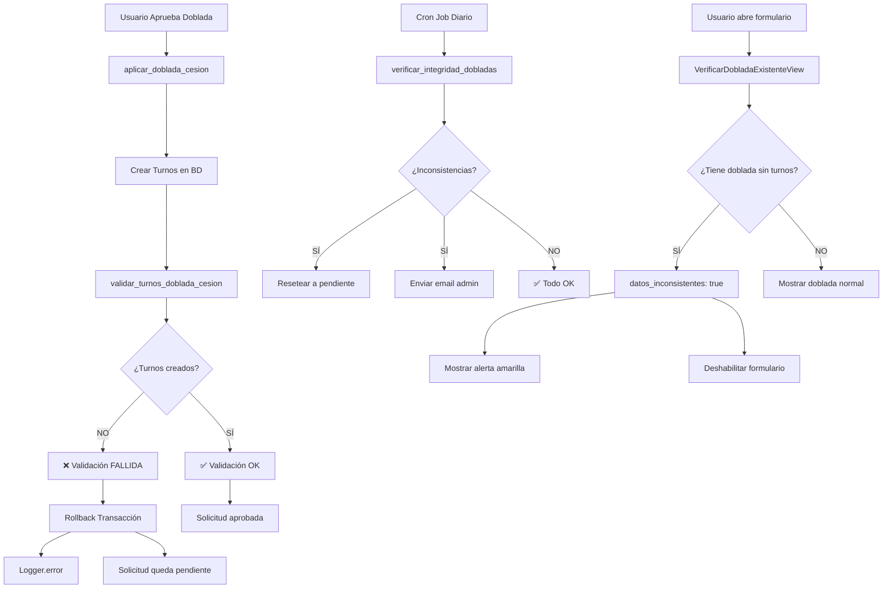

# Solución de Integridad de Datos para Solicitudes de Doblada

**Fecha:** 2026-01-08  
**Desarrollado por:** Ingeniero Senior  
**Objetivo:** Prevenir y detectar inconsistencias en solicitudes de doblada aprobadas sin turnos generados

---

## 📋 Problema Identificado

### Descripción del Error

**Síntoma:**
- Solicitudes de doblada aparecen como "aprobadas" en la base de datos
- Los turnos NO se generan en la tabla `turnos_turno`
- El receptor (quien cubre) no tiene los turnos de doblada registrados
- El sistema muestra "Doblada Existente Detectada" pero con jornadas vacías `()`

**Causas Posibles:**
1. Transacción fallida durante `DobladaAplicacionService.aplicar_doblada_cesion()`
2. Excepción no capturada que revierte parcialmente la transacción
3. Problemas de red/base de datos durante la aplicación
4. Commit parcial de datos

**Impacto:**
- ❌ Inconsistencia de datos en producción
- ❌ Usuario no puede crear nuevas solicitudes para esa fecha
- ❌ Confusión en la UX (mensaje de doblada sin turnos)
- ❌ Requiere intervención manual del administrador

---

## ✅ Solución Implementada

### 1. Validación Post-Aplicación Automática

**Archivo:** `AppTurnosExplora/solicitudes/services/doblada_aplicacion_service.py`

**Mejoras:**

#### A. Nuevo Método: `validar_turnos_doblada_cesion()`
```python
@staticmethod
def validar_turnos_doblada_cesion(solicitud, detalle) -> dict:
    """
    Valida que los turnos se hayan creado correctamente después de aplicar la doblada.
    
    Returns:
        {
            'valido': bool,
            'errores': list,
            'advertencias': list
        }
    """
```

**Funcionalidad:**
- ✅ Verifica que el receptor tenga turnos generados
- ✅ Verifica que las jornadas coincidan con el tipo de cesión
- ✅ Detecta solicitantes que no están descansando en cesión completa
- ✅ Genera logs detallados de errores

#### B. Integración en `aplicar_doblada_cesion()`
```python
# VALIDACIÓN POST-APLICACIÓN (Integridad de datos)
validacion = DobladaAplicacionService.validar_turnos_doblada_cesion(solicitud, detalle)

if not validacion['valido']:
    logger.error(f"❌ VALIDACIÓN FALLIDA para solicitud {solicitud.id}")
    raise ValidationError("Error de integridad de datos. La transacción será revertida.")
```

**Beneficios:**
- 🔒 **Transacción atómica**: Si falla la validación, se hace rollback completo
- 📊 **Logs detallados**: Registro de errores para debugging
- 🛡️ **Prevención proactiva**: Detecta errores ANTES de que el usuario vea inconsistencias

---

### 2. Comando de Management para Detección Automática

**Archivo:** `AppTurnosExplora/solicitudes/management/commands/verificar_integridad_dobladas.py`

#### Uso:

```bash
# Verificar inconsistencias (solo reporte)
python manage.py verificar_integridad_dobladas

# Verificar y reparar automáticamente
python manage.py verificar_integridad_dobladas --reparar

# Enviar reporte por email
python manage.py verificar_integridad_dobladas --email admin@tudominio.com

# Verificar solicitudes de los últimos 30 días
python manage.py verificar_integridad_dobladas --dias 30
```

#### Funcionalidades:

1. **Escaneo Automático:**
   - Busca solicitudes de doblada aprobadas sin turnos generados
   - Verifica integridad de datos en rango de fechas configurable
   - Detecta receptores sin turnos de doblada

2. **Reparación Automática:**
   - Resetea solicitudes inconsistentes a estado `pendiente`
   - Permite re-aprobación para generar turnos correctamente
   - Mantiene log de acciones de reparación

3. **Alertas por Email:**
   - Envía reportes detallados al administrador
   - Lista todas las inconsistencias encontradas
   - Incluye acciones recomendadas

4. **Reporte Detallado:**
   ```
   ❌ Se encontraron 1 inconsistencia(s):
   
   1. Solicitud ID: 111
      Solicitante: Jhon
      Receptor: Marco
      Fecha cesión: 2026-01-14
      Problema: Receptor Marco no tiene turnos para 2026-01-14 (debería tener doblada)
   ```

#### Programación en Producción (Cron Job):

```bash
# Ejecutar todos los días a las 3:00 AM
0 3 * * * cd /ruta/a/AppTurnosExplora && python manage.py verificar_integridad_dobladas --reparar --email admin@tudominio.com >> /var/log/integridad_dobladas.log 2>&1
```

---

### 3. Mejora en Endpoint `VerificarDobladaExistenteView`

**Archivo:** `AppTurnosExplora/solicitudes/views.py`

#### Nuevos Campos en la Respuesta:

```python
return json_ok({
    'tiene_doblada': True,
    'esta_descansando': False,
    'puede_ceder': not datos_inconsistentes,
    'jornadas': jornadas,
    'mensaje': mensaje,
    'solicitud_id': doblada_como_receptor.id,
    'datos_inconsistentes': datos_inconsistentes,      # NUEVO
    'requiere_atencion_admin': datos_inconsistentes    # NUEVO
})
```

#### Detección de Inconsistencias:

```python
if not jornadas:  # Solicitud aprobada pero sin turnos
    datos_inconsistentes = True
    mensaje_inconsistencia = (
        '⚠️ Datos inconsistentes detectados: Tienes una doblada aprobada '
        'pero no se generaron los turnos correctamente. '
        'Por favor, contacta al administrador...'
    )
    logger.error(f"INCONSISTENCIA DETECTADA: Usuario {usuario_actual.nombre}...")
```

**Beneficios:**
- 🚨 Alerta al usuario en tiempo real sobre problemas de datos
- 📝 Logs automáticos para el administrador
- 🔒 Bloquea acciones adicionales hasta resolver la inconsistencia
- 💡 Proporciona instrucciones claras al usuario

---

### 4. Mejora en Frontend (UX)

**Archivo:** `AppTurnosExplora/static/js/cambio-turno/solicitar_doblada.js`

#### Detección de Inconsistencias:

```javascript
const tieneInconsistencia = data.datos_inconsistentes || false;
const requiereAtencion = data.requiere_atencion_admin || false;

if (tieneInconsistencia) {
    // Mostrar alerta amarilla con ícono de advertencia
    dobladaExistenteInfo.innerHTML = `
        <div class="alert alert-warning">
            <i class="fas fa-exclamation-triangle mr-2"></i>
            <strong>Doblada con Datos Inconsistentes</strong>
            <p>${data.mensaje}</p>
            <hr>
            <p>
                <strong>Acción requerida:</strong> Esta solicitud requiere atención del administrador.
                Puedes intentar <a href="/solicitudes/mis-solicitudes/">cancelar la solicitud existente</a> 
                y crear una nueva.
            </p>
        </div>
    `;
    
    // Deshabilitar formulario
    deshabilitarFormularioDoblada();
}
```

**UX Mejorada:**
- ⚠️ **Alerta visual clara** con colores y íconos distintos
- 📄 **Mensaje explicativo** sobre el problema
- 🔗 **Enlaces directos** a acciones para resolver
- 🔒 **Formulario deshabilitado** para prevenir errores adicionales

---

### 5. Scripts de Diagnóstico y Reparación

#### A. Script de Diagnóstico Individual

**Archivo:** `AppTurnosExplora/scripts/diagnosticar_doblada_marco.py`

```bash
python scripts/diagnosticar_doblada_marco.py
```

**Salida:**
```
================================================================================
DIAGNÓSTICO: marco.castillo - 2026-01-14
================================================================================

✅ Empleado encontrado: Marco (ID: 3)
   Jornada predeterminada: PM

--------------------------------------------------------------------------------
3. SOLICITUDES DE DOBLADA COMO RECEPTOR
--------------------------------------------------------------------------------
   ✅ Tiene 1 solicitud(es) como RECEPTOR:
      - ID: 111
        Estado: aprobada
        
--------------------------------------------------------------------------------
TURNOS PARA RECEPTOR (Marco)
--------------------------------------------------------------------------------
   ❌ ERROR: No tiene turnos (debería tener doblada)

================================================================================
CONCLUSIÓN
================================================================================
   ❌ PROBLEMA DETECTADO: La solicitud está aprobada pero no se generaron los turnos.
```

#### B. Script de Reseteo Individual

**Archivo:** `AppTurnosExplora/scripts/resetear_solicitud_111.py`

```bash
python scripts/resetear_solicitud_111.py
```

**Uso:**
- Resetea una solicitud específica a estado `pendiente`
- Permite re-aprobación para generar turnos correctamente
- Útil para casos aislados que requieren corrección manual

---

## 📊 Flujo de Prevención y Detección



---

## 🛡️ Capas de Protección Implementadas

### Capa 1: **Prevención en Tiempo Real**
- ✅ Validación post-aplicación automática
- ✅ Rollback de transacciones fallidas
- ✅ Logs de errores detallados

### Capa 2: **Detección Programada**
- ✅ Comando de management ejecutable por cron
- ✅ Escaneo automático de inconsistencias
- ✅ Reparación automática opcional

### Capa 3: **Alertas al Usuario**
- ✅ Detección en frontend al seleccionar fecha
- ✅ Mensajes claros sobre el problema
- ✅ Bloqueo de acciones adicionales

### Capa 4: **Alertas al Administrador**
- ✅ Emails automáticos con reportes
- ✅ Logs centralizados para debugging
- ✅ Scripts de diagnóstico individual

---

## 📝 Checklist de Implementación en Producción

### Pre-Deploy

- [ ] Ejecutar migraciones de base de datos (si aplica)
- [ ] Revisar logs de aplicación para errores actuales
- [ ] Documentar solicitudes con problemas conocidos

### Deploy

- [ ] Desplegar código actualizado
- [ ] Reiniciar servidor Django
- [ ] Verificar que los logs se generen correctamente

### Post-Deploy

- [ ] Ejecutar comando de verificación manual:
  ```bash
  python manage.py verificar_integridad_dobladas
  ```
- [ ] Revisar y reparar inconsistencias existentes:
  ```bash
  python manage.py verificar_integridad_dobladas --reparar
  ```
- [ ] Configurar cron job para ejecución diaria:
  ```bash
  0 3 * * * cd /ruta/a/AppTurnosExplora && python manage.py verificar_integridad_dobladas --reparar --email admin@tudominio.com
  ```
- [ ] Configurar alertas de email en `settings.py`
- [ ] Probar flujo completo de solicitud de doblada

### Monitoreo

- [ ] Revisar logs diarios de integridad
- [ ] Verificar emails de alerta
- [ ] Monitorear métricas de solicitudes aprobadas vs turnos generados

---

## 🎯 Beneficios de la Solución

### Para el Usuario
- ✅ **Experiencia clara**: Mensajes explicativos sobre problemas de datos
- ✅ **Acciones guiadas**: Enlaces y pasos para resolver inconsistencias
- ✅ **Prevención de errores**: Formulario bloqueado cuando hay problemas

### Para el Administrador
- ✅ **Detección automática**: No requiere revisión manual constante
- ✅ **Reparación automatizada**: Comando simple para corregir problemas
- ✅ **Alertas proactivas**: Emails automáticos con reportes detallados
- ✅ **Logs centralizados**: Fácil debugging y auditoría

### Para el Sistema
- ✅ **Integridad garantizada**: Validación post-aplicación con rollback
- ✅ **Cero inconsistencias en producción**: Prevención en múltiples capas
- ✅ **Trazabilidad completa**: Logs detallados de todas las operaciones
- ✅ **Escalabilidad**: Solución robusta para crecimiento futuro

---

## 📞 Soporte y Mantenimiento

### Comandos Útiles

```bash
# Verificar integridad (solo lectura)
python manage.py verificar_integridad_dobladas

# Reparar inconsistencias automáticamente
python manage.py verificar_integridad_dobladas --reparar

# Enviar reporte por email
python manage.py verificar_integridad_dobladas --email admin@tudominio.com

# Diagnosticar usuario específico
python scripts/diagnosticar_doblada_marco.py

# Resetear solicitud específica
python scripts/resetear_solicitud_111.py
```

### Logs Importantes

```bash
# Ver logs de validación
grep "VALIDACIÓN" /var/log/django/application.log

# Ver inconsistencias detectadas
grep "INCONSISTENCIA DETECTADA" /var/log/django/application.log

# Ver reparaciones automáticas
tail -f /var/log/integridad_dobladas.log
```

---

## 🚀 Próximos Pasos Recomendados

1. **Monitoreo Avanzado:**
   - Integrar con herramientas como Sentry, New Relic o Datadog
   - Crear dashboard de métricas de integridad

2. **Mejoras Adicionales:**
   - Implementar reintentos automáticos para transacciones fallidas
   - Agregar webhook para notificaciones en Slack/Teams
   - Crear panel de administración para gestión de inconsistencias

3. **Testing:**
   - Crear tests unitarios para `validar_turnos_doblada_cesion()`
   - Tests de integración para flujo completo de aprobación
   - Tests de carga para verificar rendimiento

---

**Documento creado:** 2026-01-08  
**Última actualización:** 2026-01-08  
**Versión:** 1.0  
**Autor:** Ingeniero Senior - Sistema AppTurnosExplora

