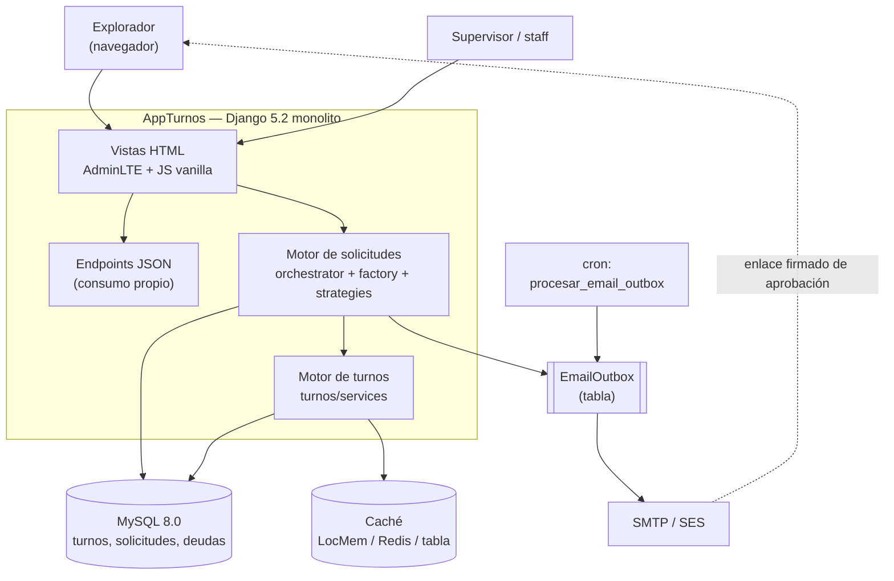
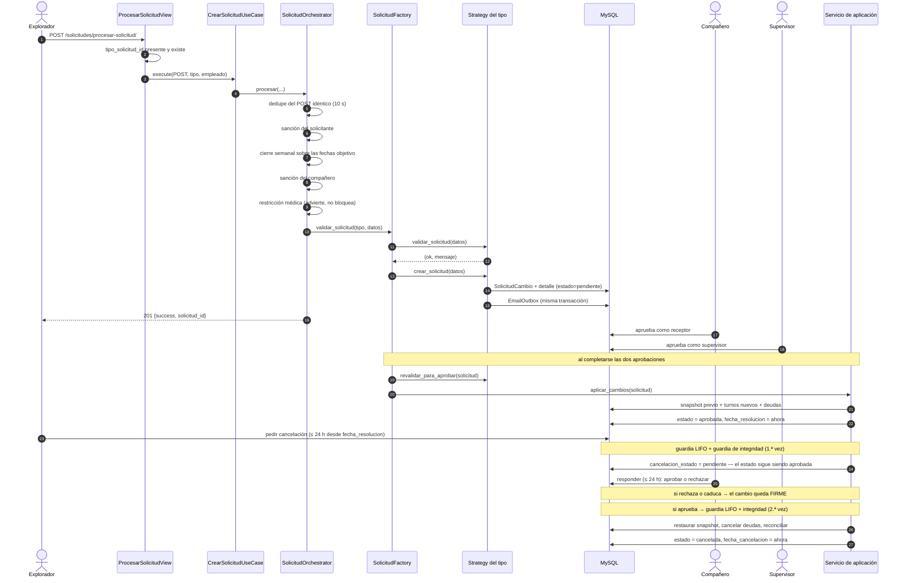
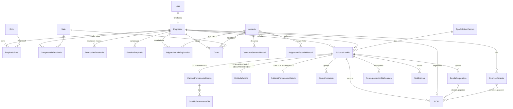
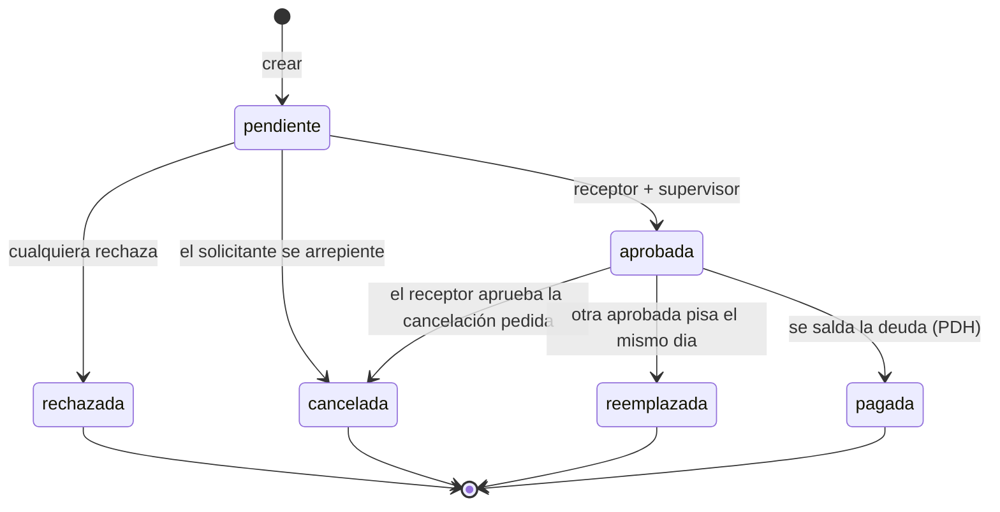
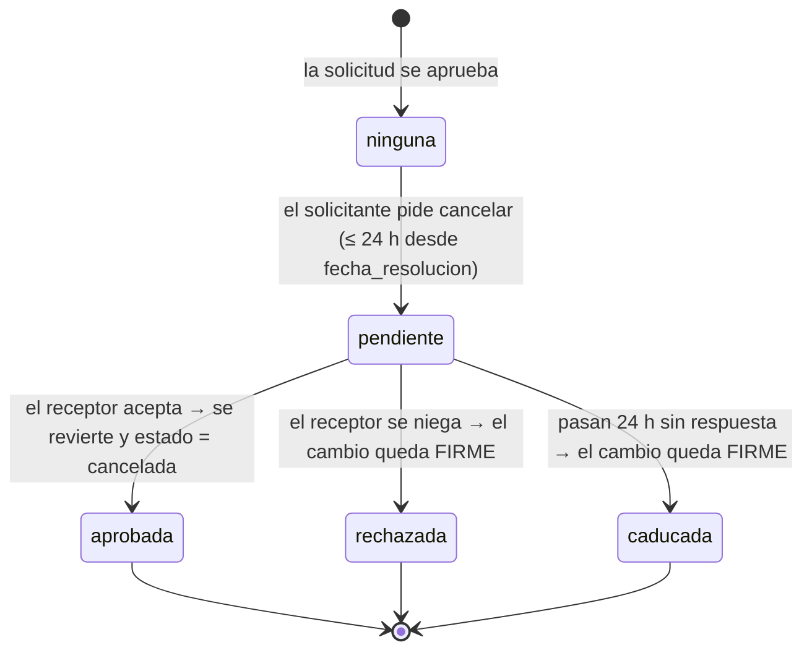
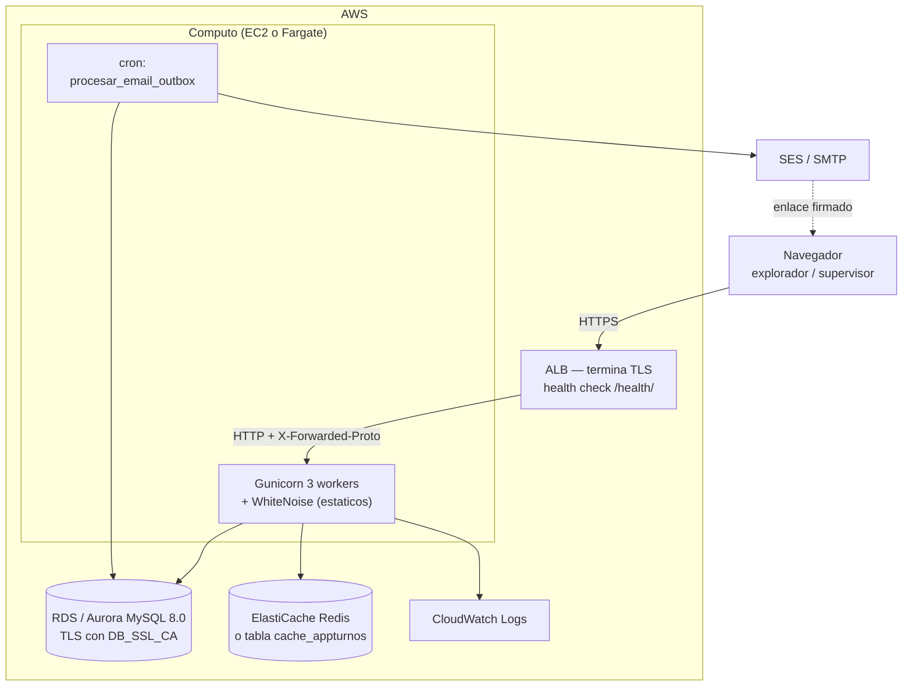

# Manual Técnico — AppTurnos / SWALP

Documentación para el desarrollador que llega mañana y tiene que instalar el proyecto,
entenderlo, tocarlo sin romperlo y desplegarlo.

Toda afirmación técnica lleva su origen entre paréntesis, en formato `ruta/archivo:línea`
relativo a `AppTurnosExplora/` salvo que se indique otra raíz. Las líneas se verificaron
contra el código el **2026-08-08**. Lo que no se pudo verificar está en
[§ 18 Por confirmar](#18-por-confirmar).

Este documento **no reemplaza** la documentación de `docs/`: la ordena y la enlaza. Cuando
un tema ya está cubierto en profundidad, aquí se resume y se remite.

La terminología de dominio (explorador, jornada, doblada, cesión, pago, temporada,
alternancia, D FDS…) es la misma que en [manual_usuario.md](./manual_usuario.md) § 1.3;
ese glosario es la referencia común y no se duplica aquí.

---

## Índice

1. [Visión general](#1-visión-general)
2. [Puesta en marcha](#2-puesta-en-marcha)
3. [Arquitectura](#3-arquitectura)
4. [Estructura del proyecto](#4-estructura-del-proyecto)
5. [Modelos y base de datos](#5-modelos-y-base-de-datos)
6. [Endpoints y URLs](#6-endpoints-y-urls)
7. [Servicios y lógica de dominio](#7-servicios-y-lógica-de-dominio)
8. [Reglas de negocio](#8-reglas-de-negocio)
9. [Autenticación, autorización y seguridad](#9-autenticación-autorización-y-seguridad)
10. [Configuración](#10-configuración)
11. [Dependencias](#11-dependencias)
12. [Recetas (how-to)](#12-recetas-how-to)
13. [Despliegue](#13-despliegue)
14. [Pruebas](#14-pruebas)
15. [Decisiones técnicas (ADR)](#15-decisiones-técnicas-adr)
16. [Zonas frágiles y bugs conocidos](#16-zonas-frágiles-y-bugs-conocidos)
17. [Cambios técnicos relevantes](#17-cambios-técnicos-relevantes)
18. [Por confirmar](#18-por-confirmar)

---

## 1. Visión general

### 1.1 Qué es el sistema y qué problema resuelve

AppTurnos (SWALP) programa los turnos de un equipo de **exploradores** del Parque Explora y
gestiona los acuerdos con los que intercambian jornadas entre ellos. Cada persona tiene una
jornada base (AM o PM) y una programación de descansos que depende del calendario —festivos,
mantenimiento, temporada— y de la alternancia publicada de fines de semana. Sobre esa base, el
sistema permite seis tipos de acuerdo entre compañeros, cada uno con reglas propias.

El núcleo técnico no es el calendario: es el **motor de solicitudes**. Seis formularios que
modifican turnos propios *y de terceros*, generan deuda de jornada, exigen doble aprobación
(compañero + supervisor) y se pueden deshacer con el acuerdo de la contraparte, dentro de dos
plazos de 24 horas ([ADR 009](./03-arquitectura/adr/009-cancelacion-consensuada.md)). Casi toda la
complejidad del repositorio está ahí: validar que un acuerdo es legal contra el estado *real* del
día, materializarlo en filas de `Turno`, poder deshacerlo exactamente, e impedir que dos cambios
concurrentes se pisen. Fuera del sistema quedan la nómina y el fichaje real: AppTurnos programa y
contabiliza deuda, no asistencia.

### 1.2 Stack y versiones exactas

| Componente | Versión / elección | Evidencia |
|---|---|---|
| Python | 3.12 | `Dockerfile` |
| Django | 5.2.16 — **sin Django REST Framework** | `requirements.txt:4` |
| Base de datos | MySQL 8.0; driver `PyMySQL` 1.1.2 instalado como `MySQLdb` si falta el nativo | `config/settings.py:115-119`, `requirements.txt:14` |
| Servidor de aplicación | Gunicorn 23.0.0, 3 workers | `requirements.txt:11`, `docker-compose.hostdb.yml` |
| Estáticos | WhiteNoise 6.8.2 (sin Nginx en el contenedor) | `config/settings.py:73` |
| Frontend | AdminLTE 3.2 + JavaScript vanilla, **sin paso de build** | `docs/03-arquitectura/TECNOLOGIAS_FRONTEND.md` |
| Historial | `django-simple-history` 3.8.0 | `config/settings.py:53` |
| Seguridad | `django-axes` 7.0.1, `django-csp` 4.0, `django-cors-headers` 4.9.0 | `config/settings.py:51-52,74` |
| Configuración | `django-environ` 0.14.0 | `config/settings.py:20-24` |
| Caché | LocMem / Redis / tabla MySQL, según `CACHE_URL` | `config/settings.py:283-316` |
| Exportación | `openpyxl` 3.1.5 | `requirements.txt:12` |
| Zona horaria | `America/Bogota`, `USE_TZ=True`, idioma `es-co` | `config/settings.py:209-212` |

No hay API REST pública: los endpoints JSON existen para el propio frontend.

### 1.3 Madurez del proyecto y estado actual

Proyecto en **pre-producción**. Lo que eso significa en la práctica:

- El esquema está maduro: 36 archivos de migración en `solicitudes/migrations/` —la última,
  `0034`, añade la cancelación consensuada—, más los de `turnos`, `empleados` y `permisos`
  (recuento exacto de estos tres pendiente, § 18; en `permisos` la homóloga es la `0008`, y la
  `0009` añade `PermisoEspecial.fecha_aprobacion`).
- La suite de pruebas es amplia: 46 archivos en `solicitudes/tests/` —uno de ellos,
  `helpers_cancelacion.py`, es un helper compartido, no un test— y 33 repartidos entre
  `turnos`, `empleados`, `permisos`, `core` e `integration_tests`.
- El despliegue en AWS está documentado y hay imagen Docker, pero la infraestructura definitiva
  sigue con pendientes ([ADR 005](./03-arquitectura/adr/005-pendientes-aws.md)).
- La política CSP estricta está publicada en modo **report-only**, a la espera de confirmar que no
  genera violaciones (`config/settings.py:399-418`).
- Los datos de la base de desarrollo son descartables: producción arranca limpia. No hay
  backfills ni migraciones de datos planificadas.

---

## 2. Puesta en marcha

Tutorial reproducible desde cero. Asume que no conoces el proyecto.

### 2.1 Requisitos previos

| Requisito | Versión | Por qué |
|---|---|---|
| Python | 3.12 | Es la versión de la imagen (`Dockerfile`) |
| MySQL | 8.0 | Motor de `DATABASES` (`config/settings.py:164`) |
| Git | cualquiera | — |
| Microsoft Word | opcional | Solo para regenerar los PDF de documentación (usa COM) |

**Trampa de orientación nº 1:** la raíz del proyecto Django es `AppTurnosExplora/` (ahí está
`manage.py`), no la raíz del repositorio.

**Trampa nº 2:** el `docker-compose.yml` de la raíz del repositorio levanta **SonarQube**, no la
aplicación. Los de la aplicación son `AppTurnosExplora/docker-compose.local.yml` y
`AppTurnosExplora/docker-compose.hostdb.yml`.

### 2.2 Entorno virtual e instalación

```bash
cd AppTurnosExplora
python -m venv .venv
.venv\Scripts\activate                 # Windows
pip install -r requirements-dev.txt    # incluye requirements.txt con -r
```

`requirements-dev.txt` hereda producción con `-r requirements.txt` y añade solo herramientas de
desarrollo (`requirements-dev.txt:3`).

### 2.3 Variables de entorno

```bash
copy .env.example .env      # y edita los valores
```

`.env.example` es la plantilla completa. Las variables **obligatorias** sin valor por defecto son
`SECRET_KEY`, `DB_NAME`, `DB_USER`, `DB_PASSWORD`, `EMAIL_HOST_USER`, `EMAIL_HOST_PASSWORD` y
`DEFAULT_FROM_EMAIL`: si falta cualquiera, `django-environ` lanza `ImproperlyConfigured` al
importar `settings` y el proceso no arranca (`config/settings.py:32,165-167,241-243`). La tabla
completa está en [§ 10 Configuración](#10-configuración).

`ENVIRONMENT` (`development` | `production`) gobierna todo el archivo de settings, que es único: no
hay `settings/local.py` (`config/settings.py:26-27`).

### 2.4 Base de datos y migraciones

```sql
CREATE DATABASE bdturnosex CHARACTER SET utf8mb4;
```

```bash
python manage.py migrate
```

Si usas caché en tabla (`CACHE_URL=db://cache_appturnos`), hace falta además, una sola vez:

```bash
python manage.py createcachetable
```

(`config/settings.py:276-278`).

**Trampa conocida en MySQL local:** las tablas de zonas horarias vienen vacías y el admin de Django
falla al filtrar por fecha. RDS/Aurora ya vienen pobladas; en local hay que cargarlas con
`mysql_tzinfo_to_sql`.

### 2.5 Datos de arranque

```bash
python manage.py createsuperuser
python manage.py instalar_calendario_colombiano      # festivos
python manage.py actualizar_codigos_estrategia       # sincroniza codigo_estrategia
```

Además hacen falta datos que **no** se generan solos:

- Las dos filas de `Jornada` con nombre exacto `AM` y `PM`. El motor las busca por nombre literal y
  no se pueden borrar (`empleados/models.py:19-25,39-41`).
- Los roles `Supervisor` y `Explorador`, también por nombre exacto (`empleados/models.py:82-85`).
- Los seis `TipoSolicitudCambio` con los nombres de `core.constants.TipoSolicitud`
  (`core/constants.py`: `CAMBIO TURNO`, `CAMBIO DESCANSO`, `CT PERMANENTE`, `DOBLADA`,
  `DOBLADA PERMANENTE`, `D FDS`).
- El calendario anual: temporada, festivos, mantenimiento, alternancia de fines de semana y
  descansos de semana. **Se carga a mano cada diciembre**; que un año futuro esté vacío es
  intencional, no un fallo. Procedimiento en
  [04-guias/mantenimiento-anual/](./04-guias/mantenimiento-anual/).

### 2.6 Arrancar y comprobar que funciona

```bash
python manage.py runserver
```

| Comprobación | Cómo | Qué debe pasar |
|---|---|---|
| Proceso vivo | `GET /health/` | `{"status": "ok"}`, sin tocar la base (`core/health.py`) |
| Base accesible | `GET /health/ready/` | Estado que sí verifica la conexión (`core/health.py`) |
| Login | `GET /` | Formulario de inicio de sesión (`core/login/urls.py:5`) |
| Panel | `GET /dashboard/` | Portada tras autenticarse (`core/dashboard/urls.py:5`) |
| Configuración | `python manage.py check --deploy` | Sin errores críticos |

Ninguno de los dos endpoints de salud requiere autenticación ni devuelve información del sistema:
solo un estado (`core/health.py`, docstring del módulo).

### 2.7 Docker / docker-compose

Hay dos ficheros, para dos escenarios distintos:

| Fichero | Qué levanta | Cuándo usarlo |
|---|---|---|
| `docker-compose.local.yml` | MySQL 8.0 efímero (puerto host 3307) + la app con la imagen de producción | Probar la imagen real sin tocar tu base local |
| `docker-compose.hostdb.yml` | Solo la app, apuntando a tu MySQL del host vía `host.docker.internal` | Probar la imagen contra tus datos reales |

```bash
docker compose -f docker-compose.local.yml up --build -d   # http://localhost:8000
docker compose -f docker-compose.local.yml down -v
```

Tres detalles que evitan sorpresas:

1. Ambos ficheros fijan `ENVIRONMENT=production` pero `SECURE_HTTPS=False`, para poder navegar en
   HTTP local sin caer en el redirect a HTTPS (`docker-compose.local.yml`, sección `environment`).
2. `docker-compose.hostdb.yml` **sobrescribe el `command`** para arrancar solo Gunicorn, sin
   `migrate`: no toca el esquema de tu base real (`docker-compose.hostdb.yml`, clave `command`).
3. El puerto de MySQL en `local` se publica en **3307** para no chocar con tu MySQL local en 3306.

Guía completa: [MANUAL_DOCKER_LOCAL.md](./05-referencia/deployment/MANUAL_DOCKER_LOCAL.md).

---

## 3. Arquitectura

### 3.1 Diagrama de contexto



**Qué muestra.** AppTurnos es un monolito Django único, sin servicios separados. Exploradores y
supervisores usan el mismo navegador y las mismas vistas; lo que cambia es el permiso. Todo lo que
modifica turnos pasa por el motor de solicitudes, que escribe en MySQL y encola correos en la tabla
`EmailOutbox` dentro de la misma transacción. El envío real lo hace después un cron que ejecuta
`procesar_email_outbox` (`solicitudes/models.py:44-64`). Los correos llevan enlaces firmados que
permiten aprobar sin iniciar sesión: es la única entrada al sistema que no pasa por el login. La
caché guarda el estado de "Mis Turnos" y se invalida al aprobar o cancelar.

### 3.2 Capas y responsabilidad de cada una

| Capa | Dónde vive | Responsabilidad | Qué NO hace |
|---|---|---|---|
| HTTP | `*/views/` | Parsear la petición, comprobar sesión y permisos, devolver JSON o HTML | No contiene reglas de negocio |
| Orquestación | `solicitudes/services/solicitud_orchestrator.py` | Encadena los chequeos transversales y despacha al tipo | No conoce las reglas de cada tipo |
| Casos de uso | `solicitudes/use_cases/` | Nombra la intención: crear, aprobar, cancelar | No habla HTTP |
| Dominio | `solicitudes/domain/` | Máquina de estados, bloqueos, invariantes | No consulta el ORM salvo lo imprescindible |
| Estrategias | `solicitudes/services/strategies/` | Reglas propias de cada uno de los seis tipos | No sabe qué otros tipos existen |
| Validadores | `solicitudes/services/validators/` | Reglas reutilizables entre tipos | No escribe |
| Servicios de aplicación | `solicitudes/services/*_aplicacion_service.py` | Materializa y revierte turnos y deudas | No valida |
| Repositorios | `solicitudes/repositories/` | Consultas al ORM aisladas | No decide |
| Modelos | `*/models.py` | Persistencia + invariantes estructurales (constraints) | — |

La descripción larga está en
[03-arquitectura/ARQUITECTURA.md](./03-arquitectura/ARQUITECTURA.md) y la justificación de la capa
de servicios en [ADR 001](./03-arquitectura/adr/001-service-layer-y-orchestrator.md).

**Middleware.** El orden de `MIDDLEWARE` (`config/settings.py:70-85`) no es decorativo; tres
posiciones están fijadas por una razón concreta:

| Posición | Middleware | Por qué ahí |
|---|---|---|
| 1.º | `core.errors.RequestIDMiddleware` (`config/settings.py:71`) | Etiqueta la petición con su identificador. Lo que quede **por encima** no queda etiquetado, así que va arriba del todo (§ 9.5) |
| 2.º | `corsheaders.middleware.CorsMiddleware` | Debe responder al preflight antes que el resto |
| último – 1 | `axes.middleware.AxesMiddleware` | La propia librería exige ir al final |
| último | `core.middleware.AperturaAnioMiddleware` | Bloquea al supervisor si falta planificar el año; necesita sesión y usuario ya resueltos |

Fuera de producción, `debug_toolbar.middleware.DebugToolbarMiddleware` se inserta en la posición 0
(`config/settings.py:87-88`), por delante incluso del identificador.

### 3.3 Flujo de una petición de punta a punta



**Qué muestra.** El ciclo de vida completo de una solicitud. Los pasos 1-11 ocurren en una sola
petición POST y terminan con la solicitud **pendiente**: nada se ha aplicado todavía al calendario.
La aplicación real solo ocurre cuando se completan las dos aprobaciones, y va precedida de una
revalidación contra el estado actual, porque entre la creación y la aprobación el mundo pudo
cambiar. La cancelación deshace exactamente lo aplicado usando el snapshot capturado antes de
aplicar, y solo si las dos guardias lo permiten.

**La cancelación de una solicitud aprobada son dos pasos, no uno.** Cancelar deshace un acuerdo,
así que quien puede deshacerlo depende de si ese acuerdo llegó a existir: una solicitud
`pendiente` la retira el solicitante solo —nadie aceptó nada—, pero una `aprobada` la **pide** el
solicitante y la **aprueba o rechaza el receptor**. Entre los dos pasos el `estado` sigue siendo
`aprobada` **a propósito**: los turnos continúan aplicados y todo lo que filtra por `'aprobada'`
—guardia LIFO, Mis Turnos, reconciliación— la sigue viendo vigente. Las guardias corren **dos
veces**: al pedir, para no molestar al receptor con algo irreversible, y al aprobar, porque entre
una cosa y otra pueden pasar 24 horas. Regla completa en § 8.2 (P4) y decisión razonada en el
[ADR 009](./03-arquitectura/adr/009-cancelacion-consensuada.md).

El paso `reconciliar` del diagrama —re-aplicar las dobladas que siguen aprobadas en esos días— es
**reparación best-effort, no una validación**: se re-aplica **sin re-validar**, así que una
solicitud vigente que ya no encaje con el calendario actual puede levantar `ValidationError` desde
los guardias de negocio de los servicios de aplicación. Cuando pasa, esa candidata se **omite** y
se registra; la cancelación en curso continúa. Política y consecuencia operativa en § 16.2.

### 3.4 Patrones aplicados y por qué

**Strategy — un archivo por tipo de solicitud.** Los seis tipos comparten la mayor parte del flujo
pero difieren en reglas casi incompatibles: una doblada genera deuda, un cambio de descanso no; un
CT permanente opera sobre un rango, un CT sencillo sobre un día. Resuelto con condicionales habría
producido una vista de miles de líneas donde tocar un tipo rompe otro. `SolicitudStrategy`
(`solicitudes/services/strategies/base_strategy.py`) define el contrato —`validar_solicitud`,
`crear_solicitud`, `aplicar_cambios`, `revalidar_para_aprobar`, `get_empleados_disponibles`— y cada
tipo lo implementa. El orquestador no sabe con qué tipo trabaja.

**Factory con búsqueda en cuatro niveles.** Los tipos viven en base de datos (`TipoSolicitudCambio`)
y sus nombres los escriben personas. `SolicitudFactory.get_strategy`
(`solicitudes/services/solicitud_factory.py:123`) busca en cascada: campo `codigo_estrategia`
normalizado (`:143`), `codigo_estrategia` directo (`:154`), nombre directo (`:176`) y, si nada casa,
estrategia por defecto con `warning` en el log (`solicitudes/services/solicitud_factory.py:182-187`).

**Validadores reutilizables.** Reglas como "no en día de mantenimiento" o "no contigo mismo" aplican
a casi todos los tipos. `SolicitudValidator`
(`solicitudes/services/validators/base_validator.py`) las concentra y los validadores específicos
—`ct_validator.py`, `ct_permanente_validator.py`, `doblada_validator.py`— añaden lo suyo.

**Máquina de estados propia, sin librería.** Un único mapa de transiciones legales
(`solicitudes/domain/estado_machine.py:11-18`) y una función que las valida
(`:28`, lanza `EstadoTransicionError` en `:47-53`). El motivo de no usar `django-fsm` está en
[ADR 002](./03-arquitectura/adr/002-fsm-sin-libreria-externa.md).

**Casos de uso.** `use_cases/` nombra la intención por encima de la implementación:
`CrearSolicitudUseCase`, `AprobarComoReceptorUseCase`, `AprobarComoSupervisorUseCase`,
`AprobarAmbosRolesUseCase` (`solicitudes/use_cases/aprobar_solicitud.py:39`),
`CancelarSolicitudUseCase`.

**Repositorios.** `solicitudes/repositories/` aísla las consultas del ORM para que las estrategias
pidan datos sin escribir querysets.

**Outbox de correos.** La fila de correo se escribe **dentro** de la misma transacción que el cambio
de negocio, con clave de idempotencia única; el envío real ocurre después y se reintenta si falla
(`solicitudes/models.py:44-64,77,93`). Sin esto, un proceso que muriera entre el COMMIT y el envío
perdía el correo en silencio.

Todo el catálogo de protecciones —bloqueo pesimista, snapshot-once, deuda idempotente, guardias que
fallan cerrado, invariantes en la base de datos— vive en **`PROTECTION_PATTERNS.md`** (raíz del
repositorio, 39 patrones). Se resume en [§ 16](#16-zonas-frágiles-y-bugs-conocidos).

### 3.5 Qué NO se hizo y por qué

| Alternativa descartada | Motivo | Dónde consta |
|---|---|---|
| Django REST Framework | No hay consumidores externos; los endpoints JSON los usa el propio frontend | Ausente de `INSTALLED_APPS` (`config/settings.py:43-62`) |
| `django-fsm` | Las transiciones son pocas y fijas; una librería añadía dependencia sin cerrar el hueco real (asignar `estado` a mano) | [ADR 002](./03-arquitectura/adr/002-fsm-sin-libreria-externa.md) |
| Celery / broker | El único trabajo diferido son los correos; se resolvió con tabla outbox + cron | `solicitudes/models.py:44-64` |
| `django-redis` | El backend Redis nativo de Django 5 basta; solo hace falta el cliente `redis` | `config/settings.py:280-281` |
| Paso de build en frontend | JS vanilla y AdminLTE servidos como estáticos; no hay bundler | `docs/03-arquitectura/TECNOLOGIAS_FRONTEND.md` |
| Índice único parcial en MySQL | MySQL no soporta `UniqueConstraint(condition=...)`; se usa columna discriminante nullable | `turnos/models.py:55-60,80-83` |
| Settings partidos por entorno | Un archivo único gobernado por `ENVIRONMENT` | `config/settings.py:26-27` |

---

## 4. Estructura del proyecto

### 4.1 Árbol de carpetas

```
C:\appTurnos\                       raíz del repositorio
├── AppTurnosExplora\               ← raíz del proyecto Django (manage.py)
│   ├── config\                     settings.py, urls.py, wsgi.py, db.py, paths.py
│   ├── core\                       login, dashboard, mixins, constantes, health, caché
│   ├── empleados\                  personas, roles, salas, competencias, restricciones, sanciones
│   ├── turnos\                     turnos, jornadas, días especiales, descansos, alternancia
│   ├── solicitudes\                el dominio central: los seis tipos de solicitud
│   ├── permisos\                   PDH y permisos especiales
│   ├── templates\                  plantillas HTML (incluye emails\)
│   ├── static\                     JS, CSS, AdminLTE, plugins autohospedados
│   ├── integration_tests\          pruebas de integración
│   ├── scripts\                    utilidades manuales (NO recogidas por pytest)
│   ├── docs\                       esta documentación
│   ├── Dockerfile
│   ├── docker-compose.local.yml    app + MySQL efímero
│   └── docker-compose.hostdb.yml   app contra tu MySQL del host
├── PROTECTION_PATTERNS.md          39 patrones de concurrencia, idempotencia y seguridad
├── instructivos\                   fuentes de negocio en .docx / .mwb
└── docker-compose.yml              ⚠ solo SonarQube, NO la aplicación
```

### 4.2 Apps Django

| App | Responsabilidad | Contiene | Depende de |
|---|---|---|---|
| `core.login` | Autenticación | `LoginFormView`, `LogoutUserView` (`core/login/urls.py:5-6`) | `empleados` |
| `core.dashboard` | Portada | `DashboardView` (`core/dashboard/urls.py:5`) | todas |
| `core` (no-app) | Mixins de permiso, constantes de dominio, caché, health, middleware, test runner | `core/mixins.py`, `core/constants.py`, `core/health.py`, `core/test_runner.py` | ninguna |
| `empleados` | Personas, jornadas, roles, salas, competencias, restricciones, sanciones, PDH (vistas) | `empleados/models.py` (303 líneas), `empleados/views/` | `core` |
| `turnos` | Turnos, días especiales, descansos de semana, alternancia, apertura de año, reportes | `turnos/models.py` (397), `turnos/services/` (13 servicios), `turnos/api/` | `empleados` |
| `solicitudes` | **Dominio central**: seis tipos, deudas, aprobaciones, notificaciones, cierre semanal, reprogramaciones, outbox | `solicitudes/models.py` (847), 29 servicios, 7 estrategias, 4 validadores, 18 módulos de vistas | `empleados`, `turnos` |
| `permisos` | PDH y permisos especiales | `permisos/models.py` (158) | `empleados`, `solicitudes` |

Dependencias en un solo sentido: `core` → `empleados` → `turnos` → `solicitudes` → `permisos`.
`core/constants.py` no importa ninguna app, precisamente para no crear ciclos (`core/constants.py`,
docstring).

### 4.3 Convenciones de nombres y de ubicación

| Elemento | Convención | Ejemplo |
|---|---|---|
| Estrategia | `services/strategies/<tipo>_strategy.py`, clase `<Tipo>Strategy` | `doblada_strategy.py` → `DobladaStrategy` |
| Validador | `services/validators/<tipo>_validator.py` | `doblada_validator.py` |
| Servicio de aplicación | `services/<tipo>_aplicacion_service.py`, método `aplicar()` / `revertir()` | `cambio_descanso_aplicacion_service.py` |
| Caso de uso | `use_cases/<verbo>_solicitud.py`, clase `<Verbo>UseCase` | `CancelarSolicitudUseCase` |
| Vista JSON | `views/api_*.py` o `views/*_api.py`, reexportada en `views/__init__.py` | `views/api_fin_semana.py` |
| Respuesta JSON | Siempre `json_ok` / `json_error` de `core/utils/json_responses.py` | — |
| Test | `test_*.py`, clases `Test*`, funciones `test_*` | `pytest.ini:3-5` |
| Literal persistido | Nunca en línea: constante en `core/constants.py` | `TipoSolicitud.DOBLADA` |

Las vistas de `solicitudes` están partidas en 18 módulos y reexportadas desde
`solicitudes/views/__init__.py`; el diagnóstico que lo motivó está en
[01-analisis/ANALISIS_VIOLACIONES_SRP.md](./01-analisis/ANALISIS_VIOLACIONES_SRP.md).

---

## 5. Modelos y base de datos

Cuatro apps con modelos: `empleados` (8 modelos), `turnos` (7), `solicitudes` (14) y
`permisos` (2). Casi todos llevan `HistoricalRecords()` de `django-simple-history`, así que
tienen además su tabla `historical*` con el rastro de cambios; `Notificacion`, `EmailOutbox`
y `TurnoArchivo` no lo llevan.

### 5.1 Diagrama entidad-relación



**Qué muestra.** El centro de gravedad es `SolicitudCambio`: toda solicitud, sea del tipo que
sea, es una fila de esa tabla más **una** fila de detalle según el tipo. Hay tres tablas de
detalle, no seis: `CambioPermanenteDetalle` para CT PERMANENTE, `DobladaPermanenteDetalle`
para DOBLADA PERMANENTE y `DobladaDetalle` —la más cargada— para DOBLADA, CAMBIO DESCANSO y
D FDS. CAMBIO TURNO no tiene detalle: le basta con `fecha_cambio_turno` y los snapshots de la
propia solicitud (`solicitudes/models.py:150,186-201`). A la izquierda queda el calendario:
`Turno` es el hecho materializado, mientras `Jornada`, `DescansoSemanaManual` y
`AsignacionEspecialManual` son la planificación que dice quién trabaja cuándo. A la derecha,
la contabilidad: `DeudaCorporativa` (30 minutos por doblada) y `PDH`, el pago que la salda.

### 5.2 Ficha por modelo

#### App `empleados` (`empleados/models.py`)

| Modelo | Campos clave | Constraints e índices | Notas de negocio |
|---|---|---|---|
| `Jornada` | `nombre` (unique, choices AM/PM), `hora_inicio`, `hora_fin` | `unique` en `nombre` (`:25`) | **Catálogo estructural.** El motor la busca por nombre literal y deriva la "jornada contraria" de forma binaria; `NOMBRES_PROTEGIDOS = (AM, PM)` y la propiedad `es_protegida` impiden borrarlas (`:19-23,38-41`) |
| `Empleado` | `user` (OneToOne con `auth.User`), `nombre`, `apellido`, `cedula` (unique), `email`, `activo`, `supervisor` (FK a sí mismo, `SET_NULL`) | `empleado_activo_idx`, `empleado_super_activo_idx` (`:58-61`) | `supervisor` define a quién llega el correo de aprobación. `notificaciones_no_leidas_count()` (`:66-68`) |
| `Role` | `nombre` (unique) | `unique` (`:87`) | **Catálogo estructural.** `es_protegido` compara sin distinguir mayúsculas porque el permiso también lo hace: un rol "supervisor" concede acceso (`:98-107`). El docstring documenta la escalada de privilegios que hubo con búsqueda `icontains` (`:73-81`) |
| `EmpleadoRole` | `empleado`, `role` | `unique_together (empleado, role)`, `empleado_role_comp_idx` (`:121-124`) | `role` es `on_delete=PROTECT` a propósito: borrar "Supervisor" arrastraba en silencio todas sus asignaciones (`:112-114`) |
| `Sala` | `nombre`, `activo` | `sala_activo_idx` (`:139-141`) | — |
| `CompetenciaEmpleado` | `empleado`, `sala` | `unique_together`, `comp_emp_sala_idx` (`:156-159`) | Qué salas sabe atender cada persona |
| `RestriccionEmpleado` | `empleado`, `fecha_inicio`, `fecha_fin` (null), `recomendacion`, `tipo_restriccion` | `rest_emp_fecha_idx`, `rest_tipo_idx` (`:179-182`) | `clean()` exige `fecha_fin >= fecha_inicio` (`:184-187`). **Advierte, no bloquea**: ver `SolicitudOrchestrator.verificar_restriccion` |
| `SancionEmpleado` | `explorador`, `supervisor`, `fecha_inicio`, `fecha_fin`, `motivo`, `levantada_en`, `levantada_por` (`PROTECT`), `levantada_motivo` | `sanc_exp_fecha_idx`, `sanc_supervisor_idx` (`:230-233`) | **Invariante: una sanción no se borra, se levanta.** `fecha_fin` es el fin *planeado* y no se toca; el fin real lo da `levantada_en` (`:193-208`). `fecha_fin_efectiva` puede quedar antes que `fecha_inicio`, y por eso se calcula en vez de guardarse (`:249-260`). `levantar()` es idempotente (`:286-299`). `clean()` prohíbe autosancionarse (`:241-242`) |

#### App `turnos` (`turnos/models.py`)

| Modelo | Campos clave | Constraints e índices | Notas de negocio |
|---|---|---|---|
| `AsignarJornadaExplorador` | `explorador`, `jornada` (`PROTECT`), `fecha_inicio` | `jornada_explorador_fecha_idx` (`:19-21`) | Sin `fecha_fin`: las jornadas son indefinidas (`:13`). La vigente es la de mayor `fecha_inicio` menor o igual a la fecha consultada |
| `Turno` | `explorador`, `fecha`, `jornada` (`PROTECT`), `sala`, `tipo_cambio` (null = turno normal), `anulado`, `motivo_anulacion`, `activo_key` (derivado, `editable=False`) | `turno_explorador_fecha_idx`; `UniqueConstraint(explorador, fecha, jornada, activo_key)` = `turno_unico_activo_por_jornada`; `CheckConstraint` `turno_tipo_cambio_valido` (`:70-95`) | **El hecho materializado.** Soft-delete auditable vía `anulado`. `activo_key` vale 1 si está activo y `NULL` si anulado, y se mantiene sola en `save()` (`:98-104`): existe porque MySQL no soporta índices únicos parciales. El manager por defecto `TurnoActivoManager` excluye anulados; `Turno.all_objects` los incluye (`:27-36,63-65`) |
| `DiaEspecial` | `fecha`, `tipo` (festivo/mantenimiento/temporada), `recurrente`, `activo`, `año_planificacion`, `es_temporada`, `mes` | `dia_esp_anio_mes_temp_idx`, `dia_esp_fecha_tipo_activo_idx`; `UniqueConstraint(fecha, tipo)` (`:140-149`) | `mes`, `año_planificacion` y `es_temporada` son **derivados** y se recalculan en cada `save()` para que no puedan contradecir a `fecha`/`tipo` (`:152-164`). **La temporada manda sobre el mantenimiento**: `es_mantenimiento_efectivo` devuelve `False` si el día cae en temporada (`:186-200`). `ANIO_MIN=2000`, `ANIO_MAX=2100` como fuente única de los límites (`:110-113`) |
| `TurnoArchivo` | Espejo de `Turno` + `fecha_archivado`, `turno_original_id` | `turno_arch_exp_fecha_idx`, `turno_arch_fecha_idx` (`:227-230`) | Sin `CheckConstraint` a propósito: solo recibe copias ya validadas (`:218-219`) |
| `DescansoSemanaManual` | `fecha` (lun-vie), `jornada` (`PROTECT`), `motivo`, `activo` | `UniqueConstraint(fecha, jornada)`, `descsem_fecha_activo_idx` (`:268-273`) | En semanas de temporada o festivo el descanso deja de ser el lunes de mantenimiento y el supervisor lo fija aquí, **por jornada** (`:240-247`). `clean()` rechaza sábado y domingo (`:275-278`) |
| `AsignacionEspecialManual` | `fecha`, `jornada_trabaja` (`PROTECT`), `tipo` (finde/festivo), `activo` | `UniqueConstraint(fecha)`, `asigesp_fecha_activo_idx` (`:318-323`) | **Fuente de verdad de la alternancia.** Una fecha sin fila significa "sin planificar" y así se reporta; nunca se inventa un grupo (`:284-296`). `clean()` valida que el tipo case con el día de la semana (`:325-333`) |
| `AperturaAnioConfig` | `inicio_recordatorio_dia/mes`, `inicio_bloqueo_dia/mes`, `bloqueo_duro` | — (singleton) | Singleton vía `obtener()` con `get_or_create(pk=1)`, para que dos peticiones concurrentes no creen dos filas (`:375-382`). `_fecha()` recorta al último día del mes y evita que un 31 configurado reviente en meses cortos (`:384-388`) |

#### App `solicitudes` (`solicitudes/models.py`)

| Modelo | Campos clave | Constraints e índices | Notas de negocio |
|---|---|---|---|
| `Notificacion` | `destinatario`, `tipo`, `titulo`, `mensaje`, `leida`, `fecha_lectura`, `solicitud` (null) | `notif_dest_leida_idx`, `notif_tipo_idx`, `notif_fecha_creacion_idx` (`:34-38`) | La campana dentro de la aplicación; independiente del correo |
| `EmailOutbox` | `asunto`, `cuerpo_texto`, `cuerpo_html`, `remitente`, `reply_to`, `destinatarios` (JSON), `estado`, `intentos`, `ultimo_error`, `clave_idempotencia` (unique, nullable), `disponible_en`, `enviado_en` | `outbox_estado_disp_idx` (`:104-107`) | **Patrón outbox.** `MAX_INTENTOS = 5` (`:77`). La fila se escribe dentro de la misma transacción que el cambio de negocio; la garantía es *como máximo una vez por clave* más *al menos una vez por reintento* (`:44-64`). `disponible_en` implementa el backoff (`:96-97`) |
| `TipoSolicitudCambio` | `nombre` (unique), `codigo_estrategia` (null), `activo`, `genera_deuda` | `tipo_sol_activo_idx` (`:129-131`) | Tabla maestra de los seis tipos. `codigo_estrategia` es el primer nivel de búsqueda de la factory |
| `SolicitudCambio` | `explorador_solicitante`, `explorador_receptor`, `tipo_cambio` (FK), `estado`, `fecha_solicitud`, `fecha_cambio_turno`, `fecha_resolucion`, `fecha_cancelacion`, `aprobado_receptor` + fecha, `aprobado_supervisor` + fecha, `turno_origen`/`turno_destino` (`SET_NULL`), `solicitud_origen`, `reemplazada_por`, `snapshot_turnos_previos`, `snapshot_turnos_resultantes`, y el bloque de **cancelación consensuada** `cancelacion_estado` (`CharField(10)`, `choices=EstadoCancelacion.CHOICES`, default `''`), `cancelacion_solicitada_por` / `cancelacion_respondida_por` (FK `Empleado`, `SET_NULL`), `cancelacion_solicitada_en` / `cancelacion_respondida_en` (datetime, null) y `cancelacion_motivo` (texto, null) (`:166-195`) | 5 índices: receptor+fecha+estado, `turno_origen`+estado, `turno_destino`+estado, `-fecha_resolucion`+estado, solicitante+`-fecha_solicitud` (`:238-264`) | **`fecha_resolucion` NO se sobrescribe al cancelar**: de ella dependen la ventana de 30 minutos y el orden de la guardia LIFO; para eso existe `fecha_cancelacion` (`:151-165`). Los dos snapshots permiten revertir y detectar que alguien más tocó el día (`:217-232`). **Invariante del bloque de cancelación:** mientras `cancelacion_estado == 'pendiente'`, `estado` sigue valiendo `'aprobada'` y los turnos siguen aplicados; la reversión solo ocurre cuando el receptor aprueba (`solicitudes/models.py:166-170`) |
| `CambioPermanenteDetalle` | `solicitud` (OneToOne), `fecha_inicio`, `fecha_fin` | `camb_perm_solicitud_idx`, `camb_perm_fecha_inicio_idx` (`:250-253`) | `clean()` exige `fecha_fin >= fecha_inicio` (`:255-258`) |
| `CambioPermanenteDia` | `cambio_permanente`, `fecha_especifica` o `dia_semana`, `tipo` | 3 índices + `CheckConstraint` `camb_perman_dia_tipo_valido`, que exige exactamente uno de los dos campos según `tipo` (`:314-328`) | `save()` rechaza sábado y domingo, tanto en `dia_semana` como en `fecha_especifica` (`:330-349`). Sin filas se usa el rango completo, por retrocompatibilidad (`:273`) |
| `DobladaDetalle` | `solicitud` (OneToOne), `minutos_deuda` (30), `fecha_pago` (**obligatoria**), `tipo_cesion`, `jornada_cedida`, `es_intercambio`, `jornada_pago_sabado` (AM/PM/AMBAS), `fecha_pago_semana`, `jornada_cubre_en_pago`, `submodalidad_semana`, snapshot previo y resultante, `empleado_receptor` | `doblada_solicitud_idx`, `doblada_fecha_pago_idx`, `doblada_receptor_fecha_idx` (`:470-474`) | **No existen dobladas abiertas**: `fecha_pago` es obligatoria (`:387-389`). `es_intercambio=True` es un swap de días y **no genera ni altera deudas** (`:403-408`). `submodalidad_semana` distingue los sub-flujos de CAMBIO DESCANSO en temporada; las filas antiguas sin valor se tratan como `intercambio_dia` (`:435-442`). El historial excluye `jornada_pago_sabado` (`:464`) |
| `DobladaPermanenteDetalle` | `solicitud` (OneToOne), `fecha_inicio`, `fecha_fin`, `dias_cesion`/`dias_devolucion` (CSV 0-6), `fechas_cesion`/`fechas_devolucion` (CSV ISO), `minutos_deuda`, `empleado_receptor`, snapshots | `dob_perm_solicitud_idx`, `dob_perm_fecha_idx` (`:537-540`) | Las **fechas específicas tienen prioridad** sobre los días de la semana; si están vacías se expanden los weekdays (`:504-514`). No se permiten domingos (`:490`). `clean()` valida el rango (`:554-557`) |
| `DeudaExplorador` | `deudor`, `acreedor`, `solicitud_origen`, `fecha_pago_pactada`, `fecha_pago_real`, `estado`, `media_jornada`, `jornada_cedida` | `deuda_deudor_estado_idx`, `deuda_acreedor_estado_idx`, `deuda_fecha_pago_estado_idx` (`:627-631`) | Deuda **entre personas** |
| `DeudaCorporativa` | `explorador`, `solicitud_origen` (`SET_NULL`), `minutos` (30), `fecha_doblada`, `estado` (activa/pagada/cancelada), `fecha_pago`, `comentario` | `deuda_corp_exp_estado_idx`, `deuda_corp_fecha_estado_idx`, `deuda_corp_fecha_dob_idx` (`:695-699`) | Deuda **con la empresa**. `obtener_deuda_total()` suma las `activa` (`:705-716`) |
| `ReprogramacionDiaDoblada` | `doblada_origen`, `explorador`, `fecha_original`, `jornada_debida`, `fecha_reprogramada`, `jornada_pago_previa`, `estado`, `motivo`, `registrado_por` | `reprog_explorador_estado_idx`, `reprog_doblada_idx` (`:773-776`) | Es **simétrico** (sirve para solicitante o receptor) y **no afecta al otro explorador**. El día original se anula por soft-delete y se le resta su deuda; al programar el nuevo se le vuelve a agregar la doblada y los 30 minutos (`:719-729`). `jornada_pago_previa` se restaura al cancelar (`:754-757`) |
| `CierreSolicitudesConfig` | `habilitado`, `dia_cierre`, `hora_cierre` | — (singleton) | Si `habilitado=False` **no hay ninguna restricción** (`:802`). `obtener()` usa `get_or_create(pk=1)` (`:815-822`) |
| `CierreSemanaOverride` | `semana_lunes` (unique), `habilitado`, `dia_cierre`, `hora_cierre` | `unique` en `semana_lunes` (`:830`) | Ajusta el cierre de una semana concreta sobre el default global |

#### App `permisos` (`permisos/models.py`)

| Modelo | Campos clave | Constraints e índices | Notas de negocio |
|---|---|---|---|
| `PDH` | `explorador`, `solicitud` (opcional), `fecha`, `horas` (decimal 5,2), `supervisor`, `tipo_registro` (`pago_horas`), `comentario`, `deudas_pagadas` (M2M a `DeudaCorporativa`), `permisos_pagados` (M2M a `PermisoEspecial`) | `pdh_exp_fecha_idx`, `pdh_solicitud_idx`, `pdh_fecha_idx` (`:31-35`) | `clean()` exige `0 < horas <= 24` (`:38-43`). Las horas del PDH son la suma de las deudas que salda (`:18-21`) |
| `PermisoEspecial` | `empleado`, `tipo` (5 valores), `es_permanente`, `fecha_inicio`, `fecha_fin`, `dias_semana` (CSV), `tiempo`, `especificacion`, `cubre` (`SET_NULL`), `motivo`, `estado`, `pagado`, `fecha_pago`, `supervisor`, `comentario_supervisor`, `jornada_trabaja`, `fecha_compensacion`, `snapshot_turnos_previos`, `fecha_aprobacion` (`DateTimeField`, `null=True blank=True`, `:94-97`) y el mismo bloque de **cancelación consensuada** que `SolicitudCambio` —`cancelacion_estado`, `cancelacion_solicitada_por`/`_en`, `cancelacion_respondida_por`/`_en`, `cancelacion_motivo`— (`:114-134`) | `perm_esp_emp_estado_idx`, `perm_esp_estado_idx`, `perm_esp_fecha_idx` (`:173-175`) | El tipo `MEDIA_JORNADA_TEMPORADA` parte el día completo de temporada en dos y **no genera deuda** (`tiempo=0`, `:98-107`). `horas_totales()` multiplica por las ocurrencias si es permanente (`:149-166`). `clean()` valida el rango (`:178-183`). `fecha_aprobacion` sella el instante en que el permiso pasó a `APROBADO` y es el equivalente de `SolicitudCambio.fecha_resolucion`: de él cuelga el plazo de 24 h para pedir la cancelación. No sirve `actualizado_en`, que es `auto_now` (`:137`) y lo reiniciaría cualquier guardado posterior (`permisos/models.py:89-97`). En la cancelación consensuada la contraparte **no es un receptor** —el permiso no tiene—, sino el **supervisor**: es quien lo aprobó y quien responde por la cobertura del día (`permisos/models.py:114-118`) |

### 5.3 Migraciones

`solicitudes` tiene 36 archivos en `solicitudes/migrations/`. El orden de dependencias entre
apps es obligatorio y no se puede invertir: `permisos/models.py:3` importa `SolicitudCambio` y
`solicitudes/models.py:4` importa `Turno`, así que el orden es
`empleados` → `turnos` → `solicitudes` → `permisos`.

**Migraciones delicadas** — las que tocan invariantes, no solo columnas:

- La que añade `Turno.activo_key` y la `UniqueConstraint` `turno_unico_activo_por_jornada`
  (`turnos/models.py:80-83`). Falla si la base ya tiene turnos activos duplicados; hay que
  limpiarlos antes.
- La que añade la `CheckConstraint` `turno_tipo_cambio_valido` (`turnos/models.py:90-94`).
  Falla si existe algún `Turno.tipo_cambio` fuera de `TipoCambioTurno.TODOS`. El comando
  `actualizar_codigos_estrategia` normaliza el catálogo antes.
- La `UniqueConstraint(fecha, tipo)` de `DiaEspecial` (`turnos/models.py:148`): sin ella, el
  borrado por `año_planificacion` dejaba restos que se duplicaban al regenerar el año.

- `solicitudes/migrations/0034_historicalsolicitudcambio_cancelacion_estado_and_more.py` y
  `permisos/migrations/0008_historicalpermisoespecial_cancelacion_estado_and_more.py` añaden los
  seis campos de cancelación consensuada, **también a las tablas históricas** de
  `django-simple-history`. Son puramente aditivas (todos los campos admiten null o traen default
  `''`), así que no fallan sobre datos existentes: una solicitud anterior queda con
  `cancelacion_estado = ''`, que es exactamente "nunca se pidió cancelar". La de `solicitudes`
  depende de `0033_solicitudcambio_fecha_cancelacion` (`:11`).
- `permisos/migrations/0009_historicalpermisoespecial_fecha_aprobacion_and_more.py` añade
  `PermisoEspecial.fecha_aprobacion`, también sobre la tabla histórica, y depende de la `0008`
  (`:9`). Aditiva y con `null=True`: los permisos aprobados antes de existir el campo lo tienen
  vacío, y por eso el cálculo del plazo usa el respaldo `fecha_aprobacion or actualizado_en`
  (`permisos/views.py:443`). Ya aplicada.

En producción no hay backfills previstos: la base arranca limpia (§ 1.3).

### 5.4 Consultas críticas y su coste

| Consulta | Dónde | Protección aplicada |
|---|---|---|
| Guardia LIFO al cancelar: todas las solicitudes aprobadas posteriores de las dos personas | `solicitudes/use_cases/cancelar_solicitud.py:254-287` | `select_related('doblada', 'doblada_permanente', 'cambio_permanente')` (`:281`) evita un N+1 al calcular los pares afectados de cada candidata |
| Candidatos de cobertura: jornada base de todos los empleados activos | `solicitudes/views/api_fin_semana.py:226-230` | Se cargan en **una** consulta a `AsignarJornadaExplorador` y se indexan en el dict `bases`; sin eso serían N consultas |
| "Mis Turnos" por mes | `turnos/api/views/turnos_mes.py` | Cacheado como `turnos_mes_<emp>_<año>_<mes>` durante una hora e invalidado con `CacheService.invalidar_cache_turnos_empleado` (`config/settings.py:288-296`) |
| Barrido del outbox | `solicitudes/services/email_outbox_service.py` | Índice `outbox_estado_disp_idx` sobre `(estado, disponible_en)` (`solicitudes/models.py:106`) |
| Matriz empleado × día de CT permanente | `solicitudes/services/ct_permanente_helper.py` | Precarga en lote, introducida en el commit `00558d8` |

⚠ La caché es **compartida obligatoriamente** en producción: con varios workers de Gunicorn,
`LocMemCache` invalidaría solo el proceso que atendió la petición y el resto seguiría
sirviendo el mes viejo hasta una hora (`config/settings.py:279-296`).

---

## 6. Endpoints y URLs

Enrutado raíz en `config/urls.py`: `health/`, `health/ready/`, `admin/`, `''` (login),
`dashboard/`, `empleados/`, `turnos/`, `permisos/` y `solicitudes/` con namespace
(`config/urls.py:24-38`). `__debug__/` solo existe con `DEBUG=True` (`config/urls.py:40-44`).

Todas las respuestas JSON se construyen con `json_ok` / `json_error` de
`core/utils/json_responses.py`; `json_error` acepta `status` y un `code` textual que el
frontend usa para distinguir el motivo.

### 6.1 Tabla de rutas

#### Raíz y `core`

| Método | Ruta | Vista | Permiso | Respuesta |
|---|---|---|---|---|
| GET | `/health/` | `core.health.health` (`config/urls.py:27`) | ninguno | Estado, sin tocar la base |
| GET | `/health/ready/` | `core.health.readiness` (`config/urls.py:28`) | ninguno | Estado verificando la conexión |
| GET/POST | `/` | `LoginFormView` (`core/login/urls.py:5`) | ninguno | Formulario / sesión |
| POST | `/logout/` | `LogoutUserView` (`core/login/urls.py:6`) | sesión | Redirección |
| GET | `/dashboard/` | `DashboardView` (`core/dashboard/urls.py:5`) | sesión | Portada |
| — | `/admin/` | Django admin (`config/urls.py:30`) | `is_staff` | — |

**No existe ruta de recuperación de contraseña.** `core/login/urls.py` declara exactamente
dos rutas, `login` y `logout` (`core/login/urls.py:4-7`), y ninguna vista de reseteo de
`django.contrib.auth` está incluida en `config/urls.py`. El desbloqueo lo hace un
administrador. Ver § 16.

#### `solicitudes/` (`solicitudes/urls.py`)

| Grupo | Rutas | Permiso |
|---|---|---|
| Panel | `''`, `notificaciones-solicitudes/` (legacy, misma vista) | sesión |
| Notificaciones | `notificaciones/`, `notificaciones/<id>/marcar-leida/` | sesión |
| Mis cosas | `mis-solicitudes/`, `mis-favores/`, `solicitudes-pendientes/` | sesión |
| Gestión | `gestion-solicitudes/` y sus acciones `reenviar/`, `cancelar/`, `eliminar/` | supervisor |
| Reprogramación | `reprogramaciones/`, `.../registrar/<id>/`, `.../<id>/programar/`, `.../<id>/cancelar/` | supervisor |
| Cierre semanal | `cierre-solicitudes/` | supervisor |
| Aprobación web | `aprobar-solicitud/<id>/`, `rechazar-solicitud/<id>/`, `aprobar-solicitud-receptor/<id>/`, `rechazar-solicitud-receptor/<id>/`, `aprobar-solicitud-ambos/<id>/`, `cancelar-solicitud/<id>/` | sesión + rol comprobado en el caso de uso |
| Cancelación consensuada | `cancelar-solicitud/<id>/` (el solicitante **pide**) y `cancelar-solicitud/<id>/responder/` (el receptor **decide**) | sesión; el caso de uso exige ser el solicitante y el receptor respectivamente |
| Aprobación por correo | `aprobar-email/<id>/<token>/`, `rechazar-email/<id>/<token>/`, `aprobar-receptor-email/<id>/<token>/`, `rechazar-receptor-email/<id>/<token>/` | **token HMAC, sin sesión** |
| Creación | `procesar-solicitud/` (POST único de los seis formularios), `cambio-turno/`, `cambio-turno/solicitar/<tipo_id>/` | sesión |
| Consulta del formulario | `obtener-empleados-disponibles/`, `obtener-turno-explorador/`, `obtener-jornadas-rango/`, `obtener-cambio-aprobado/`, `descansos-semana-usuario/`, `cambio-descanso-findes/`, `alternancia-mes/`, `dfds-companeros/`, `dobladas-semana/`, `cobertura-candidatos/`, `obtener-detalle-solicitud/<id>/` | sesión |
| Previsualización | `previsualizar-ct-permanente/`, `previsualizar-doblada-permanente/`, `dias-disponibles-doblada-permanente/` | sesión |
| Doblada | `obtener-exploradores-doblada/`, `verificar-doblada-existente/`, `exploradores-con-doblada/`, `sabado-pago-comprometido/`, `obtener-fechas-descanso/`, `verificar-coincidencia-jornadas/` | sesión |
| Administración | `tipos-solicitud/` + `create/`, `edit/<pk>/`, `delete/<pk>/` | supervisor |

Las rutas de `permisos-detalle/` están comentadas en el archivo y **no existen** en runtime
(`solicitudes/urls.py`, bloque "ADMINISTRACIÓN").

#### `turnos/`, `empleados/`, `permisos/`

Incluidas desde `config/urls.py:34-36`. Concentran los CRUD de calendario (días especiales,
descansos de semana, asignación especial anual, apertura de año), de personas (salas,
competencias, restricciones, sanciones, PDH) y de permisos especiales. La referencia de la
fuente de verdad del calendario está en [05-referencia/turnos/](./05-referencia/turnos/).

### 6.2 Fichas de endpoints no triviales

#### `POST /solicitudes/procesar-solicitud/`

1. **Método y ruta.** `POST /solicitudes/procesar-solicitud/` (`solicitudes/urls.py`, nombre `procesar_solicitud`).
2. **Vista y archivo.** `ProcesarSolicitudView` (`solicitudes/views/procesar_solicitud.py:13`).
3. **Para qué existe.** Es la **única** puerta de creación para los seis tipos de solicitud. El tipo se elige por `tipo_solicitud_id`, no por la ruta.
4. **Permiso.** `LoginRequiredMixin` (`solicitudes/views/procesar_solicitud.py:13`). No exige rol: cualquier explorador autenticado crea solicitudes.
5. **Entrada.** `tipo_solicitud_id` (int, obligatorio) más el `POST` completo del formulario, que varía por tipo; lo parsea `solicitudes/services/solicitud_request_parser.py`.
6. **Validaciones, en orden.** (a) `tipo_solicitud_id` presente, si no 400 (`:18-19`); (b) el tipo existe, si no 400 (`:21-24`); y dentro de `SolicitudOrchestrator.procesar` (`solicitudes/services/solicitud_orchestrator.py:579`): dedupe del POST idéntico (`:59-81`), cierre semanal sobre las fechas objetivo (`:146-162`), sanción del solicitante (`:165-172`), sanción del compañero (`:174-187`), restricción médica —advierte, no bloquea— (`:293`) y por último `SolicitudFactory.validar_solicitud` y `crear_solicitud`.
7. **Respuesta 201.** `json_ok({'message': ..., 'solicitud_id': ...}, status=201)`. La cobertura con dos compañeros devuelve `{'message': ..., 'solicitud_ids': [id, id]}` (`solicitud_orchestrator.py:286-291`).
8. **Errores.** `400 missing_fields` (falta `tipo_solicitud_id`), `400 invalid_type` (tipo inexistente), `400 cierre_semanal`, `400 creation_failed`, `403 sancionado`, `403 sancionado_receptor`, `409 duplicate_request` (reenvío idéntico en 10 s), `500 internal_error`.
9. **Efectos secundarios.** Crea `SolicitudCambio` en estado `pendiente` más su fila de detalle, y encola `EmailOutbox` en la misma transacción. **No toca `Turno`**: el calendario solo cambia al aprobar.
10. **Servicios que invoca.** `CrearSolicitudUseCase` → `SolicitudOrchestrator` → `SolicitudFactory` → la `Strategy` del tipo → los `validators`.
11. **Tests.** `solicitudes/tests/` (43 archivos), entre ellos `test_politica_temporada.py`, `test_cobertura_dos_companeros.py` y `test_cambio_doblada_candidatos.py`.
12. **Gotchas.** El dedupe usa una huella SHA-256 del POST completo menos el CSRF, con TTL de 10 s: dos solicitudes distintas del mismo tipo no chocan, solo el reenvío idéntico (`solicitud_orchestrator.py:59-81`). Y el **cierre semanal falla abierto**: si la comprobación revienta, la solicitud pasa y solo queda un `CRITICAL` en el log (`:159-162`).

#### `POST /solicitudes/cancelar-solicitud/<solicitud_id>/`

1. **Método y ruta.** `POST /solicitudes/cancelar-solicitud/<int:solicitud_id>/` (`solicitudes/urls.py:68`, nombre `cancelar_solicitud`).
2. **Vista y archivo.** `CancelarSolicitudView` (`solicitudes/views/aprobacion_views.py:81`).
3. **Para qué existe.** Acción de cancelar del **solicitante**. Hace dos cosas distintas según el estado: si la solicitud está `pendiente` la retira en el acto; si está `aprobada` **no cancela nada**, registra la petición y deja la decisión al receptor (`solicitudes/use_cases/cancelar_solicitud.py:43-101`).
4. **Permiso.** `LoginRequiredMixin` y el usuario debe tener `empleado` (`:93-94`); el caso de uso comprueba que sea el solicitante (`cancelar_solicitud.py:76-77`).
5. **Entrada.** `solicitud_id` en la URL; `motivo` (str, **obligatorio**, no vacío tras `strip()`) en el cuerpo `POST` (`aprobacion_views.py:83`, vía `exigir_texto_json` de `core/utils/comentarios.py:44`).
6. **Validaciones, en orden.** (a0) `motivo` con contenido, si no **400 `comentario_requerido`** antes de tocar nada (`aprobacion_views.py:83-85`); (a) la solicitud es propia (`cancelar_solicitud.py:76`); (b) `bloquear_partes` toma el lock de las dos personas (`:85`); (c) si está `pendiente`, transiciona a `cancelada` y termina (`:87-95`); (d) si está `aprobada` entra en `_pedir_cancelacion` (`:232`): no hay ya una petición pendiente (`:242`) ni una terminal (`:248`), hay receptor registrado (`:251`), hay `fecha_resolucion` (`:255`), no han pasado más de **24 h** desde ella (`:259-260`, `VENTANA_PEDIR_CANCELACION_HORAS`), ninguna de las fechas está ya cumplida (`:268`), y pasan la **guardia LIFO** y la **de integridad** (`:272`).
7. **Respuesta 200.** Dos formas. Pendiente retirada: `json_ok({'message': msg, 'cancelada': True})` (`aprobacion_views.py:97`). Aprobada: `json_ok({'message': msg, 'cancelada': False, 'cancelacion_pendiente': True})` (`:101`). El frontend **debe** mirar `cancelada`: en el segundo caso el cambio sigue vigente.
8. **Errores.** `403 forbidden` (sin empleado o no es propia), `400 cambio_mas_reciente` (LIFO), `400 conflicto_integridad`, `400 ventana_expirada` (pasaron las 24 h desde la aprobación), `400 cancelacion_ya_pedida`, `400 cancelacion_cerrada` (rechazada o caducada: el cambio quedó firme), `400 invalid_state`, `500 internal_error` (`aprobacion_views.py:89-102,116-118`), y **`400 comentario_requerido`** con el texto `Escribe el motivo de la cancelación.` (`MSG_MOTIVO`, `core/utils/comentarios.py:25`) si el motivo llega vacío. El mapeo del resto se hace **inspeccionando el texto del mensaje**, no un código; `comentario_requerido` es el único que sale de una comprobación explícita.
9. **Efectos secundarios.** Si era pendiente: transición a `cancelada`, `fecha_resolucion` y `fecha_cancelacion` al mismo instante, notificación de cancelación (`cancelar_solicitud.py:87-95`, `aprobacion_views.py:122`). Si era aprobada: escribe **solo** los cuatro campos de la petición (`cancelacion_estado`, `..._solicitada_por`, `..._solicitada_en`, `..._motivo`, `:276-282`) y notifica al receptor. **No toca turnos ni deudas ni el `estado`.** En ambos casos invalida los contadores en caché (`aprobacion_views.py:117`, `_invalidar_contadores` en `:184`).
10. **Servicios.** `CancelarSolicitudUseCase.execute` → `_pedir_cancelacion`, `bloqueo_lifo` (`:428`), `bloqueo_integridad` (`:463`); después `CacheService.delete_many` y `NotificacionService.crear_notificacion_cancelacion` o `crear_notificacion_peticion_cancelacion` (`solicitudes/services/notificacion_service.py:627`).
11. **Tests.** `solicitudes/tests/test_cancelacion_lifo.py`: `test_pedir_cancelacion_no_cancela_nada` (`:149`), `test_no_se_puede_pedir_pasado_el_plazo_del_solicitante` (`:262`) y `test_pedir_cancelacion_sin_motivo_se_rechaza` (`:166`), que hace el POST sin `motivo` y exige 400 con `code == 'comentario_requerido'` sin que se abra la petición.
12. **Gotchas.** (a) Un 200 **no** significa cancelada: hay que leer `cancelada`. (b) El mapeo de error por subcadena (`'más reciente' in msg`, `'quedó firme' in msg`) acopla la vista al texto de los mensajes: cambiar la redacción de un mensaje del caso de uso cambia el código HTTP que ve el frontend. (c) `VENTANA_CANCELACION_MINUTOS` **ya no existe en el proyecto**: era código muerto en `cancelar_solicitud.py` desde el ADR 009 y se borró junto con el bloqueo temporal del día ([ADR 010](./03-arquitectura/adr/010-dia-de-descanso-libre-tras-el-intercambio.md)). Los plazos vivos son `VENTANA_PEDIR_CANCELACION_HORAS` y `VENTANA_RESPONDER_CANCELACION_HORAS` (`core/constants.py:160,165`).

#### `POST /solicitudes/cancelar-solicitud/<solicitud_id>/responder/`

1. **Método y ruta.** `POST /solicitudes/cancelar-solicitud/<int:solicitud_id>/responder/` (`solicitudes/urls.py:70`, nombre `responder_cancelacion`).
2. **Vista y archivo.** `ResponderCancelacionView` (`solicitudes/views/aprobacion_views.py:133`).
3. **Para qué existe.** Es la **única** puerta por la que una solicitud aprobada llega a `cancelada` sin pasar por Gestión. Aprobar revierte los turnos; rechazar deja el cambio firme y cierra el asunto.
4. **Permiso.** `LoginRequiredMixin` + `empleado` (`:144-145`); el caso de uso exige ser **el receptor** de esa solicitud, comparando contra `explorador_receptor_id` (`cancelar_solicitud.py:317-318`).
5. **Entrada.** `solicitud_id` en la URL; `accion` (str, obligatorio, `aprobar` o `rechazar`, `:147-150`); `comentario_respuesta` (str, **obligatorio**, `:152`).
6. **Validaciones, en orden.** (a) `accion` válida (`:135`); (a2) `comentario_respuesta` con contenido, si no **400 `comentario_requerido`** (`:140-142`); (b) el que responde es el receptor (`cancelar_solicitud.py:317`); (c) `cancelacion_estado == 'pendiente'` —si es terminal se explica por qué ya no se puede (`:320-325`)—; (d) la solicitud sigue en `aprobada` (`:326`); (e) **caducidad**: no han pasado más de 24 h desde `cancelacion_solicitada_en` (`:331`, `_caducar_si_vencida` en `:395`); (f) `bloquear_partes` toma el lock (`:337`); y **solo si aprueba**: (g) guardia LIFO y de integridad **otra vez** (`:359`), (h) ninguna fecha ya cumplida (`:363`).
7. **Respuesta 200.** `json_ok({'message': msg, 'aprobada': <bool>})` (`aprobacion_views.py:178`).
8. **Errores.** `403 forbidden` (sin empleado o no es el receptor), `400 accion_invalida`, `400 cambio_mas_reciente`, `400 conflicto_integridad`, `400 comentario_requerido` (comentario vacío, texto `MSG_COMENTARIO`), `400 plazo_vencido` (la petición caducó), `400 invalid_state`, `500 internal_error` (`:132-164,167-169`).
9. **Efectos secundarios.** **Rechazo:** escribe `cancelacion_estado='rechazada'` + quién y cuándo, y añade la nota al motivo; nada más (`cancelar_solicitud.py:345-356`). **Aprobación:** `_revertir_por_tipo` (`:648`) restaura el snapshot y cancela deudas, se refrescan desde BD los FK `turno_origen`/`turno_destino` que quedaron colgando tras borrar los turnos materializados (`:373-377`), transición a `cancelada`, `fecha_cancelacion = ahora` **sin tocar `fecha_resolucion`**, `cancelacion_estado='aprobada'` y anotación en `comentario` (`:379-389`). En ambos casos: invalidación de contadores y notificación al solicitante (`aprobacion_views.py:171-177`).
10. **Servicios.** `CancelarSolicitudUseCase.responder_cancelacion` (`:292`) → `bloquear_partes`, `bloqueo_lifo` (`:428`), `bloqueo_integridad` (`:463`), `_revertir_por_tipo` (`:648`) → servicio de aplicación del tipo → reconciliación; después `CacheService.delete_many` y `NotificacionService.crear_notificacion_respuesta_cancelacion` (`notificacion_service.py:661`).
11. **Tests.** `solicitudes/tests/test_cancelacion_lifo.py`: `test_solo_el_receptor_puede_responder` (`:199`), `test_receptor_rechaza_y_el_cambio_queda_firme` (`:208`), `test_receptor_aprueba_y_se_revierte` (`:228`), `test_la_peticion_caduca_si_el_receptor_no_responde` (`:239`) y `test_responder_cancelacion_sin_comentario_se_rechaza` (`:184`).
12. **Gotchas.** (a) Las guardias pueden **fallar aquí aunque pasaran al pedir**: en 24 h puede entrar otro cambio sobre los mismos días, y entonces el receptor recibe el error de algo que él no provocó. (b) La caducidad es **perezosa**: nada la marca en segundo plano, se reconoce al responder (`_caducar_si_vencida`) o se filtra al listar (`solicitudes/views/notificaciones_listas.py:187-211`). Una petición vencida no tiene efecto pendiente que aplicar, así que basta con reconocerla cuando alguien la mira. (c) Los tres estados terminales son **definitivos**: no se vuelve a `pendiente` ni se puede volver a pedir; la salida es un cambio nuevo o que un supervisor cancele desde Gestión (`cancelar_solicitud.py:415`).

#### `POST /permisos/permisos-especiales/media-jornada/<pk>/cancelar/` y `.../cancelar/responder/`

1. **Método y ruta.** Los dos son `POST`; nombres `permisos_media_jornada_cancelar` (`permisos/urls.py:25-26`) y `permisos_media_jornada_cancelar_responder` (`:28-30`).
2. **Vista y archivo.** `PermisoMediaJornadaCancelView` (`permisos/views.py:391`) y `PermisoMediaJornadaCancelResponderView` (`:521`).
3. **Para qué existe.** El mismo acuerdo que en solicitudes, aplicado al permiso de media jornada de temporada. Como el permiso **no tiene receptor**, la contraparte es el **supervisor**: es quien aprobó el permiso y quien responde por la cobertura del día (`permisos/models.py:114-118`).
4. **Permiso.** Cancelar: dueño del permiso o supervisor (`permisos/views.py:415-417`); sobre el permiso **propio** siempre se PIDE, aunque quien pulse tenga rol de supervisor (`:440`). Responder: `_puede_responder_cancelacion(request.user, emp, permiso)` (`:538`, definida en `:599-624`), que exige rol de supervisor (`:613`), prohíbe que el dueño se responda a sí mismo (`:615`) y exige ser **el** supervisor del permiso (`:618-623`).
5. **Entrada.** `pk` en la URL; `motivo` (**obligatorio**) al cancelar o pedir la cancelación, validado nada más entrar al `post` y pasado como parámetro a `_pedir_cancelacion` (`:437-439`, `:457`, `:465`); al responder, `accion` —`aprobar` aprueba, cualquier otro valor rechaza (`:576`)— y `comentario` (**obligatorio**, `:571-573`). El helper es `leer_texto(request, campo)` de `core/utils/comentarios.py:34`, compartido con solicitudes: devuelve el texto limpio o `None` y **no decide la respuesta**, que aquí la construye `_fallo` (`permisos/views.py:297`).
6. **Validaciones, en orden.** Cancelar: (a) `motivo` no vacío, si no `messages.error('Escribe el motivo de la cancelación.')` y redirección (`:420-423`); (b) el permiso no está ya `CANCELADO`/`RECHAZADO` (`:425`); (c) si está `PENDIENTE` se cancela en el acto (`:430-435`); (d) si es el dueño —tenga el rol que tenga— va a `_pedir_cancelacion` (`:440-441`, definida en `:449`), que comprueba petición pendiente (`:452`), terminal (`:456`), plazo de 24 h contra `fecha_aprobacion or actualizado_en` (`:462`) y `puede_revertir_limpio` (`:474`). Responder: autorización (`:538`), hay petición pendiente (`:543`), plazo de 24 h desde `cancelacion_solicitada_en` (`:549-550`, marca `CADUCADA` en `:551`) y **por último** el `comentario` (`:557-560`) — deliberadamente después de la caducidad, para no pedir un texto que ya no serviría de nada.
7. **Respuesta.** Ninguna de las dos devuelve JSON: son vistas de formulario que dejan un `messages` y hacen `redirect('permisos_especiales_list')`.
8. **Errores.** Todos por `messages.error` + redirección, no por código HTTP.
9. **Efectos secundarios.** Pedir: escribe los cuatro campos de la petición —`cancelacion_motivo` con el texto obligatorio— y notifica al supervisor (`:449-495`). Rechazar la cancelación: además de marcar `RECHAZADA`, **concatena el motivo a `comentario_supervisor`** (`"Cancelación rechazada por {quien}. Motivo: …"`, `:569-573`), cosa que antes no se hacía y dejaba al explorador sin saber por qué. Aprobar: `PermisoMediaJornadaService.revertir` (`:511`), `estado='CANCELADO'`, nota en `comentario_supervisor` con el motivo, invalidación de la caché de turnos y notificación al dueño (`:498-518`, `:583-587`). Aprobar el permiso —no la cancelación— exige también `comentario` (`PermisoEspecialAprobarView.post`, `:303-306`) y sella `fecha_aprobacion` en las dos puertas: `:314` y `PermisoEspecialResolverEmailView.get` (`:351`).
10. **Servicios.** `PermisoMediaJornadaService.puede_revertir_limpio` y `.revertir`; `_notificar_peticion_cancelacion_permiso` (`:607`) y `_notificar_respuesta_cancelacion_permiso` (`:630`), definidas a nivel de módulo en `permisos/views.py` en vez de en `NotificacionService`. Autorización y aviso resuelven la contraparte con el **mismo** helper, `_supervisor_del_permiso` (`:561`, usado en `:588` y `:611`): decide y avisa la misma persona.
11. **Tests.** `permisos/tests/test_cancelacion_permiso_consenso.py`, cinco casos: `test_pedir_cancelacion_sin_motivo_no_abre_la_peticion` (`:94`), `test_el_plazo_no_se_reinicia_al_guardar_el_permiso` (`:110`), `test_el_plazo_corre_desde_la_aprobacion` (`:133`), `test_un_supervisor_no_cancela_directo_su_propio_permiso` (`:143`), `test_el_dueno_no_puede_responderse_a_si_mismo` (`:158`) y `test_solo_responde_el_supervisor_de_ese_explorador` (`:169`).
12. **Gotchas.** (a) El plazo se mide contra `permiso.fecha_aprobacion or permiso.actualizado_en` (`:443`): el respaldo es **deliberado y permanente**, no provisional — sin él, los permisos aprobados antes de la migración `0009` quedarían incancelables para siempre. (b) Si el permiso **no tiene supervisor resoluble** (`permiso.supervisor` y `empleado.supervisor` vacíos), puede responder **cualquier** supervisor (`:588-591`): es a propósito, porque si no la petición sería incontestable y caducaría siempre. (c) **Doble contrato de respuesta.** `_fallo` (`:297`) mira `_quiere_json` (`:289`, cabeceras `X-Requested-With` y `Accept`): quien pide JSON recibe el código HTTP real y un `code` —`403 forbidden`, `400 comentario_requerido`, `409 invalid_state`, `409 plazo_vencido`—, y el navegador conserva su `messages` + redirección `302`, que es lo que espera al enviar un formulario. Antes **todo** desenlace era el mismo `302` a la lista y un cliente automatizado no distinguía éxito de rechazo. (d) El texto obligatorio lo pide el front con `static/js/permisos/comentario_obligatorio.js`, que intercepta los formularios con `data-comentario-label` y delega el diálogo en el helper común `static/js/core/comentario_obligatorio.js` (§ 17); si ese script no carga, el POST llega sin campo y la vista redirige con el mensaje de error, así que **nunca** se pierde la acción en silencio. (e) La lista necesita `mi_empleado_id` en el contexto (`:153`) para distinguir "mi permiso" del "de otro": la plantilla condiciona con `es_supervisor and p.empleado_id != mi_empleado_id`, porque el rol por sí solo ya no basta.

#### `POST /solicitudes/aprobar-solicitud-ambos/<solicitud_id>/`

1. **Método y ruta.** `POST /solicitudes/aprobar-solicitud-ambos/<int:solicitud_id>/`.
2. **Vista y archivo.** `AprobarSolicitudAmbosView` (`solicitudes/views/aprobacion_views.py:199`).
3. **Para qué existe.** Cuando la misma persona es a la vez compañero receptor y supervisor, aprueba ambos roles en un solo paso.
4. **Permiso.** `LoginRequiredMixin` y `empleado` asociado (`:202-203`); el caso de uso valida que tenga efectivamente los dos roles sobre esa solicitud.
5. **Entrada.** `solicitud_id` en la URL; `comentario_respuesta` (str, **obligatorio**) en el POST (`:204`).
6. **Validaciones.** Primero el comentario: vacío corta con **400 `comentario_requerido`** (`:192-194`). El resto, delegadas a `AprobarAmbosRolesUseCase` (`solicitudes/use_cases/aprobar_solicitud.py:39`). Al completarse ambas aprobaciones, `SolicitudAprobacionService` llama `SolicitudFactory.revalidar_para_aprobar` antes de aplicar nada (`solicitudes/services/solicitud_aprobacion_service.py:120`).
7. **Respuesta 200.** `json_ok({'message': msg})` (`:213`).
8. **Errores.** `400 comentario_requerido` (comentario vacío), `403 approval_error` si el mensaje contiene `'permisos'`, `400 approval_error` en el resto, `500 internal_error` (`:192-204`).
9. **Efectos secundarios.** Marca ambas aprobaciones con su fecha, transiciona a `aprobada`, fija `fecha_resolucion`, captura el snapshot previo, materializa los turnos, genera deudas y encola los correos.
10. **Servicios.** `AprobarAmbosRolesUseCase` → `SolicitudAprobacionService` → `SolicitudFactory.revalidar_para_aprobar` (`solicitudes/services/solicitud_factory.py:293,308`) → servicio de aplicación del tipo.
11. **Tests.** Suite de aprobación en `solicitudes/tests/`.
12. **Gotchas.** La revalidación puede fallar aunque la solicitud fuera legal al crearse: entre la creación y la aprobación el mundo cambió. Ese rechazo tardío es intencional, no un fallo. El mensaje que se devuelve **no** es el de la validación en crudo: se reencuadra en la costura (`solicitud_aprobacion_service.py:130-134`, ver § 7.4).

#### `GET /solicitudes/cobertura-candidatos/`

1. **Método y ruta.** `GET /solicitudes/cobertura-candidatos/`.
2. **Vista y archivo.** `CoberturaCandidatosView` (`solicitudes/views/api_fin_semana.py:182`).
3. **Para qué existe.** Poblar el desplegable de compañeros de la opción "Que me cubran mi día" de CAMBIO DESCANSO en temporada, con el motivo por el que cada uno puede o no.
4. **Permiso.** `LoginRequiredMixin` (`:182`). Un usuario sin `empleado` recibe lista vacía (`:202-204`).
5. **Entrada.** `fecha_trabajo` (ISO, obligatoria), `opcion` (`AM`|`PM`, obligatoria), `fecha_pago` (ISO, opcional) (`:206-218`).
6. **Validaciones, en orden.** (a) parámetros presentes y `opcion` en AM/PM, si no 400 (`:216-218`); y por cada candidato del grupo contrario (`:243`): (b) ya trabaja la jornada `opcion` ese día → descartado (`:249-251`); (c) ya tiene el día completo AM+PM → descartado (`:252-254`); (d) el día está comprometido en otra solicitud → descartado (`:255-257`); (e) no trabaja `opcion` el día de pago → descartado, porque no habría jornada que devolverle (`:258-266`).
7. **Respuesta 200.** `json_ok({'candidatos': [...]})`, con disponibilidad, motivo y la jornada del candidato el día que cubre y el día de pago (`:192-193,204`).
8. **Errores.** `400 bad_request`, con el texto `Parámetros inválidos (fecha_trabajo, opcion=AM|PM)` (`:217-218`).
9. **Efectos secundarios.** Ninguno: es solo lectura.
10. **Servicios.** `TurnoService.dia_comprometido_por_solicitud` y `CambioDescansoAplicacionService._jornadas_actuales` (`:245-248`).
11. **Tests.** `solicitudes/tests/test_cambio_doblada_candidatos.py`, `solicitudes/tests/test_cobertura_dos_companeros.py`.
12. **Gotchas.** El filtro (e) existe porque el desplegable y la validación de envío miraban fechas distintas: el selector solo el día de cesión y el backend además el día de pago, así que ofrecía compañeros que el envío tumbaba (`:258-263`, commit `9c429e3`). Es el patrón 37 de `PROTECTION_PATTERNS.md`. Si tocas este endpoint, toca `_validar_semana_cobertura` en el mismo commit.

#### `GET /solicitudes/aprobar-email/<solicitud_id>/<token>/` y sus tres hermanas

1. **Método y ruta.** `GET`, cuatro rutas: `aprobar-email/` y `rechazar-email/` (supervisor), `aprobar-receptor-email/` y `rechazar-receptor-email/` (compañero), todas con `<int:solicitud_id>/<str:token>/`.
2. **Vista y archivo.** `AprobarSolicitudEmailView` (`solicitudes/views/aprobacion_email.py:83`), `RechazarSolicitudEmailView` (`:142`), `AprobarSolicitudReceptorEmailView` (`:201`) y `RechazarSolicitudReceptorEmailView` (`:253`). Rutas en `solicitudes/urls.py:98` y siguientes.
3. **Para qué existe.** Aprobar o rechazar desde el correo con un clic, sin iniciar sesión.
4. **Permiso.** **Ninguno de sesión.** La autorización es el `token` de la URL, verificado por `tokens_aprobacion.verificar` (`solicitudes/views/aprobacion_email.py:140,199,251,303`; el mismo módulo respalda `EmailService._verificar_token`, `solicitudes/services/email_service.py:528`).
5. **Entrada.** `solicitud_id` (int) y `token` (str), ambos obligatorios y en la URL.
6. **Validaciones, en orden.** (a) firma y caducidad: `signing.loads(token, salt='solicitudes.aprobacion-email', max_age=…)`, que devuelve `False` ante firma inválida o token caducado (`solicitudes/services/tokens_aprobacion.py:84-91`); (b) el token debe ser de **esta** solicitud, de **este** rol y de la persona que **hoy** ocupa ese rol (`:96-107`); (c) idempotencia: `_ya_resuelto_para()` corta si la solicitud ya está resuelta o si ese rol ya respondió (`solicitudes/views/aprobacion_email.py:58-73`, llamado en `:115,174,226,278`).
7. **Respuesta 200.** Página HTML `solicitudes/aprobacion_exitosa.html` con el detalle rico de la solicitud, renderizada por `_render_resultado` (`solicitudes/views/aprobacion_email.py:49-55`). No JSON.
8. **Errores.** Token inválido o caducado → página de error. Solicitud inexistente → `get_object_or_404`. Enlace ya usado → la misma página con `ya_procesada=True` y **sin** reenviar notificaciones (`:54`).
9. **Efectos secundarios.** Los mismos que la aprobación web. En el caso ya resuelto, ninguno.
10. **Servicios.** `solicitudes/services/tokens_aprobacion.py` y los casos de uso de aprobación.
11. **Tests.** `solicitudes/tests/test_tokens_aprobacion.py` (25 tests: firma, caducidad, sal, rol y suplantación) más la suite de aprobación en `solicitudes/tests/`.
12. **Gotchas.** **Excepción a la regla del comentario obligatorio** (§ 8.2, P6): estas cuatro rutas son `GET` de un clic desde el correo y **no** piden ni motivo ni comentario; el comentario queda vacío. Es deliberado: un enlace de correo no tiene formulario donde escribirlo. Si necesitas dejar constancia, resuelve desde la aplicación. El token va firmado con `SECRET_KEY`: **todas las instancias deben compartir la misma** o el enlace fallará según a cuál encamine el ALB, y **rotar `SECRET_KEY` invalida los enlaces ya enviados** (§ 9.2 y § 13.3). El uso único no se guarda en ninguna lista: depende del estado de la solicitud en base de datos, así que cualquier ruta que apruebe sin actualizar `estado`/`aprobado_*` reabre el enlace.

---

## 7. Servicios y lógica de dominio

### 7.1 Mapa de servicios

`solicitudes/services/` tiene 29 módulos. Los que importan, y quién los llama:

| Servicio | Qué hace | Quién lo llama |
|---|---|---|
| `solicitud_orchestrator.py` | Encadena los chequeos transversales —dedupe, cierre, sanciones, restricción— y despacha al tipo. Contiene además los dos flujos multi-solicitud: `_procesar_cobertura_dos` (`:191`) y `_procesar_doblada_permanente_multi` (`:366`) | `CrearSolicitudUseCase` |
| `solicitud_factory.py` | Resuelve el `TipoSolicitudCambio` a su `Strategy` en cascada de cuatro niveles (`:123-187`) y expone `validar_solicitud`, `crear_solicitud` y `revalidar_para_aprobar` (`:293`) | orquestador y servicio de aprobación |
| `solicitud_aprobacion_service.py` | Ejecuta la aprobación: revalida (`:120`) y aplica | casos de uso de aprobación |
| `solicitud_request_parser.py` | Convierte el `POST` en el dict de datos que entienden las estrategias | orquestador |
| `cambio_descanso_aplicacion_service.py` | Materializa y revierte CAMBIO DESCANSO. Contiene `_marcar_reemplazadas` (`:266`), donde vive "la última aprobada gana por día", y `dia_bloqueado_para_nuevo_cambio` (`:201`), **fuente única** de si una fecha admite un nuevo cambio de descanso: la comparten el selector de findes (`solicitudes/views/api_fin_semana.py:358`) y la validación (`cambio_descanso_strategy.py:111`), así nunca se contradicen. Su regla es **una sola** consulta: turno con `tipo_cambio` distinto de `CAMBIO DESCANSO` (`:228-232`). El parámetro `excluir_id` sobrevive por compatibilidad de firma y **hoy no hace nada** (el criterio mira turnos, no solicitudes) | `CambioDescansoStrategy`, `CambioDescansoFindesView`, cancelación |
| `doblada_aplicacion_service.py`, `doblada_permanente_aplicacion_service.py`, `d_fds_aplicacion_service.py` | Lo mismo para DOBLADA, DOBLADA PERMANENTE y D FDS | sus estrategias |
| `doblada_snapshot_service.py` | Captura y restaura snapshots de turnos; reconciliación de días colaterales. `reconciliar_dobladas_aprobadas` (`:279`) re-aplica las dobladas vigentes **sin re-validarlas**, así que una que ya no encaje con el calendario actual puede levantar `ValidationError` desde los guardias de negocio del patrón 39. Es **reparación best-effort, no validación**: la llamada a `_reaplicar_una` va envuelta en `try/except ValidationError` (`:332-342`), se registra con `logger.error` (id de solicitud, tipo, fechas y motivo) y se **continúa** con las demás, para que nunca impida una cancelación legítima. Se captura **solo** `ValidationError`; cualquier otro fallo —de BD o de programación— sigue propagándose. Consecuencia operativa en § 16.2; decisión razonada en el [ADR 008](./03-arquitectura/adr/008-reconciliacion-best-effort.md) y generalizada como patrón 40 de `PROTECTION_PATTERNS.md` | servicios de aplicación |
| `deuda_service.py`, `deuda_corporativa_service.py`, `doblada_deuda_service.py` | Generan, cancelan y saldan deudas | servicios de aplicación, PDH |
| `doblada_pago_service.py` | Aplica el día de pago de una doblada. `aplicar_doblada_pago` es `@transaction.atomic` (`:23-24`) y despacha a una rama por modalidad: sábado (`_aplicar_pago_sabado`, `:97`), `jornada_cubre_en_pago` AMBAS/media, cesión parcial, `jornada_cedida` y fallback (`:63-94`). Tres ramas **validan antes de escribir** que el acreedor trabaje el día de pago: sábado (`:137-149`, § 8.3), `jcp_media` (`:300-307`) y `jornada_cedida` en su rama **parcial** (`:534-541`, dentro del `else` de `cesion_completa`, no al inicio del método). Las tres usan `BaseValidator._explorador_trabaja`. Las otras tres —`jcp_ambas`, `cesion_parcial` y el fallback— **no tienen guardia propia**; el cierre es **parcial** y el motivo de por qué no puede extenderse —medido, no razonado— está en § 16.2 | servicios de aplicación, PDH |
| `cierre_solicitudes_service.py` | Calcula la ventana de cierre semanal: `cutoff_para_fecha` (`:123`), `fecha_bloqueada` (`:140`), `validar_fechas` (`:148`) | `SolicitudOrchestrator.verificar_cierre` |
| `email_outbox_service.py` | Encola y reclama filas del outbox por UPDATE condicional | servicios de aplicación, comando `procesar_email_outbox` |
| `email_service.py` | Plantillas, enlaces firmados y backend SMTP | outbox |
| `tokens_aprobacion.py` | **Fuente única** de los tokens firmados de los enlaces de aprobación/rechazo por correo. `generar`/`verificar` para solicitudes de cambio (sal `solicitudes.aprobacion-email`, tipos `supervisor` y `receptor`, `:44-46`) y `generar_permiso`/`verificar_permiso` para permisos especiales (sal `permisos.aprobacion-email`, `:116`), de modo que un token no vale en el circuito del otro. Firma con `django.core.signing` sobre `SECRET_KEY`, con caducidad (`:49-52`) | `email_service.py:148,528`, las cuatro vistas de `views/aprobacion_email.py:140,199,251,303` y `permisos/services.py:30,34` |
| `core/utils/error_token.py` | `render_error_token()`: punto único para la página de token inválido/caducado. Arma el contexto con `APPROVAL_LINK_MAX_AGE_DAYS` y con el `request_id`. `render_error_token_inesperado()` cierra un `except Exception` sin filtrar nada: deja la traza en el log y devuelve 500 con el mensaje genérico | las **15** llamadas de `views/aprobacion_email.py` y `permisos/views.py` |
| `core/utils/json_responses.py` | Formato único de respuesta de las APIs: `json_ok` (`:11`) y `json_error` (`:35`, con `code` y `extra`). `json_error_inesperado(request, excepcion, mensaje)` (`:68`) cierra un `except Exception` sin filtrar nada: `logger.exception` con la traza (`:99`) y **500** con el mensaje propio del endpoint más `extra: {request_id}` (`:101-102`) | todas las vistas API; las **7** llamadas al helper en `turnos/api/views/{dias_especiales,calculo_automatico,turnos_mes}.py` y `solicitudes/views/api_turno_jornada.py`. Ver § 9.5 |
| `notificacion_service.py` | Crea filas de `Notificacion`. Para la cancelación consensuada aporta `crear_notificacion_peticion_cancelacion` (`:627`, al **receptor**: exige acción, dice que el cambio sigue vigente y que hay plazo) y `crear_notificacion_respuesta_cancelacion` (`:661`, al **solicitante**, tanto si se aprueba como si se rechaza). Las dos son **solo notificación en la aplicación, sin correo**: no encolan `EmailOutbox` | vistas y casos de uso |
| `reprogramacion_doblada_service.py` | Anula el día no cumplido y programa el nuevo | vistas de reprogramación |
| `doblada_filtro_service.py` | Alimenta el desplegable de compañeros de DOBLADA. `filtrar_empleados_sin_doblada_activa` (`:27`) une dos fuentes de «ya trabaja AM+PM ese día»: las `SolicitudCambio` de tipo `DOBLADA` aprobadas en la fecha, consultadas por **`explorador_receptor_id`** (`:60-66`), y las dobladas ya materializadas en `Turno` (AM y PM el mismo día, `:94-98`). Además resuelve la jornada a ceder (`obtener_jornada_a_ceder`, `:125`) y lista a quien descansa (`obtener_empleados_en_descanso`, `:190`) | vistas API de doblada |
| `empleado_disponibilidad_service.py`, `solicitud_consulta_service.py`, `solicitud_context_service.py` | Alimentan desplegables y pantallas | vistas API |
| `ct_permanente_helper.py` | Expansión y filtrado de días de CT PERMANENTE | `CtPermanenteStrategy` |
| `permiso_service.py` | Permisos especiales | app `permisos` |
| `permisos/views.py` (funciones de módulo) | `_supervisor_del_permiso` (`:561`): fuente **única** de quién responde por un permiso (`permiso.supervisor or permiso.empleado.supervisor`); la usan la autorización (`:588`) y el aviso (`:611`), así que decide y notifica la misma persona. `_puede_responder_cancelacion` (`:569`): las tres reglas de quién puede responder una cancelación. `_notificar_peticion_cancelacion_permiso` (`:607`) y `_notificar_respuesta_cancelacion_permiso` (`:630`): equivalentes de las dos anteriores para el permiso de media jornada, pero **viven en la vista, no en `NotificacionService`**. Duplicación consciente de la costura; anotada como deuda en § 16.3 | `PermisoMediaJornadaCancelView`, `PermisoMediaJornadaCancelResponderView` |
| `descanso_solicitud_service.py`, `fechas_helper.py`, `solicitud_service.py`, `solicitud_validator.py` | Apoyo transversal | varios |

`turnos/services/` (13 módulos) responde a "¿qué pasa realmente este día?":
`turno_service.py` (`estado_dia` / `estado_mes`, la fuente de verdad),
`descanso_semana_service.py`, `asignacion_especial_service.py`,
`alternancia_fines_semana_service.py`, `temporada_service.py`, `dia_especial_service.py`,
`festivos_rotacion_service.py`, `consolidado_horas_service.py`, `reporte_dia_service.py`,
`apertura_anio_service.py`, `jornada_service.py`, `doblada_turno_service.py` y
`turno_context_service.py`.

`solicitudes/domain/` contiene lo que no depende del ORM: `estado_machine.py`,
`bloqueo_partes.py`, `fechas.py`, `jornada.py`, `solicitud.py`.
`solicitudes/repositories/` aísla las consultas: `solicitud_repository.py` y
`turno_repository.py`.

### 7.2 Validadores

| Validador | Qué regla protege |
|---|---|
| `services/validators/base_validator.py` | Reglas comunes a casi todos los tipos: día de mantenimiento con la precedencia de temporada (`:66`), `es_dia_temporada` (`:394-409`) y descanso de semana manual (`:419`) |
| `services/validators/ct_validator.py` | Reglas del cambio de turno sencillo |
| `services/validators/ct_permanente_validator.py` | Filtra los días no aptos del rango —fines de semana, festivos, mantenimiento, temporada, descansos y días comprometidos— y rechaza si no queda ninguno (`:186,219`) |
| `services/validators/doblada_validator.py` | Días especiales de doblada: los festivos de lunes a viernes y la temporada **sí** están permitidos (`:173-197`); el receptor que descansa el día de pago —casos 1.5/1.8 de la matriz— en `validar_receptor_tiene_jornada_en_fecha_pago` (`:271-292`), llamado desde `strategies/doblada_strategy.py:240`; y el caso del deudor que descansa el día de pago (`:393`) |
| `services/solicitud_validator.py` | Validación de nivel de solicitud, por encima del tipo |

### 7.3 Tareas programadas, outbox y comandos de gestión

No hay Celery ni broker: el único trabajo diferido son los correos, resuelto con la tabla
`EmailOutbox` más un cron que ejecuta un comando de gestión.

**Comandos de `solicitudes`** (`solicitudes/management/commands/`):

| Comando | Para qué | Frecuencia |
|---|---|---|
| `procesar_email_outbox` | Envía las filas pendientes del outbox y reintenta las fallidas | cron, continuo |
| `instalar_calendario_colombiano` | Carga los festivos | una vez / anual |
| `actualizar_codigos_estrategia` | Sincroniza `TipoSolicitudCambio.codigo_estrategia` | tras tocar el catálogo |
| `archivar_solicitudes_antiguas` | Mueve solicitudes viejas | periódico |
| `cancelar_deudas_fin_semana`, `cancelar_deudas_huerfanas` | Saneamiento de deudas | puntual |
| `reaplicar_doblada` (`:257`), `corregir_doblada_cesion_total` (`:73`) | Reparación manual. ⚠ **Llaman a `aplicar_doblada_pago` sin validar y sin pasar por la guardia LIFO**, y se ejecutan cuando el día ya está descuadrado — el momento de más riesgo. `verificar_doblada.py:381` sugiere el de reaplicación al detectar errores. Ver § 16.2 | puntual |
| `verificar_doblada`, `verificar_integridad_dobladas`, `verificar_efecto_aplicado`, `validar_dobladas_junio`, `validar_jornadas`, `test_factory`, `test_verificar_doblada_jeison`, `validar_fix_doblada_jeison` | Diagnóstico | manual |

**Comandos de `turnos`** (`turnos/management/commands/`): `archivar_turnos_antiguos`,
`limpiar_festivos_futuros`, `materializar_alternancia`, `verificar_apertura_anio`.

⚠ Ocho de los comandos de `solicitudes` son de diagnóstico puntual, cuatro con nombres de
incidencias concretas (`..._jeison`, `..._junio`). No son parte del ciclo de vida del
sistema; ver § 16.

El manual de operación del outbox está en
[MANUAL_OUTBOX_CORREOS.md](./05-referencia/deployment/MANUAL_OUTBOX_CORREOS.md).

### 7.4 La costura donde el mensaje cambia de destinatario

Los mensajes de validación nacieron en el formulario y están escritos en imperativo para **quien
envía**: "Elige otra fecha de pago", "Realiza primero un cambio de turno sencillo". Los ~13 de
DOBLADA viven en `solicitudes/services/validators/doblada_validator.py`. El problema aparece en la
aprobación: `SolicitudAprobacionService` llama a `SolicitudFactory.revalidar_para_aprobar`
(`solicitudes/services/solicitud_aprobacion_service.py:120`) y, si falla, quien lee el mensaje es
el **aprobador**, que no puede ejecutar ninguna de esas instrucciones — la solicitud ya existe y él
solo puede aprobarla o rechazarla.

**Decisión: no se reescriben los mensajes; se reencuadran una sola vez en la costura.** El
`return` de fallo es hoy (`solicitud_aprobacion_service.py:130-134`):

```python
return False, (
    f"No se puede aprobar: la solicitud ya no es válida con el estado actual. "
    f"Motivo: {msg_reval} "
    f"(instrucciones dirigidas a quien la envió). Recházala para que pueda rehacerse."
)
```

Antes devolvía `f"No se puede aprobar: {msg_reval}"`. El porqué de no tocar los 13 literales está
comentado en el propio código (`:123-129`) y se sostiene en tres razones:

| Razón | Dónde se comprueba |
|---|---|
| Son literales **documentados** en el manual de usuario | [manual_usuario.md](./manual_usuario.md), tabla de errores de doblada (`:976`) y nota de estilo (`:1431`); origen del literal en `doblada_validator.py:267` |
| Hay tests que verifican **subcadenas** de esos mensajes | `solicitudes/tests/test_matriz_dobladas.py:2121,2600,2727` |
| `CancelarSolicitudView` decide el **código HTTP** inspeccionando el texto (`'más reciente' in msg`) | `solicitudes/views/aprobacion_views.py:64-72`; ver § 16.2 |

Es la regla 5 del patrón 39 de `PROTECTION_PATTERNS.md`: un mensaje que atraviesa dos rutas no
puede dar instrucciones de rol. Cuando el mensaje sí es propio del servicio de escritura —el guard
de sábado— se aplica la regla en origen y se describe el problema en vez de ordenar nada
(`solicitudes/services/doblada_pago_service.py:144-150`).

---

## 8. Reglas de negocio

### 8.1 Estados de una solicitud



**Qué muestra.** Los seis estados de `SolicitudCambio` y las únicas transiciones legales. El
mapa está en un solo sitio (`solicitudes/domain/estado_machine.py:11-18`) y la función
`transicionar` lo hace cumplir, lanzando `EstadoTransicionError` cuando el destino no está
permitido (`:28,47-53`). Cuatro estados son terminales y no tienen salida: `rechazada`,
`cancelada`, `reemplazada` y `pagada` (`:14-17`). Se lee así: desde `pendiente` se puede ir a
aprobada, rechazada o cancelada; una vez `aprobada` solo caben tres finales —cancelarla, que otra
la reemplace, o que se pague su deuda—. Nada vuelve atrás.

**Cuidado: hay un segundo estado, ortogonal a este.** `cancelacion_estado` describe la petición de
cancelación, no la solicitud, y sus valores son `''` (nunca se pidió), `pendiente`, `aprobada`,
`rechazada` y `caducada` (`core/constants.py:126-154`). Los tres últimos son **terminales**:
`EstadoCancelacion.TERMINALES` (`:154`) y no se vuelve nunca a `pendiente`.



**Qué muestra.** El ciclo de la petición de cancelación, que corre en paralelo al de la solicitud.
La clave está en la combinación `estado='aprobada'` + `cancelacion_estado='pendiente'`: es un
estado **legítimo y frecuente**, y significa "hay una cancelación en trámite y el cambio sigue
aplicado". Mientras dure, la guardia LIFO, Mis Turnos y la reconciliación siguen contando esa
solicitud como vigente, que es exactamente lo que se quiere: nadie pierde su turno porque otro
haya pulsado un botón que el receptor aún no ha aceptado. Solo la rama `pendiente → aprobada`
toca los turnos. La caducidad no la escribe ningún proceso de fondo: se reconoce al responder
(`solicitudes/use_cases/cancelar_solicitud.py:395`) y se filtra al listar
(`solicitudes/views/notificaciones_listas.py:187-211`).

### 8.2 Principios transversales

Estas reglas atraviesan los seis formularios. Son el núcleo del dominio. P1 y P0 son hermanas:
la primera dice quién manda sobre un día, la segunda quién puede deshacer lo pactado.

| # | Regla | Dónde se aplica | Test que la cubre | Qué pasa si se viola |
|---|---|---|---|---|
| P1 | **La última aprobada gana por día.** El estado efectivo de un día es lo último aprobado que lo modifica. No se encadenan cambios: la solicitud anterior sobre ese (persona, día) pasa a `reemplazada`, con `reemplazada_por` apuntando a la nueva | `solicitudes/services/cambio_descanso_aplicacion_service.py:310-349`, invocado en `:408`; el estado `REEMPLAZADA` se define en `core/constants.py` (`EstadoSolicitud`) | Suite de reemplazos en `solicitudes/tests/` | El día queda con dos solicitudes vigentes que se contradicen y el consolidado cuenta doble |
| P2 | **No se encadenan cambios de descanso.** Solo se cede el descanso de temporada original; un intercambio nuevo cancela el anterior en vez de apilarse | `cambio_descanso_aplicacion_service.py:373` (documenta por qué no se marcan reemplazos cuando la solicitud no estaba aplicada) y `services/strategies/cambio_descanso_strategy.py:444` | `solicitudes/tests/test_politica_temporada.py` | Se pierde el rastro de a quién pertenece el descanso original |
| P3 | **Los días de descanso de temporada solo se tocan desde CAMBIO DESCANSO.** Son dos fechas por semana, no la temporada entera: el resto de la temporada sigue disponible para los demás formularios | Regla y motivo en `turnos/services/descanso_semana_service.py:42-60` (`es_dia_descanso_temporada`); rechazo en `solicitudes/services/strategies/doblada_strategy.py:189-197` | `solicitudes/tests/test_politica_temporada.py:222` | Un formulario ajeno cede un descanso fijado y el cómputo semanal de CAMBIO DESCANSO deja de cuadrar |
| P0 | **Cancelar deshace un acuerdo, y quién puede deshacerlo depende de si ese acuerdo llegó a existir.** `pendiente`: nadie aceptó y nada se aplicó, el solicitante la retira solo. `aprobada`: el receptor ya aceptó y los turnos se movieron, así que el solicitante **pide** la cancelación (≤ 24 h desde `fecha_resolucion`) y el **receptor** la aprueba o la rechaza (≤ 24 h desde `cancelacion_solicitada_en`). Gestión (supervisor) sigue cancelando sin pasar por el receptor: es intervención administrativa, no parte del acuerdo, y `execute_supervisor` no cambió. **Invariante:** mientras `cancelacion_estado == 'pendiente'`, `estado` sigue siendo `'aprobada'` **a propósito** —los turnos siguen aplicados y todo lo que filtra por `'aprobada'` la ve vigente—; la cancelación solo se materializa cuando el receptor aprueba. Rechazo y caducidad dejan el cambio **firme** y son definitivos | `core/constants.py:126-165` (`EstadoCancelacion`, `TERMINALES` en `:154`, las dos ventanas de 24 h en `:160` y `:165`), `solicitudes/use_cases/cancelar_solicitud.py:43` (`execute`), `:232` (`_pedir_cancelacion`), `:292` (`responder_cancelacion`), `:395` (`_caducar_si_vencida`), `:105` (`execute_supervisor`, sin cambios); invariante comentado en `solicitudes/models.py:166-170` | `solicitudes/tests/test_cancelacion_lifo.py`: `test_pedir_cancelacion_no_cancela_nada` (`:148`), `test_solo_el_receptor_puede_responder` (`:165`), `test_receptor_rechaza_y_el_cambio_queda_firme` (`:174`), `test_receptor_aprueba_y_se_revierte` (`:194`), `test_la_peticion_caduca_si_el_receptor_no_responde` (`:205`), `test_no_se_puede_pedir_pasado_el_plazo_del_solicitante` (`:228`) | Una persona deshace unilateralmente un turno que la otra ya organizó. Si además se pusiera `estado='cancelada'` al pedir, el cambio dejaría de verse vigente mientras se decide: la guardia LIFO no lo contaría, Mis Turnos mostraría el turno viejo y la reconciliación lo desharía. Hermano de P1 |
| P4 | **Reversión al cancelar.** La reversión restaura `snapshot_turnos_previos` y cancela las deudas generadas, y solo ocurre si pasan la guardia LIFO y la de integridad. Con el acuerdo (P0) esas dos guardias corren **dos veces**: al **pedir** (`cancelar_solicitud.py:272`), para no molestar al receptor con algo que ya es irreversible, y al **aprobar** (`:359`), porque entre una cosa y otra pueden pasar 24 horas y entrar otro cambio sobre los mismos días | `solicitudes/use_cases/cancelar_solicitud.py:428` (LIFO), `:463` (integridad), `:582` (`fechas_ya_cumplidas`), `:648` (`_revertir_por_tipo`); las dos llamadas en `:272` y `:359`. `VENTANA_CANCELACION_MINUTOS` ya **no existe**: se eliminó de este archivo (era código muerto) y del servicio de cambio de descanso ([ADR 010](./03-arquitectura/adr/010-dia-de-descanso-libre-tras-el-intercambio.md)) | Commit `40a7ed8`: reversión de las cinco opciones de temporada. Ciclo de dos pasos envuelto para el resto de la suite en `solicitudes/tests/helpers_cancelacion.py` (`cancelar_con_acuerdo`) | Se pisa el cambio de otra persona: se restaura un turno que el compañero ya no tiene |
| P4b | **La reconciliación posterior a una cancelación es best-effort, no todo-o-nada.** Restaurado el snapshot, `reconciliar_dobladas_aprobadas` re-aplica **sin re-validar** las solicitudes aprobadas vigentes de esos días. Si una ya no encaja con el calendario actual y levanta `ValidationError`, se **omite** —no entra en el conjunto de reaplicadas, así que su `snapshot_turnos_resultantes` tampoco se refresca—, se registra a nivel `ERROR` y el bucle sigue. Ninguna solicitud ajena puede bloquear la cancelación de otra. Solo se captura `ValidationError`; cualquier otra excepción propaga y aborta | `solicitudes/services/doblada_snapshot_service.py:279` (método), `:332-342` (`try/except` + `logger.error`), `:343` (`reaplicadas.add` fuera del `try`) | `TestReconciliacionNoTumbaLaCancelacion` (`solicitudes/tests/test_matriz_dobladas.py:3051`, caso `test_una_doblada_que_ya_no_encaja_no_impide_cancelar_otra` en `:3072`) | Queda una solicitud **aprobada** cuyo efecto **no está materializado** en turnos. Consta en el log de ERROR (id, tipo, fechas, motivo) y lo detecta `python manage.py verificar_efecto_aplicado`, que además lo repara con `--reparar`. Lo que falta es la **alerta**: hoy hay que ejecutar el comando o leer el log (§ 16.2, § 18 fila 22, [ADR 008](./03-arquitectura/adr/008-reconciliacion-best-effort.md)) |
| P5 | **Re-validación al aprobar.** Antes de aplicar nada se vuelve a validar contra el estado actual, porque entre la creación y la aprobación el mundo pudo cambiar | `solicitudes/services/solicitud_aprobacion_service.py:120` → `solicitudes/services/solicitud_factory.py:293,308` → `services/strategies/base_strategy.py:84` | Suite de aprobación en `solicitudes/tests/` | Se aplica un acuerdo que ya era ilegal cuando se aprobó |
| P6 | **Quien aprueba, rechaza o cancela algo escribe por qué.** El comentario o motivo es **obligatorio** en toda acción que resuelve: aprobar/rechazar una solicitud (como supervisor, como receptor o en ambos roles), cancelar una solicitud, responder a una petición de cancelación, aprobar o rechazar un permiso especial, pedir o responder la cancelación de un permiso de media jornada, registrar una inasistencia de doblada y registrar un PDH. Se valida **en el servidor**: quitar el `required` del HTML no se la salta. **Excepción única:** la aprobación por enlace de correo (`solicitudes/views/aprobacion_email.py`), que es un `GET` de un clic sin formulario | **Fuente única: `core/utils/comentarios.py`.** Ahí viven los textos (`MSG_COMENTARIO`, `MSG_MOTIVO`, `MSG_MOTIVO_INASISTENCIA`, `MSG_NOTA_PAGO`, `:24-27`), el código `CODE_COMENTARIO_REQUERIDO` (`:31`) y **dos** helpers con nombres distintos porque los contratos lo son: `leer_texto(request, campo) -> str \| None` (`:34`), neutral, y `exigir_texto_json(request, campo, mensaje) -> (texto, respuesta_400 \| None)` (`:44`), para vistas que hablan JSON. Solicitudes usa el segundo (`aprobacion_views.py:31`, `:41`, `:51`, `:60`, `:83`, `:140`, `:192`); permisos usa el primero y construye la respuesta con `_fallo` (`permisos/views.py:322`, `:437`, `:571`). Las plantillas reciben los mismos literales por el context processor `core.context_processors.mensajes_comentario` (`:21`, registrado en `config/settings.py:106`), y de ahí pasan al navegador —`window.MSG_COMENTARIOS` en solicitudes, `data-comentario-error` en permisos—, de forma que **cliente y servidor avisan con las mismas palabras**. Inasistencia: `solicitudes/views/reprogramacion_views.py:114,121-122`. PDH: `empleados/forms.py:378,380-383` (`required = True` + `clean_comentario`) y `empleados/views/pdh.py:108,133`, validado **después** de fecha y explorador para no tapar esos errores | `solicitudes/tests/test_cancelacion_lifo.py:166` y `:184`; `permisos/tests/test_cancelacion_permiso_consenso.py:94` (los literales de la plantilla son los de core), `:117` (cliente JSON → 400) y `:134` (navegador → 302) | La decisión llega sin explicación: el afectado no sabe por qué le movieron el turno y la auditoría posterior se queda sin rastro. El campo existía en el modelo desde siempre; lo que faltaba era obligarlo |

### 8.3 Reglas por área

| Regla | Dónde se aplica | Qué pasa si se viola |
|---|---|---|
| Un sancionado no participa en ninguna solicitud, **ni como compañero**: si no, bastaría con que otro la enviara en su nombre | `solicitud_orchestrator.py:165-172` (solicitante), `:174-187` (receptor) | La sanción es evitable |
| Una restricción médica **advierte, no bloquea**: el usuario confirma | `solicitud_orchestrator.py:293` (`verificar_restriccion(..., confirmar)`) | — |
| El mismo POST no se procesa dos veces en 10 segundos | `solicitud_orchestrator.py:59-81` | Solicitud duplicada por doble clic |
| No existen dobladas abiertas: `fecha_pago` es obligatoria | `solicitudes/models.py:387-389` | Deuda sin vencimiento |
| Cada doblada acumula 30 minutos de deuda corporativa | `solicitudes/models.py:641,663-666` | El consolidado no refleja lo trabajado |
| Un intercambio de dobladas (`es_intercambio=True`) **no genera ni altera deudas**: es un swap de días | `solicitudes/models.py:403-408` | Deuda inventada |
| **No se paga una doblada en un sábado que el receptor descansa.** Si no trabaja, no hay jornada suya que cubrir. Se valida dos veces: aguas arriba en `doblada_validator.py:271-292` (desde `doblada_strategy.py:240`) y **dentro del servicio, antes de cualquier escritura**, en `doblada_pago_service.py:137-149`, porque al servicio se entra desde tres rutas —creación, re-validación al aprobar y aprobación por enlace de correo— y no puede confiar en que alguien mirara. `aplicar_doblada_pago` es `@transaction.atomic` (`:23`), así que el `ValidationError` no deja estado a medias. El mensaje **describe el problema y no ordena una acción** ("La doblada debe rehacerse con otra fecha de pago", `:147-148`): lo lee tanto el solicitante al enviar como el aprobador al aprobar, y el aprobador no puede cambiar la fecha. El motivo está comentado en el código (`:141-143`) para que no se "mejore" de vuelta a un imperativo. **En la web es defensa en profundidad**: creación y aprobación re-validan, y la reconciliación, que re-aplica sin validar, solo corre dentro de un `revertir(...)` protegido por la guardia LIFO. Fuera de la web **no**: los comandos de gestión `reaplicar_doblada` (`solicitudes/management/commands/reaplicar_doblada.py:257`) y `corregir_doblada_cesion_total` (`:73`) entran al servicio sin validar y sin LIFO, así que ahí este guard es el único que hay. Por eso vive donde está la escritura. El mismo guard existe ya para dos ramas de pago entre semana (`:300-307`, `:534-541`); las otras dos siguen sin él por un motivo de diseño que se explica en § 16.2. El bug **real y demostrado** que apareció de camino es otro: la doble cobertura de la fila siguiente, alcanzable por aprobación normal. Cubierto por `solicitudes/tests/test_matriz_dobladas.py:2635` (`TestPagoSabadoReceptorDescansa`: `:2702` rechazo y ausencia de turno creado, `:2722` contraprueba del reparto legítimo) | El reparto de sábado, que le quita al receptor la mitad cubierta y le **crea** la contraria si no la tiene, le inventa un turno en un día libre |
| **Excepción**: que el receptor no tenga turnos ese sábado es legítimo si la **otra mitad del día ya la cubre otra doblada aprobada**, **la pague quien la pague**. Un único helper decide, `DobladaPagoService._mitad_contraria_cubierta_por_otra_doblada(solicitud, receptor, fecha_pago, jornada_sel)`: filtra por `explorador_receptor`, tipo `DOBLADA`/`D_FDS`, `estado='aprobada'`, misma `doblada__fecha_pago` y `doblada__jornada_pago_sabado` contraria, excluyendo la propia solicitud. **No filtra por `explorador_solicitante`**: que dos deudores distintos cubran cada mitad del sábado del acreedor es legítimo y ya está modelado en el dominio — `DescansoPorSolicitudService` atribuye el descanso del receptor acumulando las mitades de **todas** las solicitudes en que es receptor esa fecha, con `{'AM','PM'} <= e['parciales']`, sin mirar quién paga cada una | Helper: `solicitudes/services/doblada_pago_service.py:97-121`; consumido por el guard (`:137-138`) y por la rama `_contraria_tambien_cubierta` del reparto (`:223-224`). Atribución del descanso: `solicitudes/services/descanso_solicitud_service.py:162,203-211`.<br>**No confundir con `_otra_mitad_pagada`** (`doblada_pago_service.py:198-204`): esa consulta se parece mucho y pregunta lo contrario — el sujeto es el **deudor** ("¿ya trabajo yo la otra mitad de este sábado?"), no el acreedor, y por eso **sí** filtra por `explorador_solicitante` y **no** filtra por receptor: las dos mitades pueden pagarse a personas distintas. Están deliberadamente separadas y el motivo está comentado en el código (`:193-197`); unificarlas rompe una de las dos | Con el filtro por mismo deudor fallaban dos cosas: el reparto **recreaba** al receptor la mitad que otro deudor ya cubría (dos personas en el mismo turno) y el guard rechazaba re-aplicaciones legítimas (reconciliación, re-validación al aprobar, aprobación por enlace). Sentinelas: `solicitudes/tests/test_matriz_dobladas.py:2759` y `:2795` |
| **Tampoco se paga una doblada entre semana a un acreedor que descansa — pero solo dos de las cuatro ramas lo comprueban.** Guard con `BaseValidator._explorador_trabaja(receptor, fecha_pago)` en `_aplicar_pago_jcp_media`, al inicio y antes de escribir (`solicitudes/services/doblada_pago_service.py:300-307`), y en `_aplicar_pago_jornada_cedida` **dentro de su rama parcial**, el `else` de `tipo_cesion == 'cesion_completa'` (`:534-541`) — deliberadamente ahí y no al inicio del método. Mismo texto en las dos: "…no trabaja el DD/MM/AAAA: ese día descansa, así que no tiene una jornada que cubrirle para pagar la doblada. La doblada debe rehacerse con otra fecha de pago." Solo estas dos porque **conservan** una jornada al acreedor: al re-aplicar, `_explorador_trabaja` ve un turno real y el guard no salta. `cesion_parcial`, el fallback y `jornada_cedida` con `cesion_completa` dejan al acreedor sin turnos por diseño y el guard bloquearía su propia re-aplicación **ya en la primera aplicación** — medido, § 16.2. Cubierto por `TestGuardPagoEntreSemana` (`solicitudes/tests/test_matriz_dobladas.py:2948`, rechazos en `:2988` y `:3030`, regresión de re-aplicación en `:3005`) | Guard: `doblada_pago_service.py:300-307` y `:534-541`; motivo comentado en `:284-299` y `:528-533` | **Corrección respecto a versiones anteriores de este manual:** el daño de las ramas sin guardia **no** es "fabricarle un turno al acreedor". Auditado empíricamente con un acreedor que descansa por alternancia de fin de semana: al acreedor **no se le inventa nada**, se queda sin turnos, que es lo correcto. El perjudicado es el **deudor**, que acaba con **AM+PM** cubriendo jornadas que nadie iba a trabajar y, al quedar doblado, carga además los **30 minutos de deuda corporativa**: trabaja de más por un turno inexistente. La rama de control `jcp_media` quedó **bloqueada** correctamente por su guard en esa misma medición |
| **No se puede pedir doblada a quien ya trabaja AM+PM ese día — y el que trabaja AM+PM es el `explorador_receptor`, no el solicitante.** En una DOBLADA los dos roles hacen lo contrario ese día: el `explorador_solicitante` **cede** su jornada y **descansa**, así que sigue disponible; el `explorador_receptor` **recibe** la jornada y queda doblado, así que pedirle otra sería un triple turno. `DobladaFiltroService.filtrar_empleados_sin_doblada_activa` construye el conjunto a excluir con `values_list('explorador_receptor_id')` (`solicitudes/services/doblada_filtro_service.py:60-66`), lo une al de las dobladas ya materializadas en `Turno` —AM y PM la misma fecha, `:94-98`— y filtra (`:110-113`). La regla de negocio **no cambia**; lo que estaba mal era el rol consultado. El porqué está en el docstring (`:34-38`) y en el comentario «OJO CON EL ROL» junto a la consulta (`:56-59`) | Consulta: `doblada_filtro_service.py:60-66`. Tests sentinela: `solicitudes/tests/test_doblada_filtro_rol.py:51` (quien cedió sigue disponible), `:58` (el receptor queda excluido) y `:65` (la fuente `Turno` sigue vigente) | Con el filtro por `explorador_solicitante_id` el desplegable escondía justo a la gente **libre** ese día —incluida la que descansa porque te cedió a TI— y en cambio ofrecía al que estaba doblado. Doble fallo: candidatos válidos invisibles y candidatos inválidos ofrecidos, que el backend tumba al enviar (patrón 37) |
| CT PERMANENTE solo de lunes a viernes | `solicitudes/models.py:330-349` (`CambioPermanenteDia.save`) | Turnos permanentes en fin de semana |
| DOBLADA PERMANENTE no permite domingos | `solicitudes/models.py:490` | Ídem |
| Un solo turno **activo** por (explorador, fecha, jornada) | `turnos/models.py:80-83`, garantizado por la base de datos | La persona aparece dos veces en la misma jornada y el consolidado cuenta doble |
| `Turno.tipo_cambio` solo acepta los ocho valores de `TipoCambioTurno` | `turnos/models.py:90-94` | Un typo entra en silencio y el turno deja de contarse en los filtros de texto exacto |
| **Un día ya usado en un cambio de descanso vuelve a estar libre de inmediato.** `dia_bloqueado_para_nuevo_cambio` bloquea la fecha **solo** si hay un turno con `tipo_cambio` distinto de `CAMBIO DESCANSO` (DOBLADA, D FDS, CT…): ese bloqueo es permanente y sin ventana. Un CAMBIO DESCANSO previo **no** bloquea — coherente con P1, "la última aprobada gana por día". Es la **fuente única** que comparten el selector de findes y la validación | Regla: `solicitudes/services/cambio_descanso_aplicacion_service.py:228-232`, motivo en el docstring `:201-224`; llamadas en `solicitudes/services/strategies/cambio_descanso_strategy.py:111` y `solicitudes/views/api_fin_semana.py:358`. Tests: `solicitudes/tests/test_cambio_descanso.py:254` (`CDReintercambioDiaTest`), centinela en `:312`. Motivo completo: [ADR 010](./03-arquitectura/adr/010-dia-de-descanso-libre-tras-el-intercambio.md) | Si se **reintroduce** el bloqueo, un día intercambiado queda congelado para toda la plantilla mientras dure la ventana de cancelación (hoy 24 h). Si se **quita** el bloqueo por otro tipo de cambio, se cede un día que ya está comprometido por una doblada o un CT |
| La temporada manda sobre el mantenimiento | `turnos/models.py:186-200` (`es_mantenimiento_efectivo`) | Un lunes de temporada se trata como descanso |
| Una fecha sin `AsignacionEspecialManual` es "sin planificar" y así se reporta; nunca se infiere un grupo | `turnos/models.py:284-296` | El pasado se recalcula solo |
| Un turno anulado no cuenta como falta ni genera deuda | `turnos/models.py:52-53,27-36` | Se penaliza un día que se anuló |
| Una sanción no se borra: se levanta, dejando quién, cuándo y por qué | `empleados/models.py:193-208,286-299` | Se pierde el hecho disciplinario |
| Los roles `Supervisor` y `Explorador` se comparan **exacto** y están protegidos de renombrado y borrado | `empleados/models.py:73-85,98-107` | Escalada de privilegios; ya ocurrió con la búsqueda `icontains` |
| Las jornadas `AM` y `PM` no se pueden eliminar | `empleados/models.py:19-23,38-41` | El motor de turnos deja de resolver la jornada contraria |
| El cierre semanal bloquea las solicitudes cuyo objetivo caiga en la ventana; con `habilitado=False` no hay restricción | `solicitudes/models.py:792-803`, `solicitudes/services/cierre_solicitudes_service.py:140,148` | Se reprograma el fin de semana después de publicarlo |
| Un PDH pide entre 0 y 24 horas | `permisos/models.py:38-43` | Pago imposible |
| El permiso `MEDIA_JORNADA_TEMPORADA` no genera deuda (`tiempo=0`) | `permisos/models.py:98-107` | Deuda duplicada |

El detalle formulario a formulario está en
[05-referencia/solicitudes/](./05-referencia/solicitudes/) y, en lenguaje de usuario, en
[manual_usuario.md](./manual_usuario.md).

---

## 9. Autenticación, autorización y seguridad

### 9.1 Modelo de usuario y roles

El usuario es el `auth.User` estándar de Django, extendido por composición: `Empleado` tiene
un `OneToOneField` a `User` (`empleados/models.py:45`). No hay `AUTH_USER_MODEL`
personalizado. Casi todas las vistas usan `request.user.empleado`, y varias comprueban antes
`hasattr(request.user, 'empleado')`, porque un `User` sin `Empleado` —un superusuario creado
con `createsuperuser`, por ejemplo— rompería el acceso
(`solicitudes/views/aprobacion_views.py:60-61,96-97`).

Los roles son filas de `Role` unidas por `EmpleadoRole`. Dos son estructurales: `Supervisor`
y `Explorador` (`empleados/models.py:82-85`). Qué puede hacer cada rol está en
[manual_usuario.md](./manual_usuario.md); aquí solo el mecanismo.

### 9.2 Permisos: dónde se comprueban

| Capa | Mecanismo | Archivo |
|---|---|---|
| Sesión | `LoginRequiredMixin` de Django en cada vista | `solicitudes/views/*.py` |
| Rol, vistas HTML | `AdminRequiredMixin` — lanza o redirige | `core/mixins.py:44,57` |
| Rol, endpoints JSON | `SupervisorApiRequiredMixin` — devuelve JSON en vez de redirigir | `core/mixins.py:73,80` |
| Función común | `es_supervisor(user)` — la usan los dos mixins y el resto del código | `core/mixins.py:12-17` |
| Rol sobre una solicitud concreta | Los casos de uso: solo el solicitante cancela, solo el receptor aprueba como receptor | `solicitudes/use_cases/` |
| Token de correo | Token firmado con `django.core.signing` sobre `SECRET_KEY`, con caducidad y sal por circuito | `solicitudes/services/tokens_aprobacion.py:55-107,119-148` |

#### Tokens de aprobación por correo

Los enlaces de "aprobar" y "rechazar" del correo actúan **sin sesión iniciada**: el token de
la URL es la única credencial. Toda la firma vive en un módulo único,
`solicitudes/services/tokens_aprobacion.py`; las seis copias que antes duplicaban la
verificación —una en `email_service.py`, cuatro en `views/aprobacion_email.py` y una en
`permisos/services.py`— ahora delegan en él (§ 16.3, B1).

| Aspecto | Cómo funciona | Evidencia |
|---|---|---|
| Firma | `signing.dumps` / `signing.loads`, HMAC-SHA256 sobre `SECRET_KEY` más marca de tiempo | `tokens_aprobacion.py:59-62,84` |
| Caducidad | `max_age` = `APPROVAL_LINK_MAX_AGE_DAYS` × 86400, por defecto 30 días | `tokens_aprobacion.py:49-52`, `config/settings.py:262` |
| Aislamiento por circuito | Sal `solicitudes.aprobacion-email` para solicitudes de cambio, `permisos.aprobacion-email` para permisos especiales: un token no sirve en el otro circuito aunque comparta clave | `tokens_aprobacion.py:44,116` |
| Vínculo con la persona | El token solo vale para quien **hoy** ocupa el rol; si al explorador le cambian de supervisor, el enlace del anterior deja de servir | `tokens_aprobacion.py:65-71,96-107` |
| Fallo cerrado | Firma inválida, token caducado, de otra solicitud o de otro rol → `False`, nunca excepción | `tokens_aprobacion.py:74-107` |
| Uso único | Sin lista de tokens gastados: lo impide `_ya_resuelto_para()`, que lee el estado de la solicitud en base de datos —el almacén compartido entre instancias— y también cubre el cliente de correo que pre-carga el enlace | `solicitudes/views/aprobacion_email.py:58-73` |
| Cobertura | 25 tests dedicados | `solicitudes/tests/test_tokens_aprobacion.py` |

**Condición de despliegue.** La verificación es *stateless*: no consulta base de datos ni
caché, así que cualquier instancia detrás del balanceador valida un token emitido por otra. El
precio es que **todas las instancias deben compartir la MISMA `SECRET_KEY`** —una sola entrada
en Secrets Manager o SSM, nunca un valor generado por tarea—; si no, los enlaces fallan de
forma intermitente según a qué instancia encamine el ALB. Además, **rotar `SECRET_KEY`
invalida los enlaces ya enviados**: es el comportamiento correcto ante una filtración, pero
hay que contarlo al planificar rotaciones rutinarias (los pendientes se resuelven entrando a
la aplicación). Ver § 13.3.

**Esa condición ya se cumple en las dos rutas de despliegue documentadas** (auditado 2026-08-09):

| Evidencia | Dónde | Qué demuestra |
|---|---|---|
| `SECRET_KEY = env('SECRET_KEY')`, **sin valor por defecto** | `config/settings.py:32` | La aplicación no arranca sin la clave: `django-environ` lanza `ImproperlyConfigured`. Una tarea mal configurada muere, no se inventa una clave |
| Cero apariciones de `get_random_secret_key`, `secrets.token*` o `urandom` en todo el repositorio | — | El código **no puede** generar una clave por instancia |
| `aws secretsmanager create-secret --name swalp/SECRET_KEY` y bloque `secrets:` del task definition | [checklist Fargate](./05-referencia/deployment/CHECKLIST_DESPLIEGUE_FARGATE.md) fases 3 y 7.2 | **Una sola entrada** leída por todas las tareas, también al subir `--desired-count` a 2 o más |
| Instancia única con Elastic IP, sin ALB, con un `.env` en la máquina | [checklist EC2+RDS](./05-referencia/deployment/CHECKLIST_DESPLIEGUE_AWS_RDS.md) | Sin reparto de tráfico no hay nada que pueda divergir |
| El `Dockerfile` usa `SECRET_KEY=build-only` como **prefijo de un `RUN`**, no como `ENV` | `AppTurnosExplora/Dockerfile` | La clave ficticia del build no queda en el runtime de la imagen |

Queda como comprobación operativa —no del repositorio— confirmar en la consola de AWS que el
secreto es efectivamente uno solo el día del despliegue. El checklist de § 13.3 lo recoge.

`AUTHENTICATION_BACKENDS` pone `axes.backends.AxesStandaloneBackend` **antes** del backend de
Django, para que el bloqueo por intentos se evalúe primero (`config/settings.py:229-232`).

**Bloqueo por intentos fallidos** (`django-axes`, `config/settings.py:330-334`):

| Ajuste | Valor | Efecto |
|---|---|---|
| `AXES_FAILURE_LIMIT` | `5` | Se bloquea al quinto intento fallido |
| `AXES_COOLOFF_TIME` | `1` | Una hora de espera |
| `AXES_LOCKOUT_PARAMETERS` | `['username']` | Bloquea por usuario, no por IP |
| `AXES_RESET_ON_SUCCESS` | `True` | Un acierto limpia el contador |
| `AXES_VERBOSE` | `False` | Menos ruido en el log |

Axes se desactiva bajo tests, porque exige un `request` en `authenticate()` que
`client.login()` no provee (`config/settings.py:336-341`).

**No hay recuperación de contraseña**: ver § 6.1 y § 16.

### 9.3 Sesiones, CSRF, CSP y cabeceras

| Ajuste | Valor | Dónde |
|---|---|---|
| `SESSION_COOKIE_HTTPONLY` | `True` | `config/settings.py:438` |
| `SESSION_COOKIE_SAMESITE` / `CSRF_COOKIE_SAMESITE` | `Lax` | `config/settings.py:439-440` |
| `SECURE_CONTENT_TYPE_NOSNIFF` | `True` (siempre, dev y prod) | `config/settings.py:432` |
| `X_FRAME_OPTIONS` | `DENY` | `config/settings.py:433` |
| `CSRF_FAILURE_VIEW` | `core.errors.csrf_failure` — vista propia, no la de Django | `config/settings.py:445` |
| `SECURE_SSL_REDIRECT` + `SECURE_PROXY_SSL_HEADER` | Solo si `SECURE_HTTPS` | `config/settings.py:453-457` |
| `CSRF_TRUSTED_ORIGINS` | de `env.list`, vacío por defecto | `config/settings.py:38` |
| `CORS_ALLOWED_ORIGINS` | de `env.list`, localhost por defecto | `config/settings.py:331-334` |
| `CORS_ALLOW_CREDENTIALS` | `True` | `config/settings.py:335` |
| `AUTH_PASSWORD_VALIDATORS` | los 4 estándar de Django | `config/settings.py:200-204` |

El `csrftoken` **no** es `HttpOnly` a propósito: `api-client.js` lo lee con `document.cookie`
para mandarlo en la cabecera `X-CSRFToken` de las llamadas AJAX
(`config/settings.py:435-438`).

**CSP.** Hay dos políticas. La **activa** (`CONTENT_SECURITY_POLICY`,
`config/settings.py:376-401`) todavía permite `cdn.jsdelivr.net`, `cdnjs.cloudflare.com`,
`fonts.googleapis.com`, `fonts.gstatic.com` y `code.ionicframework.com`. La **objetivo**
(`CONTENT_SECURITY_POLICY_REPORT_ONLY`, `:409-427`) ya solo deja Google Fonts, y se publica
como `Content-Security-Policy-Report-Only`: informa de las violaciones en la consola del
navegador sin bloquear nada. Cuando se confirme que no aparece ninguna, basta con mover ese
diccionario a `CONTENT_SECURITY_POLICY` y borrar el permisivo (`:366-375`).

Ambas mantienen `'unsafe-inline'` en `script-src` y `style-src` por los inline existentes;
quitarlo exige migrar esos bloques a archivos o usar nonces (`:362-364`). Las dos declaran
`frame-ancestors: 'none'` y `connect-src: 'self'`.

**Regla operativa:** al añadir un recurso externo nuevo hay que añadirlo a las **dos**
allowlists de `config/settings.py`, o el navegador lo bloqueará. Pero el sentido de la
migración es el contrario: autohospedar en `static/plugins/` en lugar de ampliar la lista
(`config/settings.py:366-375`).

Las páginas de error (§ 9.5) llevan su CSS y su SVG **en línea**, así que dependen de
`'unsafe-inline'` en la política activa; no añaden ningún origen externo, por lo que también
pasan la política estricta en report-only. Si algún día se eliminan los inline en favor de
nonces, estas cinco plantillas hay que revisarlas a mano
(`templates/errors/_base_error.html:32-35`).

### 9.4 Datos sensibles y qué nunca se registra

Lo que el sistema guarda de personas: nombre, apellido, cédula (unique), correo,
`RestriccionEmpleado.recomendacion` —texto libre de contenido médico— y
`SancionEmpleado.motivo`. Ninguno de los dos últimos debe aparecer en logs ni en respuestas
JSON de propósito general.

Los logs del orquestador registran **identificadores, no contenido**:
`logger.info("Solicitud %d creada — tipo=%s solicitante=%s receptor=%s", ...)`
(`solicitudes/services/solicitud_orchestrator.py:672`) y
`logger.warning('Cobertura con 2 compañeros revertida (solicitante=%s): %s', solicitante.id, e)`
(`:275-276`). Mantén ese criterio: identificadores sí; motivos médicos, contraseñas y tokens,
nunca.

Las vistas capturan las excepciones y devuelven un mensaje genérico al cliente, dejando el
traceback solo en el log con `logger.exception`
(`solicitudes/views/procesar_solicitud.py:28-30`).

### 9.5 Páginas de error y trazabilidad de la petición

El razonamiento completo, con las alternativas descartadas, está en
[ADR 007](./03-arquitectura/adr/007-paginas-de-error-propias-y-request-id.md). Aquí va lo que hay
que saber para trabajar con el sistema.

**El problema.** Con `DEBUG=True`, Django respondía a cualquier URL inexistente con su pantalla
técnica, que imprime el **URLconf completo** —todos los endpoints, incluidos `aprobar-solicitud` y
`rechazar-solicitud`—, y a un 500 con traceback, código fuente y variables locales. Es divulgación
de información: CWE-215, CWE-209 y OWASP A05:2021 Security Misconfiguration. El caso concreto que
lo destapó está escrito en el docstring del test de regresión
(`core/tests/test_paginas_error.py:8-10`).

**Las piezas.** Todo vive en `core/errors.py`:

| Pieza | Dónde | Qué hace |
|---|---|---|
| `RequestIDMiddleware` | `core/errors.py:51-76` | Genera `uuid4().hex[:12].upper()`, lo guarda en un `ContextVar` y en `request.request_id`, y lo devuelve en la cabecera `X-Request-ID` |
| `get_request_id()` | `core/errors.py:46-48` | Identificador de la petición en curso, o `'-'` fuera de una petición |
| `RequestIDFilter` | `core/errors.py:79-84` | `logging.Filter` que inyecta `record.request_id` para que los formatters lo impriman |
| `_render` | `core/errors.py:96-111` | Renderiza la plantilla **sin** `request`, con fallback si la propia plantilla falla |
| `bad_request` / `permission_denied` / `page_not_found` / `server_error` | `core/errors.py:114-131` | `handler400`/`403`/`404`/`500`, enlazados en `config/urls.py:56-59` |
| `csrf_failure` | `core/errors.py:154-164` | `CSRF_FAILURE_VIEW` (`config/settings.py:445`) |
| `previsualizar_error` | `core/errors.py:134-151` | Renderiza una página a demanda para revisarla en desarrollo |
| Plantillas | `templates/errors/_base_error.html` + `templates/{400,403,403_csrf,404,500}.html` | Una base y cinco instancias |

**El identificador de petición.** `RequestIDMiddleware` es el **primer** middleware
(`config/settings.py:71`): lo que quede por encima no queda etiquetado. Tres decisiones que no se
deben deshacer:

- **No se acepta un `X-Request-ID` entrante del cliente.** Sería un valor controlado por el
  atacante escrito en los logs: inyección de log y envenenamiento de trazas
  (`core/errors.py:58-61`). Hay test (`core/tests/test_paginas_error.py:84-91`).
- **Se usa un `ContextVar`**, no solo un atributo del `request`, porque el filtro de logging no
  recibe el `request` (`core/errors.py:41-43`).
- **Es aleatorio, no correlativo:** no revela cuántas peticiones ha atendido el sistema ni permite
  adivinar el de otro usuario (`core/errors.py:28-29`).

El usuario ve ese código en la página de error como «código de referencia», y es exactamente el
mismo que viaja en la cabecera y en cada línea de log de esa petición
(`core/tests/test_paginas_error.py:68-76`).

**Por qué `_render` no recibe el `request`.** Usa `loader.get_template(...).render(context)` y no
`render(request, ...)` (`core/errors.py:96-100`). `render()` activaría los context processors, y
`core.context_processors.permisos` consulta la base de datos: en un `handler500` provocado
precisamente por la BD caída, eso lanzaría una segunda excepción y Django devolvería su 500 de
emergencia en texto plano (`core/errors.py:90-94`). Además Django renderiza `handler500` con
contexto **vacío** —sin `request`, sin `user`, sin context processors—, así que las plantillas no
pueden depender de ninguna variable obligatoria. Si aun así la plantilla falla, hay una última red
que registra la excepción y devuelve un HTML mínimo (`core/errors.py:101-110`).

**Por qué las plantillas son autocontenidas.** No heredan de `base.html` y no cargan **nada**
externo: CSS y SVG en línea (`templates/errors/_base_error.html:6-30`).

| Razón | Qué evita |
|---|---|
| Seguridad | No se muestra la ruta pedida, ni la excepción, ni nombres de vista. Solo el código opaco (`core/errors.py:124-126`) |
| Robustez | Heredar de `base.html` renderizaría el sidebar, que consulta `user.empleado.notificaciones_no_leidas_count` y tocaría la BD posiblemente caída |
| Disponibilidad | La página se ve aunque WhiteNoise/S3 o la red de estáticos estén caídos |

**El fallo de CSRF no dice por qué falló.** `csrf_failure` registra el `reason` con
`logger.warning` y al usuario le muestra el mensaje genérico de sesión expirada
(`core/errors.py:154-164`): decirle a un atacante si falló por «CSRF token missing» o por «Referer
checking failed» le indica qué comprobación esquivar en el siguiente intento.

**Cómo se revisan las páginas en desarrollo.** Con `DEBUG=True` Django nunca llega a usar los
handlers. Por eso se enruta `/__error__/<codigo>/` **solo** bajo `DEBUG`
(`config/urls.py:38-48`): `/__error__/400/`, `/403/`, `/404/`, `/500/` y `/419/` —código libre para
distinguir el CSRF del 403 genérico— (`core/errors.py:142-148`). Esa ruta **no existe en
producción**.

**El código de referencia en los envíos sin recarga.** Las páginas de error solo aparecen cuando
el navegador *navega*. Los seis formularios de solicitud envían por `fetch` y no recargan: ante un
500 pintaban su propio aviso y el identificador se perdía, aunque el servidor lo mandaba en la
cabecera `X-Request-ID` de esa misma respuesta (`core/errors.py:51-76`). Justo el caso más grave
—una solicitud que pudo quedar a medias en la base— era el que se quedaba sin código. Lo cierra
`static/js/utils/codigo-referencia.js`.

| Decisión | Dónde | Por qué |
|---|---|---|
| Se **envuelve `window.fetch`** en lugar de tocar cada envío | `static/js/utils/codigo-referencia.js:89-107` | Hay ~50 llamadas a `fetch` repartidas por los formularios, casi ninguna usa `ApiClient` y varias descartan la respuesta en su propio `.catch()`. Envolver una vez las captura todas sin tocar la lógica de envío |
| Solo se guarda el identificador de respuestas **con error** (`!response.ok`) | `:94-96` | Si se guardara el de cualquier respuesta, un sondeo de fondo correcto pisaría el código del fallo que el usuario acaba de ver |
| **Vigencia de 60 s** (`VIGENCIA_MS`) | `:36`, `:40-44` | Pasado ese plazo el código se considera de otro incidente y no se muestra: un código equivocado manda al equipo a leer la traza de otra petición, y eso es peor que no dar ninguno |
| Se carga **antes** que jQuery y el resto de scripts | `templates/base.html` (jQuery después) | Un script que se registre después no captaría las peticiones que ya hayan salido |
| Un **stub** define `window.CodigoReferencia` antes de cargar el fichero | `templates/base.html`, justo encima del `<script src=…>` | Sin él, si el fichero no llegara a cargarse los `.catch()` lanzarían `ReferenceError` **antes** de `rehabilitar()` / `restablecer()`: el usuario se quedaría sin aviso y con el formulario bloqueado. Una ayuda de diagnóstico no puede ser un punto de fallo en la propia ruta de error. El fichero real sobrescribe el stub al cargarse |

Salvaguardas del shim, que **no se deben deshacer** (§ 16.1): no altera argumentos ni respuesta
—devuelve la misma `Response` intacta (`:101`)—, **no encadena `.catch`**, así que un fallo de red
sigue rechazando la promesa igual que antes (`:103-105`), y protege la lectura de la cabecera con
`try/catch` para que una respuesta opaca no rompa la petición (`:93-100`).

La API tiene cuatro métodos: `ultimo()` devuelve el código vigente o `null` (`:40-44`);
`mensaje(txt)` lo añade en **texto plano**, para los avisos que van en `text:` de SweetAlert
(`:53-58`); `htmlMensaje(html)` lo añade como marcado, para los que se inyectan en `html:` —
`notificar()` pasa su tercer argumento ahí, donde un `\n` no se vería— y sanea el valor con
`/[^A-Za-z0-9]/g` antes de interpolarlo (`:70-79`); `registrar(codigo)` permite alimentarlo a mano
si algún día se usa XHR (`:82-86`).

Ocho puntos de aviso de **envío fallido** en los seis `static/js/cambio-turno/solicitar_*.js` lo
incorporan (p. ej. `solicitar_cambio_turno.js:421`, `solicitar_d_fds.js:442`,
`solicitar_doblada_permanente.js:705`, `solicitar_cambio_descanso.js:1328,1362,1382`). Siete usan
`htmlMensaje`, de modo que el código sale en el mismo recuadro monoespaciado en los seis
formularios; `solicitar_ct_permanente.js:1748` y `solicitar_doblada.js:2862` pasaron de `text:` a
`html:` justamente para no ser la excepción. El único que usa `mensaje()` es
`solicitar_cambio_turno.js:421`, porque ahí el texto se compone antes de decidir en qué aviso se
pinta y además se inspecciona con `includes()`. Ojo con ese punto: el código se aplica **sobre**
`data.error || …`, no solo sobre el mensaje de respaldo; envolver únicamente el respaldo hacía que
el código se perdiera cada vez que el servidor mandaba texto propio. Los avisos
de **carga** de listas (compañeros, dobladas) **no lo llevan a propósito**: no hay nada que
reportar, se reintenta solo al cambiar de selección. El CSS del aviso está en
`static/css/base_custom.css:23-36`: `white-space: pre-line` en `.swal2-html-container`, porque los
mensajes que llegan por `text:` traen saltos de línea reales, y el estilo del `<code>` del código.

**La otra vía sin plantilla: los enlaces de aprobación por correo.**
`templates/solicitudes/error_token.html` es una respuesta normal de una vista, no un handler, así
que quedó fuera del barrido inicial. Cuatro `except Exception` de
`solicitudes/views/aprobacion_email.py` hacían
`render_error_token(request, f'Error al procesar la solicitud: {str(e)}')`: exactamente el CWE-209
que cierra esta sección, en una página que ve quien llega desde un correo, posiblemente sin sesión
iniciada. El texto de una excepción de base de datos lleva fragmentos de SQL, nombres de tabla y de
columna o el nombre de la restricción violada.

Ahora esos cuatro puntos llaman a `render_error_token_inesperado(request, e, contexto)`
(`core/utils/error_token.py`), que registra la traza con `logger.exception` —el filtro le adjunta el
mismo identificador que se muestra en pantalla— y devuelve el mensaje genérico `MENSAJE_INESPERADO`
con un **500**. El docstring del módulo fija la regla: en `mensaje` solo va texto redactado por
nosotros, nunca `str(excepcion)`.

Segundo arreglo en las mismas vistas: devolvían **200 OK** en todos los fallos, lo que los hacía
invisibles para cualquier alarma que vigile códigos de error. Ahora **403** para un token inválido
o expirado, **409** para un rechazo por reglas de negocio o por falta de supervisor, y **500** para
lo inesperado. `render_error_token` conserva `status=200` por defecto solo por compatibilidad; hay
un test que exige `status=` explícito en todas las llamadas de esas vistas.

**La tercera vía: las APIs JSON.** Mismo patrón, tercer frente. Nueve `except Exception` de vistas
API devolvían el error crudo dentro del propio JSON:

```python
except Exception as e:
    return JsonResponse({'error': f'Error al obtener festivos: {str(e)}'}, status=500)
```

Son respuestas normales de una vista, no handlers, así que tampoco las tocó el barrido inicial.
`str(e)` de MySQL puede ser `(1054, "Unknown column 'turnos_diaespecial.descripcion' in 'field
list'")` —nombres reales de tabla y columna— o `(2003, "Can't connect to MySQL server on
'swalp-prod.xxxx.rds.amazonaws.com'")`, que **expone el endpoint de RDS**: el caso más serio de los
tres frentes por lo que revela, aunque no el más expuesto por quién lo alcanza.

Atenuante respecto a la fuga original del 404: las nueve **exigen sesión iniciada**. Cinco las
alcanza cualquier empleado autenticado; tres solo un supervisor —las dos de
`turnos/api/views/calculo_automatico.py`, con `SupervisorApiRequiredMixin` (`:37,83`), y la de
`solicitudes/views/gestion_solicitudes.py`, con `AdminRequiredMixin` (`:126`)—. Ninguna es anónima.

| Punto corregido | Vista | Quién llega |
|---|---|---|
| `turnos/api/views/dias_especiales.py:186-188` | `DiasFestivosView` (`:11`) | empleado autenticado |
| `turnos/api/views/dias_especiales.py:263-265` | `DiasTemporadaView` (`:191`) | empleado autenticado |
| `turnos/api/views/dias_especiales.py:352-354` | `DiasEspecialesPorTipoView` (`:268`) | empleado autenticado |
| `turnos/api/views/calculo_automatico.py:78-80` | `CalcularMantenimientoAutomaticoView` (`:37`) | supervisor |
| `turnos/api/views/calculo_automatico.py:130-132` | `CalcularFestivosAutomaticoView` (`:83`) | supervisor |
| `turnos/api/views/turnos_mes.py:22-24` | turnos AM/PM de un día | empleado autenticado |
| `solicitudes/views/api_turno_jornada.py:553-555` | cálculo de jornadas de un rango | empleado autenticado |
| `solicitudes/views/gestion_solicitudes.py:178-185` | reenvío de notificación desde Gestión | supervisor / staff |

Los siete primeros llaman ahora a `json_error_inesperado(request, e, mensaje)`
(`core/utils/json_responses.py:68-102`), hermano de `render_error_token_inesperado`: registra con
`logger.exception` (`:99`) y devuelve **500** con el mensaje propio del endpoint más
`extra: {request_id}` (`:101-102`), el mismo código que el shim de `fetch` pinta en el aviso. El
octavo no es JSON —pinta un `messages.error` en la pantalla de Gestión— y compone el código de
referencia en el propio texto (`solicitudes/views/gestion_solicitudes.py:182-185`).

**Decisión de diseño: mensaje específico por endpoint, no uno genérico único.** Al contrario que la
página del token, que usa `MENSAJE_INESPERADO`, aquí cada llamada pasa su propia frase ("No pudimos
cargar los festivos. Inténtalo de nuevo.", `dias_especiales.py:188`; "No pudimos calcular los días
de mantenimiento. Inténtalo de nuevo.", `calculo_automatico.py:80`). Un genérico único habría sido
más barato de mantener, pero degrada la experiencia más de lo que exige la seguridad: el usuario
pierde toda pista de **qué** falló. La regla que sí es dura la fija el docstring del helper
(`core/utils/json_responses.py:96`): en `mensaje` solo va texto redactado por nosotros.

**Hallazgo: seis de los nueve no dejaban traza.** El arreglo no solo tapa la fuga, añade
observabilidad que no existía. Tres no registraban absolutamente nada (`dias_especiales.py:186` y
`:263`, `gestion_solicitudes.py:178`) y tres usaban `logger.error(f"...{e}")` sin `exc_info`, así
que guardaban el mensaje pero **no el traceback**. Solo dos estaban bien. Se estaba en lo peor de
ambos mundos: el detalle se le enseñaba a quien no le sirve y no se le guardaba a quien lo necesita.

**La novena, y la peor: un depurador que se quedó puesto.** `MisTurnosPorMesView`
(`turnos/api/views/turnos_mes.py`) no solo interpolaba `str(e)`: devolvía en el propio JSON
`'traceback': error_trace if request.user.is_staff else None`. Es decir, **publicaba el traceback
completo** —rutas de fichero, líneas de código y nombres de variables— a cualquier usuario
`is_staff`, que aquí incluye a los supervisores. No era un descuido como las otras ocho: era una
puerta abierta a propósito para depurar y nunca cerrada. La acompañaban dos `print()`, sin nivel y
sin identificador de petición, de modo que en CloudWatch quedaban sueltos y sin poder cruzarlos.

**El test de regresión tenía un agujero, y por eso se escapó.** La primera versión comparaba
**línea a línea**, así que un `JsonResponse(` en una línea y el `str(e)` en la siguiente pasaban
limpios. Ahora analiza el **bloque completo** del `except`, ignora los comentarios con `tokenize`
—los propios comentarios que explican las fugas ya corregidas citan el patrón y se daban por
reincidencias— y añade `test_no_se_publica_ningun_traceback`, que prohíbe que un `traceback` acabe
en una respuesta aunque esté detrás de un `if request.user.is_staff`. La corrección se verificó
ejecutando ambas versiones contra el código con la fuga: la antigua no la detecta, la nueva sí.

> Regla que deja este episodio: **una barrera de regresión que no se prueba contra el fallo que
> dice prevenir no es una barrera.** Antes de dar por buena una de estas comprobaciones, ejecútala
> contra el código defectuoso y comprueba que falla.

**Tests de regresión.** `core/tests/test_paginas_error.py`, 19 tests; `core/tests/test_json_error_inesperado.py`, 16 tests sobre las APIs JSON (que ni el endpoint de RDS ni los nombres de tabla y columna lleguen al cliente, que el mensaje propio sí, que la traza quede en el log y que el código de referencia viaje en `extra`), uno de ellos parametrizado sobre los cinco módulos —lista `MODULOS` (`:25`)— que recorre el fichero con expresión regular y **falla si reaparece `str(e)` dentro de un `except Exception`** (`:114-115`); más `core/tests/test_error_token.py`, 8 tests sobre la página de los enlaces de correo (que no se filtre la excepción, que la traza sí quede en el log, los estados HTTP y que no reaparezca ninguna interpolación de `str(e)`)
(`pytest core/tests/test_paginas_error.py --collect-only -q`), en tres bloques: que no se filtre
nada de la lista `FUGAS` (`:16-23`), que el código de referencia funcione y sea del servidor
(`:60-91`), que `base.html` defina el stub **antes** de cargar el fichero y este antes que jQuery, y que las cinco plantillas rendericen sin `request` y sin cargar `http(s)://`
(`:94-128`).

---

## 10. Configuración

Un único `config/settings.py` gobernado por `ENVIRONMENT`; no hay `settings/local.py`
(`config/settings.py:26-27`). Se lee con `django-environ` desde `.env`
(`config/settings.py:10,20,24`); el porqué está en
[ADR 004](./03-arquitectura/adr/004-variables-de-entorno-django-environ.md).

**Ningún valor real aparece en este manual.** Los valores viven en `.env`, que no se versiona;
la plantilla es `.env.example`.

| Variable | Oblig. | Tipo | Por defecto | Qué se rompe si falta | Dónde se lee |
|---|---|---|---|---|---|
| `ENVIRONMENT` | sí | str (`development`\|`production`) | — | No arranca: gobierna todo el archivo | `config/settings.py:26` |
| `SECRET_KEY` | sí | str | — | `ImproperlyConfigured` al importar settings | `config/settings.py:32` |
| `DEBUG` | sí | bool | — | Ídem | `config/settings.py:33` |
| `ALLOWED_HOSTS` | no | lista | `['127.0.0.1','localhost']` | 400 en cualquier otro host | `config/settings.py:34` |
| `CSRF_TRUSTED_ORIGINS` | no | lista | `[]` | POST rechazados tras un proxy con otro origen | `config/settings.py:38` |
| `DB_NAME` | sí | str | — | No conecta a la base | `config/settings.py:165` |
| `DB_USER` | sí | str | — | Ídem | `config/settings.py:166` |
| `DB_PASSWORD` | sí | str | — | Ídem | `config/settings.py:167` |
| `DB_HOST` | no | str | `localhost` | Apunta a la base equivocada | `config/settings.py:168` |
| `DB_PORT` | no | str | `3306` | Ídem | `config/settings.py:169` |
| `DB_CONN_MAX_AGE` | no | int | `60` en prod, `0` en dev | Reconexión en cada petición (latencia) | `config/settings.py:137` |
| `DB_SSL_CA` | no | str (ruta) | `''` | Sin TLS contra RDS | `config/settings.py:152` |
| `TEST_DB_NAME` | no | str | `test_<DB_NAME>` | Dos corridas de tests comparten base y se pisan | `config/settings.py:186` |
| `EMAIL_HOST` | no | str | `smtp.gmail.com` | Correo al servidor equivocado | `config/settings.py:238` |
| `EMAIL_PORT` | no | int | `587` | Ídem | `config/settings.py:239` |
| `EMAIL_USE_TLS` | no | bool | `True` | Credenciales en claro | `config/settings.py:240` |
| `EMAIL_HOST_USER` | sí | str | — | `ImproperlyConfigured` | `config/settings.py:241` |
| `EMAIL_HOST_PASSWORD` | sí | str | — | Ídem | `config/settings.py:242` |
| `DEFAULT_FROM_EMAIL` | sí | str | — | Ídem | `config/settings.py:243` |
| `EMAIL_TIMEOUT` | no | int (s) | `10` | Un SMTP colgado congela la petición | `config/settings.py:246` |
| `EMAIL_SEND_ASYNC` | no | bool | `True` en prod | En dev y tests el envío es síncrono y determinista | `config/settings.py:251` |
| `SITE_URL` | no | str | `http://127.0.0.1:8000` | Los enlaces de aprobación del correo apuntan a localhost | `config/settings.py:253` |
| `APPROVAL_LINK_MAX_AGE_DAYS` | no | int (días) | `30` | Nada al arrancar: sin la variable rigen 30 días. Bajarla acorta la vida de los enlaces del correo ya enviados; subirla amplía la ventana en que un enlace filtrado sigue sirviendo | `config/settings.py:262`, leída en `solicitudes/services/tokens_aprobacion.py:51` |
| `CACHE_URL` | no | str | `''` (LocMem) | Con más de un worker, la invalidación de "Mis Turnos" solo limpia un proceso | `config/settings.py:283` |
| `CORS_ALLOWED_ORIGINS` | no | lista | `localhost:8000` | Peticiones cruzadas bloqueadas | `config/settings.py:321` |
| `SECURE_HTTPS` | no | bool | `True` en prod | Sin redirección a HTTPS, o bucle de redirección si no hay proxy | `config/settings.py:437` |
| `LOG_DIR` | no | str (ruta) | `<BASE_DIR>/logs` | Nada: si no es escribible se renuncia al fichero y todo sale por stdout (§ 13.5) | `config/settings.py:502` |

**Valores de `CACHE_URL`** (`config/settings.py:283-301`): vacío → `LocMemCache`, solo
desarrollo con un proceso; `redis://host:6379/1` o `rediss://…` → backend Redis nativo de
Django 5, opción recomendada en AWS; `db://cache_appturnos` → tabla en la propia MySQL, que
exige `python manage.py createcachetable` una vez.

### Diferencias dev / test / producción

| Aspecto | development | test | production |
|---|---|---|---|
| `ENVIRONMENT` | `development` | el del `.env` | `production` |
| Caché | LocMem | LocMem | Redis o tabla, **compartida** |
| `EMAIL_SEND_ASYNC` | `False` | `False` | `True` |
| `django-axes` | activo | **desactivado** (`config/settings.py:336-341`) | activo |
| `SECURE_HTTPS` | `False` | `False` | `True` |
| Base de datos | `DB_NAME` | `TEST_DB_NAME` (`config/settings.py:186`) | `DB_NAME` |
| Test runner | — | `core.test_runner.NoInputDiscoverRunner` (`config/settings.py:193`) | — |
| `debug_toolbar` | solo con `DEBUG=True` (`config/urls.py:40-44`) | no | no |

En Docker, ambos ficheros compose fijan `ENVIRONMENT=production` con `SECURE_HTTPS=False`,
para poder navegar en HTTP local (§ 2.7).

---

## 11. Dependencias

### 11.1 Producción (`requirements.txt`)

| Paquete | Versión | Para qué | Riesgo al actualizar |
|---|---|---|---|
| `Django` | 5.2.16 | Framework | **Alto**: subir de major exige revisar, entre otras cosas, `CheckConstraint(condition=…)`, que cambió de nombre respecto a `check=` — el proyecto usa las dos formas (`turnos/models.py:91` vs `solicitudes/models.py:322`) |
| `PyMySQL` | 1.1.2 | Driver MySQL puro Python, instalado como `MySQLdb` si falta el nativo (`config/settings.py:115-119`) | Medio: `install_as_MySQLdb()` es sensible a la versión |
| `django-environ` | 0.14.0 | Lee `.env` y tipa las variables | Bajo |
| `django-simple-history` | 3.8.0 | Tabla `historical*` por modelo | **Alto**: cada subida suele traer migraciones nuevas en todos los modelos con historial, que aquí son casi todos |
| `django-axes` | 7.0.1 | Bloqueo por intentos fallidos de login | Medio: la rama 7.x cambió nombres de ajustes de bloqueo |
| `django-csp` | 4.0 | Cabeceras CSP | Medio: la 4.0 introdujo el formato de diccionario `CONTENT_SECURITY_POLICY` que usa este proyecto |
| `django-cors-headers` | 4.9.0 | CORS | Bajo |
| `django-widget-tweaks` | 1.5.0 | Retoques de widgets en plantillas | Bajo |
| `whitenoise` | 6.8.2 | Sirve los estáticos desde el propio proceso, sin Nginx en el contenedor | Bajo |
| `gunicorn` | 23.0.0 | Servidor WSGI de producción | Bajo |
| `redis` | 5.2.1 | **Solo el cliente.** El backend de caché es el nativo de Django 5; no hace falta `django-redis` (comentario en `requirements.txt`) | Bajo |
| `openpyxl` | 3.1.5 | Exportación de reportes a Excel | Bajo |
| `cryptography`, `cffi`, `pycparser` | 46.0.3 / 2.0.0 / 2.23 | Transitivas de TLS | Medio: `cryptography` exige ruedas binarias compatibles con el intérprete |
| `python-dateutil` | 2.9.0.post0 | Aritmética de fechas | Bajo |
| `tzdata` | 2025.2 | Zonas horarias en sistemas sin base tz | Bajo pero **necesario**: `USE_TZ=True` con `America/Bogota` |
| `asgiref`, `sqlparse`, `six` | 3.11.0 / 0.5.3 / 1.17.0 | Transitivas de Django | Bajo |

Todas las versiones están **fijadas con `==`**. Es deliberado: sin lockfile, el pin exacto es
lo único que hace reproducible un `pip install`.

### 11.2 Desarrollo (`requirements-dev.txt`)

Hereda producción con `-r requirements.txt` y añade cinco herramientas:
`django-debug-toolbar` 6.2.0, `pytest` 8.3.4, `pytest-django` 4.9.0, `pytest-xdist` 3.8.0 y
`pytest-cov` 7.1.0.

`pytest-xdist` no está solo por velocidad: da a cada worker su propia base de test con sufijo
`_gwN`, lo que elimina de raíz que dos corridas simultáneas se pisen la misma base `test_*`
(comentario de `requirements-dev.txt` sobre `pytest-xdist`).

### 11.3 Frontend y externas

- **Sin paso de build.** AdminLTE 3.2 y JavaScript vanilla servidos como estáticos
  (`docs/03-arquitectura/TECNOLOGIAS_FRONTEND.md`).
- **Autohospedados en `static/plugins/`:** flatpickr, chart.js, sweetalert2, fullcalendar,
  ionicons y Font Awesome 5.15.4 (`config/settings.py:349-352,394-396`).
- **Lo único externo que queda:** Google Fonts (`fonts.googleapis.com`, `fonts.gstatic.com`)
  en `base.html` y el login. Es lo único que la política CSP objetivo sigue permitiendo
  (`config/settings.py:396`).
- **SMTP / SES.** Se configura por variables de entorno (§ 10); el envío pasa siempre por
  `EmailOutbox`.
- **AWS.** RDS o Aurora para MySQL, ElastiCache opcional para la caché; ver § 13 y
  [05-referencia/deployment/](./05-referencia/deployment/).

No se encontró integración activa con Google Apps Script en el código de
`AppTurnosExplora/`; ver § 18.

---

## 12. Recetas (how-to)

### 12.1 Añadir un tipo de solicitud

Guía completa:
[04-guias/GUIA_AGREGAR_NUEVO_TIPO_SOLICITUD.md](./04-guias/GUIA_AGREGAR_NUEVO_TIPO_SOLICITUD.md).
El recorrido, resumido:

1. Añade el nombre a `TipoSolicitud` en `core/constants.py` y su equivalente en
   `TipoCambioTurno` si escribe turnos; actualiza `MAPA_SOLICITUD_A_TURNO`.
2. Amplía `TipoCambioTurno.TODOS` y migra: la `CheckConstraint` `turno_tipo_cambio_valido`
   (`turnos/models.py:90-94`) rechazará el valor nuevo hasta entonces.
3. Crea la fila de `TipoSolicitudCambio` con ese `nombre` y su `codigo_estrategia`.
4. Crea `services/strategies/<tipo>_strategy.py` implementando el contrato de
   `SolicitudStrategy` (`services/strategies/base_strategy.py`): `validar_solicitud`,
   `crear_solicitud`, `aplicar_cambios`, `revalidar_para_aprobar` (`:84`) y
   `get_empleados_disponibles`.
5. Regístrala en `SolicitudFactory` (`services/solicitud_factory.py:123-187`). Si cae en la
   estrategia por defecto verás un `warning` en el log (`:182-187`).
6. Si genera o revierte turnos, crea `services/<tipo>_aplicacion_service.py` con snapshot
   previo y resultante, y engánchalo en `_revertir_por_tipo`
   (`use_cases/cancelar_solicitud.py:474`).
7. Ejecuta `python manage.py actualizar_codigos_estrategia`.
8. Escribe el test **antes** de tocar el frontend.

### 12.2 Añadir un campo a un modelo

```bash
python manage.py makemigrations <app>
python manage.py migrate
```

Con `django-simple-history` la migración toca **dos** tablas: la del modelo y su
`historical*`. Si el campo es obligatorio, dale `default` o hazlo `null=True`: la tabla
histórica ya tiene filas y no puede quedarse sin valor. Si el campo participa en un
invariante, exprésalo como `constraints` en `Meta` y no solo en `clean()`: `clean()` no corre
en `save()` (patrón 26 de `PROTECTION_PATTERNS.md`, y por eso `Turno` valida `tipo_cambio` con
una `CheckConstraint`, `turnos/models.py:90-94`).

### 12.3 Correr los tests

```bash
cd AppTurnosExplora
pytest                          # toda la suite
pytest -n 4                     # en paralelo — unos 3 minutos
pytest solicitudes/tests/test_politica_temporada.py -v
pytest --cov=solicitudes --cov-report=term-missing
```

`pytest.ini` fija `DJANGO_SETTINGS_MODULE=config.settings` y los `testpaths`
(`pytest.ini:2,11-18`). Ver § 14.

### 12.4 Depurar un fallo de validación

1. Identifica el tipo: `SolicitudCambio.tipo_cambio.nombre` frente a `TipoSolicitud` de
   `core/constants.py`. Si estás filtrando `Turno.tipo_cambio`, el vocabulario es **otro**
   (`TipoCambioTurno`); confundirlos no da error, da un filtro que no casa con nada
   (`core/constants.py`, docstring del módulo).
2. Localiza la estrategia con `SolicitudFactory.get_strategy`
   (`services/solicitud_factory.py:123`). Si cayó en la estrategia por defecto hay un
   `warning` en el log (`:182-187`): ahí está el problema.
3. Los chequeos transversales fallan **antes** que la estrategia. Mira el `code` de la
   respuesta JSON: `cierre_semanal`, `sancionado`, `sancionado_receptor` y
   `duplicate_request` señalan al orquestador, no al tipo.
4. Si falla al **aprobar** y no al crear, es la re-validación (P5): el estado del día cambió
   entre medias.
5. Si el desplegable ofrece a alguien que el envío rechaza, es el patrón 37: selector y
   validación miran fechas distintas (`solicitudes/views/api_fin_semana.py:258-263`).

### 12.5 Regenerar la documentación

```bash
python .claude/skills/project-documentation-master/scripts/md_to_pdf.py \
  AppTurnosExplora/docs/manual_tecnico.md \
  AppTurnosExplora/docs/pdf/Manual_Tecnico.pdf \
  --titulo "Manual Tecnico" --subtitulo "AppTurnos / SWALP"
```

Requiere Microsoft Word (usa COM). El PDF **nunca** se edita a mano: se regenera desde el
Markdown, que es la fuente de verdad.

Si Word aborta con *"no podemos guardar el archivo porque es de solo lectura"*, casi siempre hay un
**visor con el PDF abierto** bloqueando la escritura (Adobe Reader lo hace); ciérralo y repite. El
atributo del archivo puede seguir siendo normal, así que el mensaje despista.

#### El aviso automático de documentación desfasada

Un hook `Stop` (`.claude/hooks/docs-desactualizados.sh`) avisa al terminar una sesión de trabajo
cuando la documentación pudo quedarse atrás. Emite **dos** avisos distintos, que conviene no
confundir:

| Aviso | Cómo se decide | Qué hacer |
|---|---|---|
| Falta exportar | El `.md` es más nuevo que su PDF (por fecha de archivo: son dos artefactos del mismo árbol) | Regenerar el PDF con el comando de arriba |
| Código sin revisar | El commit actual o el trabajo sin confirmar no coinciden con el **sello** `docs/.revisado-hasta` | Juzgar si esos cambios afectan a los manuales, actuar en consecuencia y **sellar** |

Sellar una revisión —tanto si hubo que escribir algo como si se concluyó que no hacía falta—:

```bash
bash .claude/hooks/sellar-docs.sh
```

El sello guarda dos datos: el `commit` revisado y una huella **por contenido** del código aún sin
confirmar. La segunda línea es la que evita el ruido: sin ella, cualquier rama con trabajo en curso
dejaría el aviso saltando en cada sesión hasta commitear.

**Por qué un sello y no la fecha de los PDF** (que es como funcionaba antes): el `mtime` no
sobrevive a git — `git clone` escribe todos los archivos con la hora del clon, y `checkout`, `pull`
o `stash pop` lo revuelven igual, así que el resultado pasaba a depender del orden de escritura.
Además confundía *"el PDF está viejo"* con *"falta documentación"*: un cambio de código sin efecto
en los manuales dejaba el aviso saltando para siempre, porque revisarlo y concluir "no hacía falta"
no dejaba rastro. Y un aviso que salta siempre se acaba ignorando siempre.

**Dos limitaciones conocidas, ambas a propósito:**

1. **Los hooks no se versionan.** `.gitignore:44` ignora `.claude/` entero, así que
   `docs-desactualizados.sh` y `sellar-docs.sh` viven solo en la máquina de quien los escribió; el
   sello sí se versiona. Sacar `hooks/` de esa regla **no basta**: el hook lo dispara el bloque
   `"Stop"` de `.claude/settings.json`, también ignorado, y ese archivo mezcla la configuración del
   proyecto con ~200 líneas de permisos locales (rutas de la máquina, scripts de depuración). Si
   algún día el repo lo trabaja más de una persona, la forma correcta es versionar `hooks/` **y**
   `settings.json`, moviendo antes el allowlist de permisos a `settings.local.json`, que sí es
   personal. Hacerlo a medias deja scripts en el árbol que nadie ejecuta.
2. **La lista de archivos "sin commitear" peca de larga.** El sello guarda una huella del conjunto,
   no la lista de archivos, así que el hook sabe *que* algo cambió pero no *cuál* respecto a la
   última revisión: enumera todo lo modificado frente a `HEAD`. Con lo ya commiteado no ocurre (ahí
   compara `sello..HEAD` y es exacto). Nunca oculta un archivo que cambió; muestra de más. Se
   corregiría guardando `archivo:hash` en el sello, a cambio de un sello de decenas de líneas que
   ensucia cada diff — no compensa con el volumen actual.

Un cambio que solo toca tests **no** dispara el aviso: la especificación de rutas excluye
`tests/`, `migrations/`, `docs/` y los estáticos de terceros.

### 12.6 Desplegar

Ver § 13 y los checklists de [05-referencia/deployment/](./05-referencia/deployment/).

---

## 13. Despliegue

### 13.1 Topología



**Qué muestra.** Un solo proceso de aplicación detrás de un balanceador. El ALB termina el TLS
y reenvía por HTTP con `X-Forwarded-Proto`; sin `SECURE_PROXY_SSL_HEADER`,
`SECURE_SSL_REDIRECT` provocaría un bucle infinito de redirecciones
(`config/settings.py:439-441`). Los estáticos los sirve WhiteNoise dentro del propio proceso
(`config/settings.py:73`): no hay Nginx en el contenedor. Gunicorn corre con 3 workers, y de
ahí que la caché **tenga que ser compartida** —Redis o tabla— y nunca `LocMemCache`
(`config/settings.py:279-296`). El envío de correo no lo hace la petición web: lo hace un cron
independiente que vacía `EmailOutbox`. La base es MySQL 8.0 gestionada, con TLS si `DB_SSL_CA`
apunta al certificado (`config/settings.py:152`).

Dos variantes documentadas: EC2 + RDS
([MANUAL_DESPLIEGUE_EC2.md](./05-referencia/deployment/MANUAL_DESPLIEGUE_EC2.md),
[arquitectura-aws-rds-recomendada.md](./05-referencia/deployment/arquitectura-aws-rds-recomendada.md))
y Fargate
([CHECKLIST_DESPLIEGUE_FARGATE.md](./05-referencia/deployment/CHECKLIST_DESPLIEGUE_FARGATE.md)).

### 13.2 Pipeline y pasos

No hay CI/CD automatizado en el repositorio. El despliegue es manual y sigue esta secuencia:

1. Construir la imagen desde `AppTurnosExplora/Dockerfile` (Python 3.12).
2. Publicarla en el registro.
3. Aplicar migraciones: `python manage.py migrate`.
4. `python manage.py collectstatic --noinput` — WhiteNoise sirve desde `STATIC_ROOT`
   (`config/settings.py:219`).
5. Arrancar Gunicorn con 3 workers.
6. Verificar `/health/` y `/health/ready/`.

Ojo: `docker-compose.hostdb.yml` **sobrescribe el `command`** para arrancar solo Gunicorn sin
`migrate` (§ 2.7). En producción el `migrate` es un paso explícito, no implícito.

### 13.3 Checklist previo

- [ ] `python manage.py check --deploy` sin errores críticos. Conviene convertirlo en **puerta del
      pipeline** con `--fail-level WARNING`, para que un `DEBUG=True` colado no llegue a
      desplegarse.
- [ ] `ENVIRONMENT=production` y `DEBUG=False`.
- [ ] `SECRET_KEY` distinta de la de desarrollo. **Pendiente real hoy**: con
      `DEBUG=False SECURE_HTTPS=True python manage.py check --deploy` el único aviso que queda es
      `security.W009` — la clave sigue siendo la autogenerada con prefijo `django-insecure-`, y
      además estuvo expuesta en pantallas de debug. Con ella se firman las cookies de sesión:
      quien la tenga puede falsificar la sesión de cualquier usuario, incluido un superusuario.
      Generar la nueva con
      `python -c "from django.core.management.utils import get_random_secret_key; print(get_random_secret_key())"`
      y guardarla en Secrets Manager. No se ha rotado en el repositorio a propósito: invalida
      todas las sesiones activas, así que es una decisión de despliegue.
- [ ] `SECRET_KEY` **idéntica en todas las instancias**: una sola entrada en Secrets Manager o
      SSM, nunca un valor generado por tarea. **El procedimiento documentado ya lo garantiza**
      (§ 9.2); esto se marca comprobando en la consola que `swalp/SECRET_KEY` es un único
      secreto y que el task definition lo inyecta en `secrets:`, no en `environment:`.
      Firma los tokens de aprobación por correo, y si
      cada instancia usa la suya los enlaces fallan de forma intermitente según a cuál
      encamine el ALB (`solicitudes/services/tokens_aprobacion.py:59-62,84`). Rotarla invalida
      los enlaces ya enviados: avisa antes.
- [ ] `APPROVAL_LINK_MAX_AGE_DAYS` revisada si el plazo de respuesta real no cabe en 30 días
      (`config/settings.py:262`).
- [ ] `ALLOWED_HOSTS` y `CSRF_TRUSTED_ORIGINS` con el dominio real.
- [ ] `SITE_URL` con el dominio real: si no, los enlaces de aprobación del correo apuntan a
      `127.0.0.1` (`config/settings.py:253`).
- [ ] `CACHE_URL` apuntando a Redis o a tabla. **Nunca vacío con más de un worker.**
- [ ] Si es tabla: `python manage.py createcachetable` ejecutado una vez.
- [ ] `DB_SSL_CA` con el bundle de RDS.
- [ ] `SECURE_HTTPS=True` y el ALB reenviando `X-Forwarded-Proto`.
- [ ] Cron de `procesar_email_outbox` activo.
- [ ] **Alarma del cierre semanal creada** (§ 13.6): metric filter sobre
      `CIERRE SEMANAL INOPERATIVO` + alarma con umbral 1 hacia SNS. Sin esto, el cierre puede
      quedar desactivado de hecho sin que nadie se entere: la comprobación falla **abierta**
      a propósito y su única señal es una línea de log.
- [ ] Calendario del año cargado (§ 2.5): festivos, temporada, mantenimiento, alternancia y
      descansos de semana.
- [ ] Los seis `TipoSolicitudCambio` creados con los nombres exactos de `core/constants.py`.
- [ ] Los roles `Supervisor` y `Explorador` y las jornadas `AM` y `PM` existentes.

Checklists completos:
[CHECKLIST_DESPLIEGUE_AWS_RDS.md](./05-referencia/deployment/CHECKLIST_DESPLIEGUE_AWS_RDS.md) y
[CONFIGURACION_PRODUCCION.md](./05-referencia/deployment/CONFIGURACION_PRODUCCION.md).

### 13.4 Rollback

Volver a la imagen anterior es inmediato. **Las migraciones no**: varias añaden constraints
que no se pueden revertir sin perder la garantía (§ 5.3). Regla práctica: si el despliegue
incluyó migraciones que crean `UniqueConstraint` o `CheckConstraint`, el rollback de código es
seguro pero el de esquema exige revisión manual. Antes de cualquier despliegue con
migraciones, snapshot de RDS.

### 13.5 Observabilidad

| Qué | Dónde se mira |
|---|---|
| Salud del proceso | `GET /health/` — no toca la base |
| Salud de la base | `GET /health/ready/` |
| Errores de aplicación | `logger.exception` en vistas y servicios → stdout → CloudWatch |
| Traza de una petición concreta | El **código de referencia** que el usuario ve en la página de error (§ 9.5). Filtrarlo en CloudWatch devuelve todas sus líneas |
| Cierre semanal caído | **Alarma** sobre `CIERRE SEMANAL INOPERATIVO` (ver § 13.6). Buscarlo a mano no basta: el fallo es silencioso |
| Tipo de solicitud sin estrategia | `warning` de la factory (`solicitudes/services/solicitud_factory.py:182-187`) |
| Correos atascados | `EmailOutbox` con `estado='fallido'` — agotó los 5 intentos (`solicitudes/models.py:69,77`) |
| Solicitudes atascadas | Pantalla `/solicitudes/gestion-solicitudes/` |
| Auditoría de cambios | Tablas `historical*` de `django-simple-history` |

#### Configuración de `LOGGING`

Definida en `config/settings.py:466-576`. Los errores **no** se le muestran al usuario (§ 9.5):
salen por aquí, y solo por aquí. Dos destinos, cada uno por un motivo distinto:

| Handler | Destino | Por qué |
|---|---|---|
| `console` | stdout | En ECS/Fargate el log driver `awslogs` recoge stdout y lo publica en CloudWatch Logs **sin dependencias extra**. Si el contenedor muere, el driver ya envió lo que había |
| `file` | `logs/appturnos.log`, `RotatingFileHandler` de 10 MB × 5 backups (~50 MB de techo) | Sobrevive a un corte de red con CloudWatch y permite un `tail -f` inmediato por SSH. El CloudWatch agent puede además vigilar el fichero si se quiere un segundo grupo con otra retención |

Loggers configurados: `solicitudes` e `turnos` a `INFO`; `django.request` a `ERROR` —**aquí
aterrizan los 500 con su traceback completo**, es el logger que sustituye a la pantalla de debug—;
`django.security` a `WARNING` (fallos de CSRF, `Host` fuera de `ALLOWED_HOSTS`); y `core.errors`.
La raíz, a `WARNING`.

**El filtro `request_id`.** `core.errors.RequestIDFilter` inyecta el identificador en cada registro,
y ambos formatters lo imprimen entre corchetes. Por eso buscar el código que el usuario reporta
reconstruye la petición entera:

```bash
aws logs filter-log-events --log-group-name /swalp/app --filter-pattern '"A3F91C2B7D01"'
```

Fuera de una petición el campo vale `-`.

**El fichero puede no existir, y es intencionado.** `LOG_DIR` se puede reapuntar por entorno —por
ejemplo a un volumen montado, cuando el contenedor arranca con el sistema de ficheros en **solo
lectura**, que es lo recomendable en Fargate—. Si el directorio no se puede crear o no es
escribible, `LOG_A_FICHERO` queda en `False` y `_DESTINOS` se reduce a `['console']`: la aplicación
**no se cae por no poder escribir un log**, simplemente renuncia al fichero y todo sale por stdout,
que es de donde tira CloudWatch de todos modos.

> **Retención y datos personales.** Estos logs contienen nombres de empleado y detalles de
> solicitudes. La retención se configura **en el grupo de CloudWatch**, no en el fichero, y el
> acceso al grupo se restringe por IAM. `logs/` está en `.gitignore`: no se versiona nunca.

### 13.6 Alarma obligatoria: el cierre semanal falla ABIERTO

`ProcesarSolicitudOrchestrator.verificar_cierre` envuelve toda la comprobación del cierre en un
`try/except Exception`. Si la verificación se rompe, **la solicitud se acepta sin validar el
cierre** y solo queda un `logger.critical` (`solicitudes/services/solicitud_orchestrator.py:154-162`).

La decisión de fallar abierto es deliberada y está razonada en el docstring: un *fail-closed*
dejaría a **todos** los exploradores sin poder enviar ninguna solicitud, mientras que dejar pasar
alguna fuera de plazo el supervisor todavía puede rechazarla a mano. Romper el formulario a todo
el mundo es peor que colar una solicitud.

**Pero esa decisión solo es aceptable si alguien se entera.** El comentario del código dice que se
registra en CRITICAL "para que el fallo sea visible en alertas"; esa frase asume una alerta que
**hay que crear en el despliegue**. Sin ella, el cierre semanal queda desactivado de hecho y nadie
lo nota: no hay error visible ni formulario roto, simplemente empiezan a entrar solicitudes fuera
de plazo una a una. Es un fallo silencioso y progresivo, el peor tipo.

Hoy el único destino de los logs es `console` → stdout (`config/settings.py`, bloque `LOGGING`), y
`ADMINS` no está definido, así que **no existe ningún envío automático**.

#### Fargate / ECS (recomendado)

El `logConfiguration` ya manda stdout al grupo `/ecs/swalp`. Falta el filtro y la alarma:

```bash
# 1. Tema SNS al que suscribir a quien deba enterarse
aws sns create-topic --name swalp-alertas
aws sns subscribe --topic-arn <arn-del-tema> --protocol email --notification-endpoint <tu-correo>

# 2. Metric filter: cuenta las apariciones del texto en el log
aws logs put-metric-filter \
  --log-group-name /ecs/swalp \
  --filter-name swalp-cierre-inoperativo \
  --filter-pattern '"CIERRE SEMANAL INOPERATIVO"' \
  --metric-transformations \
      metricName=CierreSemanalInoperativo,metricNamespace=SWALP,metricValue=1,defaultValue=0

# 3. Alarma: una sola aparición ya es motivo de aviso
aws cloudwatch put-metric-alarm \
  --alarm-name swalp-cierre-semanal-inoperativo \
  --namespace SWALP --metric-name CierreSemanalInoperativo \
  --statistic Sum --period 300 --evaluation-periods 1 \
  --threshold 1 --comparison-operator GreaterThanOrEqualToThreshold \
  --treat-missing-data notBreaching \
  --alarm-actions <arn-del-tema>
```

El umbral es **1**: una sola aparición significa que el cierre ya no está protegiendo nada. El
`Sum` sobre 5 minutos además distingue un fallo puntual de una avería continua (doscientas
apariciones en una hora no es lo mismo que una suelta).

Conviene una segunda alarma con el mismo patrón sobre `?ERROR ?CRITICAL` para no depender de
haber previsto cada texto concreto.

#### EC2 (instancia única)

No hay CloudWatch por defecto: los logs de Gunicorn van a `journald`. Dos opciones:

- Instalar el **CloudWatch agent** apuntando al journal de la unidad y aplicar el mismo filtro.
- Sin agente, un cron diario que avise:
  ```bash
  journalctl -u appturnosex --since "24 hours ago" | grep -q "CIERRE SEMANAL INOPERATIVO" \
    && echo "Cierre semanal inoperativo en las ultimas 24h" | mail -s "SWALP: alerta" <tu-correo>
  ```

#### Qué hacer cuando la alarma suena (runbook)

Que suene significa **dos** cosas, y la segunda se olvida: la comprobación está rota **y**,
mientras lo estuvo, entraron solicitudes sin validar el cierre. Arreglar solo lo primero deja
solicitudes coladas para un fin de semana ya cerrado que nadie va a mirar, porque no dieron error.

**Prioridad: no es una caída.** La aplicación sigue funcionando y el supervisor conserva la última
palabra sobre cada solicitud. Se atiende en horario laboral. Lo que no se puede es ignorar: cada
día que pasa son más solicitudes que revisar hacia atrás.

1. **Causa.** El log lleva `exc_info=True`: la traza completa viaja en el propio mensaje de
   CloudWatch. No hay que reproducir nada. Causas típicas: base inaccesible o con *timeout*, dato
   mal cargado en `CierreSolicitudesConfig` / `CierreSemanaOverride`, festivos o mantenimientos sin
   cargar para el año, o un fallo introducido en el último despliegue.

2. **Ventana afectada.** Anotar la hora del **primer** `CRITICAL`: es el momento en que dejó de
   haber protección.

3. **Encontrar lo que se coló.** Esta consulta reutiliza el mismo servicio que hace la validación,
   así que aplica exactamente el criterio que se saltó:

   ```python
   # python manage.py shell
   from solicitudes.models import SolicitudCambio
   from solicitudes.services.cierre_solicitudes_service import CierreSolicitudesService as C
   from django.utils.dateparse import parse_datetime

   desde = parse_datetime('2026-08-15 03:12:00+00:00')   # hora del primer CRITICAL
   for s in SolicitudCambio.objects.filter(fecha_solicitud__gte=desde, estado='pendiente'):
       f, msg = C.validar_fechas([s.fecha_cambio_turno])
       if f:
           print(s.id, s.explorador_solicitante, s.fecha_cambio_turno, '->', msg)
   ```

   Lo que aparezca **no debería haber entrado**; el supervisor lo rechaza desde
   `/solicitudes/gestion-solicitudes/`.

   ⚠️ Cubre las solicitudes de fecha única (`fecha_cambio_turno`). Los tipos **permanentes**
   guardan su rango en tablas relacionadas (`CambioPermanenteDetalle`) y hay que revisarlos aparte.

4. **Arreglar y confirmar de verdad.** Cuando la alarma vuelva a OK, crear una solicitud de prueba
   para una fecha **dentro** de la ventana cerrada: debe rechazarse con "Cierre de solicitudes
   activo…" y código `cierre_semanal`. Que deje de haber `CRITICAL` no prueba que la validación
   funcione — prueba que dejó de ejecutarse la rama del `except`.

#### Por qué NO se resuelve con `mail_admins`

Django trae `AdminEmailHandler`, que enviaría el CRITICAL por correo con solo definir `ADMINS`.
Se descarta a propósito: ese handler envía **de forma síncrona y dentro del hilo del request**,
saltándose el patrón *outbox*. Es exactamente el bloqueo de ~20 s por handshake SMTP que el
proyecto eliminó con `EMAIL_SEND_ASYNC` (§ 7.3). Además, un fallo de correo es una de las causas
plausibles de la avería que se quiere avisar: no conviene que la alarma dependa del subsistema que
puede estar roto. La alarma vive fuera de la aplicación.

---

## 14. Pruebas

### 14.1 Cómo se corren

```bash
cd AppTurnosExplora
pytest                # suite completa
pytest -n 4           # en paralelo — unos 3 minutos
```

`pytest.ini` fija el módulo de settings, los patrones de descubrimiento —`test_*.py`,
`Test*`, `test_*`— y `--strict-markers` (`pytest.ini:2-10`).

### 14.2 Cómo está partida la suite

| `testpath` | Archivos | Qué cubre |
|---|---|---|
| `solicitudes/tests` | 44 | El dominio central: los seis tipos, validadores, aprobación, cancelación, reversión y temporada |
| `solicitudes/tests/helpers_cancelacion.py` | — | **No es un test, es un helper compartido.** `cancelar_con_acuerdo(solicitud, solicitante=None, receptor=None)` envuelve el ciclo de dos pasos de P0 —pedir y aprobar— y devuelve `(ok, mensaje)` con el mismo contrato que el caso de uso; si la petición falla, devuelve ese fallo sin llegar a responder. Úsalo en cualquier test que solo quiera **llegar** a `cancelada` (reversión de turnos, deudas, reconciliación) en vez de repetir los dos pasos. Para probar el acuerdo **en sí** —que pedir no cancela, que rechazar deja el cambio firme, la caducidad, quién puede responder— el sitio es `test_cancelacion_lifo.py` |
| `turnos/tests`, `empleados/tests`, `permisos/tests`, `core/tests`, `integration_tests` | 33 entre todos | Calendario, personas, permisos, utilidades y flujos de punta a punta |

La seguridad de los enlaces de correo tiene archivo propio: `solicitudes/tests/test_tokens_aprobacion.py`,
25 tests (`pytest solicitudes/tests/test_tokens_aprobacion.py --collect-only -q`), que cubren
firma, caducidad, aislamiento por sal, rol equivocado y suplantación.

Los `testpaths` están declarados en `pytest.ini:11-18`. `AppTurnosExplora/scripts/` **no** está
en la lista: son utilidades manuales y pytest no las recoge.

### 14.3 Base de datos de test

Cuatro decisiones que evitan fallos fantasma:

- `TEST_DB_NAME` da un nombre explícito a la base de test, por defecto `test_<DB_NAME>`
  (`config/settings.py:186`). Sin él, dos corridas simultáneas compartían base y producían
  fallos masivos sin relación con el código.
- `pytest-xdist` da a cada worker su propia base con sufijo `_gwN` (comentario de
  `requirements-dev.txt`). Por eso `-n 4` no solo va más rápido: aísla.
- `TEST_RUNNER = 'core.test_runner.NoInputDiscoverRunner'` evita que una base `test_*`
  huérfana —de una corrida que murió a medias— deje la ejecución esperando un "yes" que nadie
  puede escribir (`config/settings.py:190-194`).
- `django-axes` está desactivado bajo pytest (`config/settings.py:336-341`).

### 14.4 Cobertura y áreas sin cubrir

El inventario de tests está en
[05-referencia/pruebas/INVENTARIO_TESTS.md](./05-referencia/pruebas/INVENTARIO_TESTS.md).

Áreas con menos cobertura relativa, medidas por número de archivos de test frente al peso del
módulo: la app `permisos/` (dos modelos, PDH y permisos especiales) y las vistas de
`empleados/` (salas, competencias, restricciones, indicadores). El porcentaje exacto de
cobertura no se midió en esta pasada: ver § 18. La suite completa está en verde con **965
tests**. El circuito de cancelación consensuada tiene ocho pruebas propias del lado de
`solicitudes` (`test_cancelacion_lifo.py:149-262`) y nueve del lado de `permisos`
(`permisos/tests/test_cancelacion_permiso_consenso.py`), que cubren el plazo medido desde
`fecha_aprobacion`, las tres reglas de autorización, el rechazo en servidor cuando falta el
comentario o el motivo (`test_cancelacion_lifo.py:166` y `:184`;
`test_cancelacion_permiso_consenso.py:144`), que el literal de la plantilla sea el mismo que el
del servidor (`:94`) y el doble contrato de respuesta: `400` con `code` para el cliente JSON
(`:117`) y `302` con su mensaje para el navegador (`:134`).

---

## 15. Decisiones técnicas (ADR)

| ADR | Título | En una línea |
|---|---|---|
| [001](./03-arquitectura/adr/001-service-layer-y-orchestrator.md) | Service Layer y patrón Orchestrator | La lógica sale de las vistas a servicios, con un orquestador que encadena los chequeos transversales |
| [002](./03-arquitectura/adr/002-fsm-sin-libreria-externa.md) | Máquina de estados sin librería externa (django-fsm) | Las transiciones son pocas y fijas; la librería añadía dependencia sin cerrar el hueco real |
| [003](./03-arquitectura/adr/003-on-commit-para-notificaciones.md) | `transaction.on_commit()` para desacoplar notificaciones | Un fallo de correo no revierte la operación de negocio. **Superado en parte** por el outbox (`solicitudes/models.py:44-64`), que además garantiza la entrega |
| [004](./03-arquitectura/adr/004-variables-de-entorno-django-environ.md) | Variables de entorno con django-environ | Configuración fuera del código, un único `settings.py` |
| [005](./03-arquitectura/adr/005-pendientes-aws.md) | Pendientes para despliegue en AWS | Lista de trabajo de infraestructura |
| [006](./03-arquitectura/adr/006-tokens-firmados-para-aprobacion-por-correo.md) | `django.core.signing` para los tokens de aprobación por correo | Una credencial que actúa sin sesión se firma en un solo sitio con `SECRET_KEY` y caduca. Recoge por qué se descartaron el HMAC propio, la tabla de tokens gastados y la caché |
| [007](./03-arquitectura/adr/007-paginas-de-error-propias-y-request-id.md) | Páginas de error propias e identificador de petición | Las pantallas técnicas de Django filtraban el URLconf completo y el traceback. Se sustituyen por cinco plantillas autocontenidas y se traza cada petición con un código opaco que el usuario puede reportar. Ver § 9.5 |
| [009](./03-arquitectura/adr/009-cancelacion-consensuada.md) | Cancelar una solicitud aprobada exige el acuerdo de la contraparte | La cancelación unilateral deshacía el turno que la otra persona ya había organizado. Ahora el solicitante **pide** y el receptor **decide**, con dos ventanas de 24 h. Contrapartida asumida: mientras se decide, `estado` sigue siendo `'aprobada'` y las guardias corren dos veces. Ver § 8.2 (P0) y § 8.1 |
| [010](./03-arquitectura/adr/010-dia-de-descanso-libre-tras-el-intercambio.md) | El día de un cambio de descanso queda libre en cuanto se aplica | El bloqueo temporal del día venía calcado de la ventana de cancelación de 30 min; con la cancelación a 24 h alinearlos habría congelado el día un día entero para toda la plantilla. Se protege la **elección de día de descanso**, no la reversibilidad. Contrapartida asumida: reutilizar el día mientras vive la cancelación anterior deja al LIFO impidiendo revertirla. Ver § 8.3 y § 16.2 |
| [008](./03-arquitectura/adr/008-reconciliacion-best-effort.md) | La reconciliación tras cancelar es una reparación best-effort | Un `ValidationError` de una solicitud ajena abortaba la cancelación entera y dejaba al usuario sin salida. Ahora esa pieza se omite y se registra. Contrapartida asumida: consistencia diferida, auditable con `verificar_efecto_aplicado`. Ver § 8.2 (P4b) y § 16.2 |

Los cuatro primeros están fechados en 2026-06 y marcados **Implementado**; el 005 no lleva
cabecera de estado y es una lista de pendientes, no una decisión cerrada.

**Regla:** una decisión técnica nueva se registra como ADR en `docs/03-arquitectura/adr/`, no
como párrafo suelto en este manual. Decisiones tomadas y documentadas fuera del formato ADR
que deberían tener el suyo: el patrón outbox, la `UniqueConstraint` con columna discriminante
`activo_key`, y `core/constants.py` como fuente única de vocabularios. Ver § 18.

---

## 16. Zonas frágiles y bugs conocidos

### 16.1 El catálogo de protecciones

`PROTECTION_PATTERNS.md` (raíz del repositorio) recoge **39 patrones** aplicados, cada uno con
su motivo y el caso real que lo provocó. Es lectura obligatoria antes de tocar cualquier flujo
de escritura. Los que más restringen lo que puedes hacer:

| # | Patrón | Qué te obliga a hacer |
|---|---|---|
| 2 | Select-for-update + transacción | Bloqueo pesimista sobre las filas que vas a modificar |
| 3 | Idempotent guards / snapshot-once | El snapshot se captura **una sola vez**, antes de aplicar; re-aplicar no lo reescribe |
| 21 | Deuda idempotente por (explorador, fecha) | Reintentar no duplica deuda |
| 22 | Reconciliación completa | Cubrir **todos** los modelos de detalle, no solo el del tipo que tocaste |
| 25 | Guardias que fallan **cerrado** | Ante la duda, bloquear |
| 26 | Invariantes estructurales en la **base de datos** | Un `clean()` no basta: no corre en `save()` |
| 27 | Una sola noción de "hoy": `timezone.localdate()` | Nunca `date.today()` |
| 28 | El turno real (L1) manda sobre la atribución de descanso (L2) | Validar contra el estado real, no contra la jornada base |
| 29 | Un hueco en L2 no da error: da un dato **falso** | Comprobar la ausencia explícitamente |
| 30 | Un snapshot solo vale si nadie tocó el día | De ahí `snapshot_turnos_resultantes` y la guardia de integridad |
| 31 | Un catálogo que gobierna permisos se compara EXACTO y se protege | `Role` y `Jornada` |
| 32 | Un hecho que se registra no se borra, y su fin previsto no es su fin real | `SancionEmpleado` |
| 33 | Al re-aplicar, el conjunto de días afectados se **cierra** antes de escribir | Incluir los días colaterales |
| 35 | La regla se valida sobre el campo que **manda al aplicar** | No sobre el que la declara |
| 37 | Un desplegable de candidatos filtra por las **mismas fechas** que valida el envío | Selector y validación se cambian en el mismo commit |
| 38 | Una credencial no se genera al vuelo: se inyecta y se verifica al arrancar | Ver § 9.5 y el [ADR 006](./03-arquitectura/adr/006-tokens-firmados-para-aprobacion-por-correo.md) |
| 39 | **La guardia vive donde está la ESCRITURA, no solo en la estrategia** (`PROTECTION_PATTERNS.md:1585`) | Todo `*_aplicacion_service` / `*_pago_service` valida sus precondiciones antes de la primera escritura, aunque ya estén validadas aguas arriba; **lanza, no arregla**; y su mensaje no da instrucciones de rol. Ampliado con la auditoría de esta rama: la **puerta abierta son los comandos de gestión**, el cierre de `aplicar_doblada_pago` es **parcial** y con su motivo, el principio "**una guardia que consulta el estado posterior no sirve en un método cuyo efecto es cambiar ese estado**", y el aviso de **no mover** la guardia de `jornada_cedida` al inicio del método |

La regla más generalizable del patrón 39 es la 4: **un `create()` dentro de un `if not
...exists()` es la señal de alarma**. Pregúntate si ese registro falta porque *no debía existir*,
en vez de tratarlo como un hueco que rellenar. Ese fue exactamente el bug del reparto de sábado:
al acreedor que descansaba se le "completaba" la jornada ausente, inventándole un turno.

⚠️ **Las cinco ramas restantes de `aplicar_doblada_pago` están auditadas y el cierre es PARCIAL.**
`jcp_ambas` está limpia en este eje. `jcp_media` y `jornada_cedida` repetían la forma del bug de
sábado y **ya llevan el guard** (`doblada_pago_service.py:300-307` y `:534-541`). `cesion_parcial`
y el fallback **siguen expuestas**: no fabrican turno, pero validan con la jornada **base** en vez
de con "¿trabaja?".

**Qué daño hacen exactamente** (auditado empíricamente, con un acreedor que descansa por
alternancia de fin de semana; corrige lo que decían versiones anteriores de este manual): al
**acreedor no se le inventa ningún turno** — se queda sin turnos, que es lo correcto. El
perjudicado es el **deudor**: termina con **AM+PM**, cubriendo jornadas que **nadie** iba a
trabajar, y al quedar doblado se le generan además los **30 minutos de deuda corporativa**.
Trabaja de más por un turno inexistente. En la misma medición, la rama de control `jcp_media`
quedó **bloqueada** por su guard, como se esperaba.

El LIFO **no las protege del todo**. Tapa la reconciliación, pero no los comandos de gestión
`reaplicar_doblada` (`solicitudes/management/commands/reaplicar_doblada.py:257`) y
`corregir_doblada_cesion_total` (`:73`), que llaman a `aplicar_doblada_pago` sin validar y sin
pasar por el LIFO — y se ejecutan justo cuando un día ya está descuadrado.

Por qué solo dos ramas y no cuatro: `cesion_parcial`, el fallback y `jornada_cedida` en
`cesion_completa` dejan al acreedor **sin turnos por diseño**. Como `TurnoService.estado_dia`
cuenta el descanso por solicitud aprobada y no admite excluir la solicitud en curso, el guard
bloquearía su **propia re-aplicación**. Esto está **medido, no razonado**: se instrumentó
`BaseValidator._explorador_trabaja(acreedor, fecha_pago)` **antes** de aplicar en esas ramas y ya
devuelve `False`, porque en cuanto la solicitud pasa a `aprobada` `DescansoPorSolicitudService` le
atribuye el descanso a **esa misma solicitud**. Es decir, el guard no bloquearía solo la
re-aplicación: se bloquearía a sí mismo en la **primera** aplicación. No es "arriesgado": es que no
funciona. Detalle, invariante y la solución pendiente
(`snapshot_turnos_previos`) en § 16.2; la limitación viva, en § 18, filas 19 y 20.

El archivo tiene además una matriz de patrones por flujo (`PROTECTION_PATTERNS.md:1087`), un
checklist para flujos nuevos (`:1541`) y una sección de **deuda conocida pendiente de
decisión** (`:1731`) que no se debe aplicar todavía.

⚠ `PROTECTION_PATTERNS.md` vive **fuera** de `docs/`, lo que rompe el "una sola fuente de
verdad" del árbol documental. Ver § 18.

### 16.2 Zonas que se rompen fácil

| Zona | Por qué es frágil | Qué hacer |
|---|---|---|
| Los tres campos llamados `tipo_cambio` | `SolicitudCambio.tipo_cambio` (FK), `Turno.tipo_cambio` y `TurnoArchivo.tipo_cambio` (texto) **no comparten vocabulario**. Mezclarlos no da error: da un filtro que no casa con ninguna fila y una validación que deja de aplicarse en silencio. Ya pasó, con `tipo_cambio__nombre='CT'` comparando un `codigo_estrategia` contra un `nombre` (`core/constants.py`, docstring) | Usar siempre `core/constants.py` y `MAPA_SOLICITUD_A_TURNO` |
| El bloqueo del día para un nuevo cambio de descanso | `dia_bloqueado_para_nuevo_cambio` (`solicitudes/services/cambio_descanso_aplicacion_service.py:201`) **tuvo** un bloqueo temporal de 30 min tras un CAMBIO DESCANSO previo, para que reutilizar el día no rompiera el revert de una cancelación aún posible. Se **retiró**: con la cancelación consensuada a 24 h, alinearlas habría congelado el día un día entero para toda la plantilla. Decisión de producto: se protege la **elección de día de descanso**, no la reversibilidad. Contrapartida asumida: si alguien reutiliza el día mientras la cancelación anterior sigue viva, la **guardia LIFO** impide revertirla. Al leer el código, la regla parece "incompleta": no lo es | **No reintroduzcas el bloqueo** sin revisar el [ADR 010](./03-arquitectura/adr/010-dia-de-descanso-libre-tras-el-intercambio.md). El motivo está en el docstring (`:201-224`) y el centinela es `test_dia_bloqueado_para_nuevo_cambio_directo` (`solicitudes/tests/test_cambio_descanso.py:312`), que comprueba los dos lados del intercambio justo después de aplicar. Tampoco "limpies" `excluir_id`: es compatibilidad de firma con las llamadas de re-validación |
| Reversión de una cancelación | Restaurar el snapshot pisa cambios ajenos si alguien tocó el día. Las dos guardias no ven permisos especiales, reprogramaciones ni ediciones del admin (`use_cases/cancelar_solicitud.py:463`) | No añadir rutas de escritura de turnos que salten los servicios de aplicación |
| La pareja `estado='aprobada'` + `cancelacion_estado='pendiente'` | Es un estado **legítimo**, no un residuo: significa "cancelación en trámite, cambio todavía aplicado" (§ 8.1, § 8.2 P0). Toda consulta que filtre por `estado='aprobada'` la sigue viendo vigente, **y así debe ser** | No "arregles" el `estado` al pedir la cancelación, ni añadas `.exclude(cancelacion_estado='pendiente')` a las consultas de guardia, Mis Turnos o reconciliación: dejarías el turno sin dueño mientras la otra persona decide. Si necesitas listar las peticiones, hazlo en una consulta **aparte**, como `SolicitudesPendientesListView._cancelaciones_pendientes` (`solicitudes/views/notificaciones_listas.py:187`) |
| Quién decide sobre un permiso ya aprobado | Dos preguntas que es fácil confundir: **de quién es** el permiso y **qué rol** tiene quien pulsa. Mezclarlas dejó que un explorador con rol de supervisor se autoaprobara la cancelación de su propio permiso (B9-B11, § 16.4). Además, la contraparte se resolvía en dos sitios: la autorización miraba el rol y el aviso miraba `permiso.supervisor or permiso.empleado.supervisor` | Invariantes: (a) sobre el permiso **propio** siempre se PIDE, sea cual sea el rol (`permisos/views.py:424`), y el dueño no se responde a sí mismo (`:585`); (b) la contraparte sale de **una sola** función, `_supervisor_del_permiso` (`:561`), que usan la autorización (`:588`) y la notificación (`:611`) — si añades otro punto que decida o avise, llámala también; (c) el caso "sin supervisor resoluble → vale cualquier supervisor" (`:588-591`) **no es un agujero**: sin él la petición sería incontestable; (d) el plazo se mide con `fecha_aprobacion or actualizado_en` (`:443`) y el respaldo se queda. Lo fija `permisos/tests/test_cancelacion_permiso_consenso.py` (5 casos) |
| La caducidad de una petición de cancelación | Es **perezosa**: nada la marca en segundo plano. La escribe quien intenta responder (`_caducar_si_vencida`, `use_cases/cancelar_solicitud.py:395`) y la lista la **excluye por fecha** en vez de marcarla (`notificaciones_listas.py:200-211`) | No añadas un cron que "limpie" las caducadas creyendo que falta: una petición vencida no tiene efecto pendiente que aplicar, el cambio simplemente sigue vigente. Y si listas una vencida, le das al receptor un botón que va a fallar |
| `Role` y `Jornada` | Se buscan **por nombre literal**. Renombrar "Supervisor" deja la operación sin supervisores; borrar `AM`/`PM` rompe el motor | Los `NOMBRES_PROTEGIDOS` lo impiden; no los ablandes (`empleados/models.py:73-85,19-23`) |
| Turnos duplicados | El invariante se sostenía por la disciplina de delete-then-create repetida en unos quince sitios | Ahora lo garantiza la base de datos (`turnos/models.py:73-83`). No desactives esa constraint |
| El reparto de sábado de una doblada | `_aplicar_pago_sabado` da por sentado que el receptor trabaja: le quita la mitad cubierta y le **crea** la contraria si no la tiene (`solicitudes/services/doblada_pago_service.py:124-135`). Con un receptor que descansa, eso no falla: escribe un turno falso. Y al servicio se entra desde tres rutas distintas, así que una validación solo en la estrategia no lo protege | Invariante: el guard de `:137-149` va **antes de cualquier escritura**. Su excepción y la rama `_contraria_tambien_cubierta` del reparto (`:223-224`) comparten ya **un único helper**, `_mitad_contraria_cubierta_por_otra_doblada` (`:97-121`): no vuelvas a duplicar el criterio. Y **no le añadas un filtro por `explorador_solicitante`**: reintroducirlo revive la doble cobertura cuando dos deudores distintos cubren cada mitad (test sentinela `solicitudes/tests/test_matriz_dobladas.py:2759`). Registrado como **patrón 39** de `PROTECTION_PATTERNS.md` (`:1585`) |
| **Pago de doblada entre semana: dos ramas guardadas, dos todavía expuestas** (cierre parcial) | Cuatro ramas escribían el día de pago sin comprobar que el acreedor trabaje. **Ya guardadas:** `_aplicar_pago_jcp_media` (guard al inicio, `solicitudes/services/doblada_pago_service.py:300-307`) y `_aplicar_pago_jornada_cedida` en su rama **parcial** (guard dentro del `else` de `cesion_completa`, `:534-541`). Ambas usan `BaseValidator._explorador_trabaja` y lanzan `ValidationError` con el mismo texto que el de sábado ("…no trabaja el DD/MM/AAAA: ese día descansa… La doblada debe rehacerse con otra fecha de pago"). **Siguen expuestas:** `_aplicar_pago_cesion_parcial` (`:351-443`) y `_aplicar_pago_fallback` (`:565-640`), que **no le fabrican ningún turno al acreedor** —se queda sin turnos, que es lo correcto— pero validan con `JornadaService.get_jornada_explorador_fecha` — devuelve la jornada **BASE** ("esta persona es AM"), no si **trabaja** ese día; recibe una fecha, así que parece responder lo segundo y responde lo primero, y contesta `'AM'` igual un día de descanso. En `cesion_parcial` se entra a ese camino justo cuando el acreedor **no tiene turnos**, el aspecto de un día libre; el `raise` existente (`:389-393`) solo salta si nunca se le asignó jornada base, que es otra situación. **La puerta abierta son los comandos de gestión, no la reconciliación:** `reaplicar_doblada` (`solicitudes/management/commands/reaplicar_doblada.py:257`) y `corregir_doblada_cesion_total` (`:73`) llaman a `aplicar_doblada_pago` sin validar y sin pasar por el LIFO; `verificar_doblada.py:381` imprime el de reaplicación como sugerencia al detectar errores, y lo indican dos guías de operación (`docs/05-referencia/solicitudes/dobladas/CHECKLIST_SOLUCION_DOBLADA.md`, `GUIA_RAPIDA_REAPLICAR_DOBLADA.md`), que **ya llevan un aviso destacado**: `reaplicar_doblada` no valida nada, hay que comprobar en Mis Turnos que el acreedor **trabaje** la fecha de pago —la jornada asignada no sirve: dice "es AM" aunque ese día descanse— y si descansa **no** reaplicar. Es el momento de más riesgo: se ejecutan cuando el día **ya** está descuadrado. El LIFO solo tapa la vía de la reconciliación (`doblada_snapshot_service.py:463` dentro de un `revertir(...)`; `use_cases/cancelar_solicitud.py:182,223,254,420,444`).<br>**El daño, medido (corrige lo que decía este manual):** no es "le fabrican un turno al acreedor". Al acreedor **no se le inventa nada**: se queda sin turnos. El perjudicado es el **deudor**, que acaba con **AM+PM** cubriendo jornadas que nadie iba a trabajar y carga los **30 minutos de deuda corporativa** por quedar doblado. Trabaja de más por un turno inexistente | **Invariante 1 — por qué solo dos ramas.** `cesion_parcial`, el fallback y `jornada_cedida` con `cesion_completa` dejan al acreedor **sin turnos por diseño** (en `cesion_parcial` está escrito "El acreedor descansa", `:423-424`; `eliminar_turnos_explorador(receptor, ...)` en `:519` y `:632`). Como `TurnoService.estado_dia` incluye el descanso por solicitud aprobada y **no admite excluir la solicitud en curso**, al RE-aplicar la misma solicitud —que es exactamente lo que hace `reaplicar_doblada`— el acreedor consta descansando **por culpa de ella** y el guard bloquearía su propia re-aplicación. Una comprobación sobre el estado POSTERIOR no distingue "descansa porque yo lo dejé así" de "descansa porque no le tocaba". Y no es una sospecha: se **midió** `BaseValidator._explorador_trabaja(acreedor, fecha_pago)` **antes** de aplicar en esas ramas y ya devuelve `False`, porque con la solicitud en `aprobada` `DescansoPorSolicitudService` atribuye el descanso a **esa misma solicitud** (`solicitudes/services/descanso_solicitud_service.py:162,203-211`). El guard se bloquearía a sí mismo ya en la **primera** aplicación, no solo al repetirla. No es "arriesgado": no funciona. La solución correcta sería comparar contra `snapshot_turnos_previos` (el mundo anterior a aplicar): **no se ha hecho**, es un cambio de más calado y está sin decidir (§ 18, fila 20). **Invariante 2:** las dos guardadas lo son porque **conservan** una jornada al acreedor; al re-aplicar, `_explorador_trabaja` ve un turno real y el guard no salta. No muevas el guard de `jornada_cedida` al inicio del método: caería sobre `cesion_completa` y rompería su re-aplicación. **Invariante 3:** si se debilita el LIFO, las dos ramas expuestas quedan además sin la cobertura de la reconciliación. Lo fijan `TestLifoProtegeLaReconciliacion` (`solicitudes/tests/test_matriz_dobladas.py:2864`) y `TestGuardPagoEntreSemana` (`:2948`: rechazo en `:2988` y `:3030`, y la regresión `test_jcp_media_reaplicar_no_se_autoengana` en `:3005`, que demuestra que re-aplicar no se bloquea a sí mismo). Verificado que los dos tests de rechazo tienen dientes: neutralizando los guards, fallan. Sigue siendo señal del **patrón 39** |
| La reconciliación tras cancelar (`reconciliar_dobladas_aprobadas`) | Re-aplica las dobladas vigentes de esos días **sin re-validarlas** (`solicitudes/services/doblada_snapshot_service.py:279`). Desde que los servicios de aplicación llevan guardias de negocio (patrón 39), una solicitud vigente que ya no encaja con el calendario actual levanta `ValidationError` al re-aplicarse — estado **demostrado empíricamente**: una doblada aprobada cuyo pago cae en un sábado donde el acreedor ya no trabaja. Antes ese error subía por el bucle y **abortaba la transacción de cancelación**: el usuario no podía cancelar por culpa de una solicitud ajena que él no puede arreglar | **Riesgo cerrado.** `_reaplicar_una` va dentro de un `try/except ValidationError` (`doblada_snapshot_service.py:332-342`): se registra con `logger.error` —id de solicitud, tipo, fechas y motivo— y se **continúa** con las demás. Razón: la reconciliación es **reparación best-effort, no una validación**; si una pieza no se puede recolocar se anota y se sigue, pero nunca debe impedir una cancelación legítima. Invariante: capturar **solo** `ValidationError` (precondición de negocio); cualquier otro fallo —BD, programación— debe seguir propagándose, porque ahí sí conviene abortar. No amplíes ese `except`. **Consecuencia operativa:** cuando ocurre, la solicitud sigue **aprobada** pero su efecto queda **sin materializar**, y no salta ningún aviso. El auditor **sí existe**: `python manage.py verificar_efecto_aplicado` lista las solicitudes aprobadas cuyo efecto ya no está en los turnos y `--reparar` las re-materializa; funciona precisamente porque el resultante de la omitida no se refrescó. La deuda que queda es la **alerta automática** sobre ese log de ERROR (§ 18). Razonado en el [ADR 008](./03-arquitectura/adr/008-reconciliacion-best-effort.md), junto con las alternativas descartadas (re-validar antes de re-aplicar, cancelar en cascada, marcar la solicitud como inválida). Test: `TestReconciliacionNoTumbaLaCancelacion` (`solicitudes/tests/test_matriz_dobladas.py:3051`, caso en `:3072`), verificado con dientes: cambiando el tipo de excepción capturada, falla |
| Las dos consultas gemelas del sábado en `doblada_pago_service.py` | `_mitad_contraria_cubierta_por_otra_doblada` (`:97-121`) y `_otra_mitad_pagada` (`:198-204`) tienen casi el mismo `filter()` y preguntan cosas opuestas: la primera por el **acreedor** (¿alguien cubre su otra mitad?), la segunda por el **deudor** (¿ya trabajo yo la otra mitad?). Por eso una filtra por `explorador_receptor` y la otra por `explorador_solicitante`. Unificarlas "porque están duplicadas" rompe una de las dos | Invariante: se quedan separadas. El motivo está comentado en el código (`:193-197`) y en el aviso ⚠ del patrón 39. Hay además una **tercera** copia del criterio en `strategies/doblada_strategy.py:288-303` (`_es_complemento_sabado`), asimétrica a propósito y hoy verificada como inofensiva (§ 18, fila 17) |
| Los dos selectores de pago de doblada | El de sábado y el de día de semana (`sincronizarSelectorPagoSabado` `:398` y `sincronizarOpcionesCubrePagoReceptorDoblada` `:444`, en `static/js/cambio-turno/solicitar_doblada.js`) resuelven la misma pregunta con datos que llegan en **dos respuestas asíncronas independientes** y en orden no garantizado (el receptor puede resolverse después de la fecha). Por eso la decisión de sábado se guarda en `sabadoDatosDeudor` (`:81`) y se reevalúa desde ambos flujos (`:1439`, `:1540`) | No devolver la lógica a un bloque inline dentro de un `.then`. Al cambiar la fecha de pago hay que resetear `sabadoDatosDeudor` junto a `estadoReceptorPago` (`:1064`). Patrón 37: si cambias el criterio del selector, cambias en el mismo commit el del backend |
| Selectores de compañero | Un desplegable que filtra por criterios distintos a los que valida el envío ofrece candidatos que el backend tumba. Variante propia de DOBLADA: **confundir el rol**. El filtro de `doblada_filtro_service.py` mira `explorador_receptor_id` porque el receptor es quien queda AM+PM; el solicitante **cede y descansa**, y sigue disponible. Consultar el rol equivocado no da error —devuelve una lista plausible pero invertida—, así que solo se detecta cuando alguien echa en falta a un compañero | Patrón 37; ocurrió en `9c429e3` y en `4dd6cd6`. Invariante: en cualquier consulta sobre «quién está doblado» el sujeto es `explorador_receptor` (`doblada_filtro_service.py:60-66`); no lo cambies a `explorador_solicitante`. Lo fija `solicitudes/tests/test_doblada_filtro_rol.py` (3 casos). Candidato a patrón nuevo en `PROTECTION_PATTERNS.md`: «en una relación asimétrica, nombra el rol en el nombre de la variable» |
| Caché de "Mis Turnos" | Con `LocMemCache` y varios workers, la invalidación limpia un solo proceso | `CACHE_URL` obligatorio en producción (`config/settings.py:279-296`) |
| El shim de `window.fetch` | Está en el camino de **todas** las peticiones del frontend. Un `.catch` encadenado convertiría un fallo de red en promesa resuelta y los formularios dejarían de mostrar su aviso; devolver algo distinto de la `Response` original rompería a todos sus consumidores | Invariante: no encadenar `.catch`, no alterar argumentos ni respuesta, y mantener la lectura de la cabecera dentro del `try/catch` (`static/js/utils/codigo-referencia.js:89-107`). Candidato a patrón nuevo en `PROTECTION_PATTERNS.md` |
| Un `except Exception` nuevo en una vista API | Es la vía más fácil de reabrir CWE-209: `JsonResponse({'error': str(e)})` parece inofensivo y puede acabar publicando el endpoint de RDS. No pasa por ningún handler de Django | Invariante: usar `json_error_inesperado(request, e, mensaje)` (`core/utils/json_responses.py:68`) con texto propio. El test parametrizado de `core/tests/test_json_error_inesperado.py:114-115` vigila los cinco módulos ya saneados, **pero no los que se añadan después**: al crear un módulo API nuevo, súmalo a `MODULOS` (`:25`). Ver § 9.5 |
| Mapeo de errores por subcadena | `CancelarSolicitudView` decide el código HTTP inspeccionando el texto del mensaje (`'más reciente' in msg`) | Cambiar la redacción de un mensaje cambia el HTTP que ve el frontend (`solicitudes/views/aprobacion_views.py:64-72`) |

### 16.3 Bugs y riesgos abiertos

| # | Síntoma | Causa | Evidencia |
|---|---|---|---|
| B3 | **No hay recuperación de contraseña.** Tras 5 intentos fallidos el usuario queda bloqueado una hora y su única salida es un administrador | `core/login/urls.py` declara solo `login` y `logout`; ninguna vista de reseteo está enrutada. `AXES_FAILURE_LIMIT=5`, `AXES_COOLOFF_TIME=1` | `core/login/urls.py:4-7`, `config/settings.py:330-331` |
| B4 | **El cierre semanal falla abierto.** Si la comprobación revienta, la solicitud se acepta y solo queda un `CRITICAL` en el log | Decisión deliberada y documentada: romper el formulario a todos los exploradores es peor que colar una solicitud fuera de plazo, que el supervisor aún puede rechazar. El riesgo era que nadie vigilara ese log. **Mitigado con procedimiento**: la alarma sobre `CIERRE SEMANAL INOPERATIVO` es ahora un ítem obligatorio del despliegue (§ 13.6 y § 13.3, y los checklists de Fargate y EC2). El código no cambia: fallar abierto sigue siendo lo correcto; lo que faltaba era el aviso. **Queda abierto hasta que la alarma exista de verdad en AWS** — créala y pruébala | `solicitudes/services/solicitud_orchestrator.py:146-162`, § 13.6 |
| B5 | **Cobertura con dos compañeros: correo posiblemente irretirable.** Si la segunda creación falla, `transaction.atomic()` borra las dos filas, pero un correo ya enviado no se puede desenviar | El outbox garantiza *como máximo una vez por clave*, no la retirada; el propio docstring de `EmailOutbox` lo dice | `solicitudes/services/solicitud_orchestrator.py:262-280`, `solicitudes/models.py:61-64`. **Alcance sin verificar**: depende de si `crear_solicitud` encola dentro de la misma `atomic()` y de si el worker ya reclamó la fila. Ver § 18 |
| B6 | **Comandos de diagnóstico con nombre de incidencia en el árbol de producción**: `test_verificar_doblada_jeison`, `validar_fix_doblada_jeison`, `validar_dobladas_junio`, `test_factory` | Scripts puntuales que nunca se retiraron. Confunden a quien llega nuevo y ensucian `manage.py help` | `solicitudes/management/commands/` |
| B7 | **Rutas comentadas en `urls.py`.** El bloque `permisos-detalle/` está comentado con la nota "COMENTADO TEMPORALMENTE", igual que sus imports. Una de las líneas comentadas apunta además a `PermisoDetalleUpdateView` donde debería ir la de borrado | Deuda: o se restauran o se borran | `solicitudes/urls.py`, bloque de imports y bloque "ADMINISTRACIÓN" |
| B8 | **CSP estricta en modo report-only indefinido.** La política activa sigue permitiendo cuatro CDN que ninguna plantilla usa ya | Falta confirmar que no hay violaciones para promoverla | `config/settings.py:349-361,399-418` |

### 16.4 Resueltos que conviene recordar

| # | Qué pasaba | Cómo se cerró |
|---|---|---|
| B1 (cerrado) | Los enlaces de aprobación por correo se firmaban con una clave **escrita en el código**, `b'secret_key_change_this'`, con el comentario "Cambiar en producción". Quien la conociera —está en el repositorio— podía fabricar un enlace válido para cualquier solicitud y aprobarla sin sesión. La verificación estaba **duplicada seis veces**: una en `email_service.py`, cuatro en `views/aprobacion_email.py` y una en `permisos/services.py` (esta última, de otra app, ni siquiera estaba documentada). Cualquier arreglo había que hacerlo seis veces, y bastaba olvidar una para reabrir el agujero | Se centralizó todo en `solicitudes/services/tokens_aprobacion.py`, que firma con `django.core.signing` sobre `SECRET_KEY`. Los seis puntos delegan en él (`email_service.py:148,528`; `views/aprobacion_email.py:140,199,251,303`; `permisos/services.py:30,34`). **Por eso el módulo está centralizado: no lo vuelvas a duplicar.** El literal solo sobrevive dentro de `solicitudes/tests/test_tokens_aprobacion.py:68`, donde se usa a propósito para comprobar que un token firmado con la clave vieja ya no se acepta |
| B2 (cerrado) | Los tokens no caducaban ni se invalidaban tras usarse: eran deterministas sobre `(solicitud_id, empleado_id, tipo)` | La firma incluye marca de tiempo y se valida con `max_age` = `APPROVAL_LINK_MAX_AGE_DAYS` (`tokens_aprobacion.py:49-52,84`). El uso único lo garantiza `_ya_resuelto_para()` contra el estado en base de datos (`views/aprobacion_email.py:58-73`), no una lista en memoria. Ver § 9.2 |
| B6 (cerrado) | Seis mensajes que ve el usuario tenían los acentos rotos por doble codificación UTF-8: en pantalla se leía literalmente `Token inválido o expirado` y `No se encontró supervisor para esta solicitud`. Eran 31 secuencias en 5 archivos de `solicitudes/views/` | Corregidas todas. La comprobación de que no vuelven: `grep -rn "á\|ó\|é\|í\|ñ\|ú" --include=*.py --include=*.html .` (excluyendo `static/plugins/`, donde una librería de terceros tiene tablas de caracteres legítimas) |
| B7 (cerrado) | La página de error del token no decía el plazo ni qué hacer, y un mismo mensaje cubre cuatro causas distintas (caducado, manipulado, ajeno, rol equivocado) | `templates/solicitudes/error_token.html` nombra ahora los `{{ dias_validez }}` días y remite a resolver desde la aplicación. El contexto se arma en `core/utils/error_token.py`, punto único por el que pasan las **15** llamadas de `solicitudes` y `permisos`: así ninguna vista puede olvidarse de pasar el dato y dejar la frase coja |
| B9 (cerrado) | En permisos, el plazo de 24 h para pedir la cancelación se medía contra `actualizado_en`, que es `auto_now`: cualquier guardado posterior del permiso —un comentario del supervisor, la propia petición— reiniciaba el reloj. El modelo no tenía el equivalente de `SolicitudCambio.fecha_resolucion` | Campo propio `PermisoEspecial.fecha_aprobacion` (`permisos/models.py:94-97`; migración `permisos/0009`, aditiva y también sobre la tabla histórica, depende de la `0008`, ya aplicada), sellado al aprobar en las dos puertas: `PermisoEspecialAprobarView.post` (`permisos/views.py:303`) y `PermisoEspecialResolverEmailView.get` (`:340`). El cálculo usa `permiso.fecha_aprobacion or permiso.actualizado_en` (`:443`). **El respaldo es un invariante, no algo provisional**: sin él, los permisos aprobados antes de la migración quedarían incancelables para siempre. No lo quites. Tests `:110` y `:133` de `permisos/tests/test_cancelacion_permiso_consenso.py` |
| B10 (cerrado) | `PermisoMediaJornadaCancelView.post` bifurcaba con `if es_dueno and not es_sup`, así que un explorador que además fuera supervisor caía en la rama de cancelación directa y se autoaprobaba la cancelación de su propio permiso | La condición es ahora `if es_dueno` (`permisos/views.py:424`): decide **de quién es el permiso**, no qué rol tiene quien pulsa. Sobre lo propio siempre se PIDE. La otra mitad de la regla vive en `_puede_responder_cancelacion` (ver B11). Test `test_un_supervisor_no_cancela_directo_su_propio_permiso` (`:143`) |
| B11 (cerrado) | `PermisoMediaJornadaCancelResponderView` solo comprobaba `_es_supervisor(request.user)`: cualquier supervisor decidía sobre el permiso de cualquier explorador, aunque el aviso se mandara solo al suyo. Control por **rol** en vez de por **relación** | Dos helpers de módulo en `permisos/views.py`: `_supervisor_del_permiso` (`:561`), fuente única de quién responde por el permiso —`permiso.supervisor or permiso.empleado.supervisor`—, usada por la autorización (`:588`) y por el aviso (`:611`) para que decida y avise la misma persona; y `_puede_responder_cancelacion` (`:569`), con tres reglas: rol de supervisor (`:583`), el dueño no se responde a sí mismo (`:585`) y hay que ser **el** supervisor concreto (`:588-591`), **salvo que el permiso no tenga ninguno resoluble**, en cuyo caso vale cualquiera —matiz deliberado: si no, la petición sería incontestable y caducaría siempre—. La vista carga con `select_related('empleado', 'empleado__supervisor', 'supervisor')` (`:534`). Tests `:158` y `:169` |
| B13 (cerrado) | **`VENTANA_CANCELACION_MINUTOS = 30` existía dos veces con significados distintos**: legado sin uso en `solicitudes/use_cases/cancelar_solicitud.py` y regla viva en `cambio_descanso_aplicacion_service.py`, donde sostenía el bloqueo temporal del día. Quien leyera una creería haber entendido la otra | **Cerrado por eliminación, no por el renombrado que se anticipaba.** Se retiró el bloqueo temporal —la premisa que lo sostenía murió con la cancelación consensuada, ver [ADR 010](./03-arquitectura/adr/010-dia-de-descanso-libre-tras-el-intercambio.md)— y con él la constante en **los dos** archivos: la del `use_case` era código muerto sin ningún uso. `VENTANA_CANCELACION_MINUTOS` **ya no existe en el proyecto**; los plazos vivos son `VENTANA_PEDIR_CANCELACION_HORAS` y `VENTANA_RESPONDER_CANCELACION_HORAS` (`core/constants.py:160,165`). Suite en verde: **959 tests** |
| B14 (cerrado) | El modal de aprobación/rechazo de solicitudes enviaba el texto en el campo `comentario`, pero todas las vistas de `aprobacion_views.py` leen `comentario_respuesta`. El comentario del supervisor **nunca se guardaba**: se escribía, se enviaba y se perdía en el camino, sin error visible | El front envía ya `comentario_respuesta` (`static/js/solicitudes/solicitudes_pendientes_list.js`, con el motivo comentado en el propio código para que no se “corrija” de vuelta). Al hacerse obligatorio el comentario (P6) el fallo habría salido igualmente: el backend rechazaría con `comentario_requerido` un formulario aparentemente relleno |
| B12 (cerrado) | Los dos mensajes de bloqueo de `cambio_descanso_strategy.py` aconsejaban "cancela ese cambio dentro de los 30 min de aprobado": desde el acuerdo de cancelación consensuada (ADR 009) ni el plazo son 30 minutos ni la cancelación depende de quien lee el mensaje. Un consejo inejecutable | Reescritos (`solicitudes/services/strategies/cambio_descanso_strategy.py:120-128`): ahora dicen esperar a que pase la ventana o pedírselo al supervisor. En esa pasada **solo** cambió el consejo. Después, el bloqueo temporal en sí se **retiró** (ADR 010) y el segundo mensaje, el de "cambio de descanso reciente", quedó **inalcanzable** y se eliminó: hoy queda **uno solo**, el de otro tipo de cambio aplicado (`solicitudes/services/strategies/cambio_descanso_strategy.py:117-120`). Ver B13 |

Los dos primeros están generalizados como **patrón 38** de `PROTECTION_PATTERNS.md` (una credencial
que actúa sin sesión se firma en un solo sitio, caduca y falla cerrada) y razonados en el
[ADR 006](./03-arquitectura/adr/006-tokens-firmados-para-aprobacion-por-correo.md).

---

## 17. Cambios técnicos relevantes

Changelog para desarrolladores, del más reciente al más antiguo. Cada línea corresponde a un
commit real del repositorio. Las filas que antes figuraban como *(sin commit aún)* ya llevan su
hash corto: el trabajo de la rama `fix/cambio-descanso-temporada` está confirmado y fusionado en
`main`. Varias filas comparten hash porque un mismo commit cierra código, tests y notas de un
mismo hallazgo; las filas puramente documentales apuntan al commit de documentación que las
introdujo (`9dc4af1`).

### El comentario pasa a ser obligatorio en toda decisión

Aprobar, rechazar y cancelar movían turnos reales sin dejar una sola línea escrita: el campo
existía en los modelos y estaba en blanco casi siempre. Ahora se exige, y se exige **en el
servidor** — borrar el `required` del HTML no sirve de nada. Suite completa en verde: **965 tests**.

> Una segunda pasada consolidó lo que la primera dejó repartido: los helpers, los textos y la
> convención de etiqueta. Las tablas de abajo describen ya el estado final.

| Qué cambió | Dónde | Notas |
|---|---|---|
| Módulo nuevo `core/utils/comentarios.py`: textos, código de error y **dos** helpers | `MSG_*` (`:24-27`), `CODE_COMENTARIO_REQUERIDO` (`:31`), `leer_texto` (`:34`), `exigir_texto_json` (`:44`) | Nombres distintos porque los contratos lo son: `leer_texto` devuelve `str \| None` y no decide la respuesta; `exigir_texto_json` devuelve `(texto, respuesta 400)`. Antes había un `_texto_obligatorio` **en cada app con semánticas distintas**, que invitaba a copiar la llamada de un lado al otro y perder el error |
| Aplicado a las siete vistas de decisión, vía `exigir_texto_json` | `AprobarSolicitudView` (`:31`), `AprobarSolicitudReceptorView` (`:41`), `RechazarSolicitudView` (`:51`), `RechazarSolicitudReceptorView` (`:60`) y `AprobarSolicitudAmbosView` (`:192`) con `comentario_respuesta`; `CancelarSolicitudView` con `motivo` (`:83`); `ResponderCancelacionView` con `comentario_respuesta` (`:140`) | Fichas en § 6.2 |
| Mismo criterio en permisos, con `leer_texto` + `_fallo` | `permisos/views.py:322` (aprobar/rechazar), `:437` (cancelar o pedir la cancelación; el motivo se valida al entrar al `post` y `_pedir_cancelacion` lo recibe por parámetro, `:457,465`), `:571` (responder) | Rechazar una cancelación **concatena ahora el motivo a `comentario_supervisor`**, que antes se descartaba |
| **Códigos HTTP en permisos** | `_quiere_json` (`permisos/views.py:289`) y `_fallo` (`:297`) | Quien pide JSON (`X-Requested-With`, `Accept`) recibe `403 forbidden`, `400 comentario_requerido`, `409 invalid_state` o `409 plazo_vencido`; el navegador conserva `messages` + `302`. Antes **todo** desenlace era el mismo `302` y un cliente no distinguía éxito de rechazo |
| **Los textos llegan a las plantillas desde el servidor** | Context processor `core.context_processors.mensajes_comentario` (`:21`), registrado en `config/settings.py:106` | Expone `MSG_COMENTARIO` y `MSG_MOTIVO` a **todas** las plantillas, así nadie tiene que acordarse al añadir una pantalla. Los literales estuvieron en tres sitios a la vez (constantes, vistas de permisos y atributos del HTML) y se desincronizaban |
| `motivo` obligatorio al registrar una inasistencia de doblada | `solicitudes/views/reprogramacion_views.py:114,121-122` | Desaparece el `motivo or None`: la notificación al explorador siempre lleva el motivo entre paréntesis (`:140`) |
| Nota del PDH obligatoria | `empleados/forms.py:378,380-383` (`required = True` + `clean_comentario`), `empleados/views/pdh.py:108,133` | En la vista se valida **después** de fecha y explorador, a propósito, para no tapar esos mensajes |
| **Helper de front común** `static/js/core/comentario_obligatorio.js` | `window.ComentarioObligatorio.swal({...})`; lo usan los cuatro Swal de solicitudes (`mis_solicitudes_list.js:514`, `:608`; `solicitudes_pendientes_list.js:153`, `:200`) y el interceptor de permisos (`:36`) | Opciones propias `etiqueta`, `error`, `marcador`; el resto pasa a SweetAlert. En `didOpen` pinta el **asterisco rojo** sobre `.swal2-input-label` acotado a `Swal.getPopup()`. Los textos vienen de `window.MSG_COMENTARIOS`, que sirve la plantilla |
| Front: `required` en las plantillas | `templates/solicitudes/solicitudes_pendientes_list.html:253`, `templates/empleados/pdh_create.html:59`, `templates/solicitudes/reprogramacion_registrar.html:49` | Comodidad, no defensa: la que cuenta es la del servidor |
| Archivo nuevo `static/js/permisos/comentario_obligatorio.js` | Cargado en `templates/permisos/permisos_especiales_list.html:177`, después del helper común (`:176`) | Sustituye a los `onsubmit="return confirm(...)"` de la lista de permisos. Ya no construye su propio Swal: delega en `ComentarioObligatorio.swal` |
| **Una sola convención de etiqueta** | Plantillas y Swal | El asterisco rojo `<span class="text-danger">*</span>` es la marca de campo obligatorio de la aplicación (~40 usos). Los Swal decían `(obligatorio)` porque `inputLabel` se inserta como texto plano; ahora el helper lo pinta a mano y `data-comentario-label` ya no lo lleva |

**Contrato del interceptor de permisos.** `comentario_obligatorio.js` engancha el `submit` de todo
`<form data-comentario-label>`, pide el texto con `Swal` (con *fallback* a `window.prompt` si `Swal`
no está), lo inyecta como `<input type="hidden">` y reenvía el formulario marcándolo con
`data-comentario-listo="1"` para no volver a preguntar. Los cinco atributos:

| Atributo | Obligatorio | Para qué | Por defecto |
|---|---|---|---|
| `data-comentario-label` | Sí | Activa el interceptor y titula el campo de texto | — |
| `data-comentario-campo` | No | Nombre del input oculto que se envía; debe coincidir con el que lee la vista (`comentario` o `motivo`) | `comentario` |
| `data-comentario-titulo` | No | Título del diálogo | `¿Confirmas la acción?` |
| `data-comentario-texto` | No | Cuerpo HTML del diálogo: qué va a pasar si confirma | vacío |
| `data-comentario-error` | No | Texto del error cuando el campo llega vacío. Lo pone la plantilla desde el contexto (`{{ MSG_COMENTARIO }}` / `{{ MSG_MOTIVO }}`), así repite **literalmente** el del servidor: dos redacciones para la misma falta hacen dudar de si el problema es otro (`static/js/permisos/comentario_obligatorio.js:21`) | `ComentarioObligatorio.RESPALDO`, genérico a propósito para no recrear una segunda copia del texto bueno |

Ejemplos de uso en `templates/permisos/permisos_especiales_list.html:102-104` (aprobar),
`:109-111` (rechazar), `:124-133` (responder a una cancelación) y `:146-148` (cancelar o pedir la
cancelación, con `data-comentario-campo="motivo"`).

**Bug corregido de paso.** El modal de aprobación enviaba el campo como `comentario` y el backend
lee `comentario_respuesta`: el comentario del supervisor nunca llegaba a guardarse. Ver § 16.4, fila B14.

**Tests que sujetan la regla.** `solicitudes/tests/test_cancelacion_lifo.py:166` y `:184` (pedir y
responder sin texto → 400 `comentario_requerido`, sin que se abra ni se resuelva nada);
`permisos/tests/test_cancelacion_permiso_consenso.py:94` (**el literal renderizado en la plantilla es
exactamente el de `core.utils.comentarios`** — la garantía de que las copias no vuelvan a divergir),
`:117` (cliente JSON → 400 con `code`) y `:134` (navegador → 302 con su mensaje).

**Excepción conocida.** La aprobación por enlace de correo (`solicitudes/views/aprobacion_email.py`)
es un `GET` de un clic y no exige comentario: no hay formulario donde escribirlo.

**Tests.** Cinco archivos existentes se actualizaron para incluir el campo en sus `POST`
(`solicitudes/tests/test_cancelacion_integridad.py`, `test_cambio_descanso.py`,
`test_cambio_descanso_revert_semana.py`, `test_cambio_turno_revert.py`,
`permisos/tests/test_media_jornada_revert.py`) y se añadieron tres que fijan el rechazo en servidor:
`solicitudes/tests/test_cancelacion_lifo.py:166` y `:184`, y
`permisos/tests/test_cancelacion_permiso_consenso.py:94`.

### Retirado el bloqueo temporal del día para un nuevo cambio de descanso

Cierre del hilo abierto por la cancelación consensuada. Implementado y probado: **959 tests** en
verde. Razonado en el [ADR 010](./03-arquitectura/adr/010-dia-de-descanso-libre-tras-el-intercambio.md).

| Qué cambió | Detalle | Riesgo / contrapartida |
|---|---|---|
| **Regla.** `dia_bloqueado_para_nuevo_cambio` se reduce a **una**: turno ese día con `tipo_cambio` distinto de `CAMBIO DESCANSO` → bloqueado, siempre. Cualquier otra cosa → libre | Desaparecen las dos ramas que miraban la ventana (la del lado que trabaja, recorriendo solicitudes; y la del lado que descansa, vía `_mapa_descanso(dentro_ventana=True)`). La función pasa de ~50 líneas a un único `Turno.objects...exists()` (`solicitudes/services/cambio_descanso_aplicacion_service.py:228-232`) | Reutilizar el día mientras la cancelación anterior sigue viva deja al **LIFO** impidiendo revertirla. Asumido y escrito en el docstring (`:201-224`). Zona frágil: § 16.2 |
| **Eliminada `VENTANA_CANCELACION_MINUTOS` de los dos sitios** | Del servicio de cambio de descanso (sostenía el bloqueo) y de `use_cases/cancelar_solicitud.py` (código muerto, sin ningún uso). La constante **ya no existe en el proyecto**: **B13 cerrado por eliminación** (§ 16.4) | — |
| **Parámetro `dentro_ventana` retirado** de `_mapa_descanso` y `_mapa_descanso_multi` (firmas y filtro) | Solo existía para ese cálculo (`:76`, `:90`) | — |
| **`excluir_id` se conserva** en `dia_bloqueado_para_nuevo_cambio` por compatibilidad con las llamadas existentes | Con la regla actual **no hace nada**: el criterio mira turnos, no solicitudes. Documentado así en el docstring | Parece un filtro activo y no lo es; no lo uses como si excluyera algo |
| **Rastro actualizado.** Un solo mensaje de bloqueo en `cambio_descanso_strategy.py:117-120` (el segundo era inalcanzable) y docstring de `_trabaja_dia` corregido (`:91`); comentario del selector de findes en `solicitudes/views/api_fin_semana.py:326-330` | Texto literal del mensaje que queda: "Ese día ya tiene un cambio aplicado (TIPOS). Para usarlo en un intercambio, primero hay que deshacer ese cambio: pídeselo a tu compañero si aún está en plazo, o a tu supervisor." | El frontend no debe mapear este texto a códigos |
| **Tests.** `CDVentanaCancelacionTest` → `CDReintercambioDiaTest` (`solicitudes/tests/test_cambio_descanso.py:254`) y ahora afirma lo contrario: el día queda libre desde el primer minuto | El test directo (`:312`) comprueba **los dos lados** del intercambio justo después de aplicar, para que falle si alguien reintroduce el bloqueo | Es el centinela de la decisión: no lo relajes |

### La cancelación de una aprobada deja de ser unilateral

Cambio de **regla de negocio**, no de implementación: es el más profundo desde "la última
aprobada gana por día". Implementado, migrado y con la suite en verde (**959 tests**).

| Qué cambió | Detalle | Riesgo / contrapartida |
|---|---|---|
| **Regla.** Cancelar una solicitud `aprobada` ya no la cancela: la **pide** el solicitante y el **receptor** la aprueba o la rechaza | `CancelarSolicitudUseCase.execute` bifurca por estado (`solicitudes/use_cases/cancelar_solicitud.py:87,96`): `pendiente` → retirada inmediata; `aprobada` → `_pedir_cancelacion` (`:232`), que **no cancela nada**. La reversión vive ahora solo en `responder_cancelacion` (`:292`). `execute_supervisor` (`:105`) **no cambió**: Gestión sigue cancelando directo | Un flujo de un paso pasa a ser de dos, con dos actores y dos plazos. El frontend **debe** leer `cancelada` en la respuesta: un 200 ya no significa cancelada |
| **Vocabulario.** `EstadoCancelacion` en `core/constants.py:126`, con `NINGUNA=''`, `PENDIENTE`, `APROBADA`, `RECHAZADA`, `CADUCADA`, sus `CHOICES` y `TERMINALES` (`:154`) | Los tres terminales son definitivos: no se vuelve a `pendiente`. Ventanas: `VENTANA_PEDIR_CANCELACION_HORAS = 24` desde `fecha_resolucion` (`:160`) y `VENTANA_RESPONDER_CANCELACION_HORAS = 24` desde `cancelacion_solicitada_en` (`:165`) | Antes eran 30 minutos y la cancelación era inmediata; con una respuesta de por medio, 30 minutos no alcanzan para que nadie conteste |
| **Modelos.** Seis campos nuevos, **idénticos** en `SolicitudCambio` (`solicitudes/models.py:166-195`) y `PermisoEspecial` (`permisos/models.py:105-125`) | `cancelacion_estado`, `cancelacion_solicitada_por` / `_en`, `cancelacion_respondida_por` / `_en`, `cancelacion_motivo`. Migraciones `solicitudes/0034` y `permisos/0008`, ya aplicadas, aditivas y también sobre las tablas históricas. Después, `permisos/0009` añadió `PermisoEspecial.fecha_aprobacion` (misma forma: aditiva, histórica, depende de la `0008`) | Dos modelos con el mismo bloque de campos y sin abstracción común: cualquier cambio hay que hacerlo dos veces |
| **Invariante.** Mientras la petición está pendiente, `estado` sigue siendo `'aprobada'` **a propósito** | Los turnos siguen aplicados y todas las consultas que filtran por `'aprobada'` —guardia LIFO, Mis Turnos, reconciliación— la ven vigente (`solicitudes/models.py:166-170`) | Es el punto que más fácil se "arregla" por error. Ver § 16.2 |
| **Las guardias corren dos veces.** LIFO, integridad y `fechas_ya_cumplidas` no cambiaron; cambió **cuándo** se ejecutan | Al pedir (`:272`), para no molestar al receptor con algo ya irreversible; y al aprobar (`:359`), porque pueden haber pasado 24 h | El receptor puede recibir un error causado por un tercero que tocó esos días mientras él decidía |
| **Caducidad perezosa.** `_caducar_si_vencida` (`:395`) marca `CADUCADA` al leer o responder, no un proceso de fondo | Una petición vencida no tiene efecto pendiente que aplicar: el cambio sigue vigente, basta con reconocerla cuando alguien la mira. `_mensaje_cancelacion_cerrada` (`:415`) explica por qué no se puede reintentar | Sin cron ni tarea: si nadie la mira, se queda en `pendiente` en base de datos aunque a efectos de negocio esté vencida |
| **Endpoints.** Nuevo `POST /solicitudes/cancelar-solicitud/<id>/responder/` (`ResponderCancelacionView`, `solicitudes/views/aprobacion_views.py:107`, `urls.py:70`) | El de cancelar acepta ahora `motivo` y devuelve `{'cancelada': bool, 'cancelacion_pendiente': bool}`; códigos nuevos `cancelacion_ya_pedida` y `cancelacion_cerrada`, y `ventana_expirada` pasa a dispararse por el plazo de 24 h. El nuevo usa `forbidden`, `cambio_mas_reciente`, `conflicto_integridad`, `plazo_vencido`, `invalid_state`. Fichas completas en § 6.2 | El mapeo de código de error sigue haciéndose por subcadena del mensaje |
| **Permisos.** Nuevo `POST /permisos/permisos-especiales/media-jornada/<pk>/cancelar/responder/` (`PermisoMediaJornadaCancelResponderView`, `permisos/views.py:502`) y la vista de cancelar bifurca dueño / supervisor (`:424`) | La contraparte es el **supervisor**: el permiso no tiene receptor, y es quien lo aprobó y responde por la cobertura del día | Los tres defectos que quedaron abiertos en esta ruta (**B9**, **B10**, **B11**) ya están **cerrados**: § 16.4 |
| **Permisos, segunda pasada (cierre de B9-B12).** Campo `PermisoEspecial.fecha_aprobacion` + migración `permisos/0009`; `if es_dueno` en vez de `if es_dueno and not es_sup` (`permisos/views.py:424`); helpers `_supervisor_del_permiso` (`:561`) y `_puede_responder_cancelacion` (`:569`); `select_related` en la vista de responder (`:515`); `mi_empleado_id` en el contexto de `PermisoEspecialListView` (`:153`); y los dos mensajes de `cambio_descanso_strategy.py:120-128` reescritos | El plazo cuelga de una fecha propia, con el respaldo permanente `fecha_aprobacion or actualizado_en` (`:443`); sobre el permiso propio siempre se PIDE, tenga quien pulse el rol que tenga; responde **el** supervisor del permiso, salvo que no haya ninguno resoluble. La plantilla distingue "mi permiso" del "de otro" por empleado, no por rol | Cinco tests nuevos en `permisos/tests/test_cancelacion_permiso_consenso.py`. Suite en verde: **959 tests**. En esa tanda el bloqueo de 30 min de `dia_bloqueado_para_nuevo_cambio` **no** cambió; se retiró después (ver la entrada siguiente y el ADR 010) |
| **Notificaciones.** `crear_notificacion_peticion_cancelacion` (`notificacion_service.py:627`) y `crear_notificacion_respuesta_cancelacion` (`:661`) | Sin correo: solo notificación en la aplicación. En permisos hay dos equivalentes a nivel de módulo dentro de `permisos/views.py` (`:607`, `:630`) | La lógica de aviso vive en dos sitios distintos según la app |
| **Listas.** `SolicitudesPendientesListView.get_context_data` añade `cancelaciones_pendientes` (`solicitudes/views/notificaciones_listas.py:184,187`) | Consulta **aparte**, porque esas solicitudes están `aprobada` y no `pendiente`. Excluye las vencidas **por fecha** en vez de marcarlas | Sin esta lista la petición no tendría dónde verse y caducaría siempre |
| **Tests.** Helper compartido `solicitudes/tests/helpers_cancelacion.py` (`cancelar_con_acuerdo`), seis pruebas nuevas del acuerdo en `test_cancelacion_lifo.py` (`:148`-`:243`) y cinco de permisos en `permisos/tests/test_cancelacion_permiso_consenso.py` | El helper evita que cada test que solo quiere llegar a `cancelada` se acople a la forma del ciclo de dos pasos | Suite en verde: **959 tests** |

### Aviso al elegir un día de pago que ya se trabaja AM+PM

Commit `e93ce3b` (*fix(cobertura): avisar cuando el dia de pago ya se trabaja AM+PM*).

| Cambio | Impacto |
|---|---|
| El aviso de "ese día ya doblas, no te queda jornada con la que pagar" se adelanta a la elección del día | `_validar_semana_cobertura` ya lo rechazaba, pero el usuario se enteraba al enviar, con el formulario entero relleno |
| La sincronización del select compartido de compañero se limita a los sub-tipos que lo usan (`intercambio_dia` y `jornadas_partidas`) | En cobertura el compañero se elige en `cob-select-1` y el compartido está oculto y vacío: sincronizar contra él borraba la selección buena, y el formulario pedía un compañero que ya estaba elegido |
| Tests en `solicitudes/tests/test_cambio_doblada_candidatos.py` | Regresión de ambas mitades |

### Páginas de error propias y trazabilidad de la petición

Commit `65c08ac` (*feat(errores): paginas de error propias y codigo de referencia por peticion*),
rama `fix/cambio-descanso-temporada`. Detalle completo en § 9.5 y
[ADR 007](./03-arquitectura/adr/007-paginas-de-error-propias-y-request-id.md).

| Cambio | Impacto |
|---|---|
| Nuevo `core/errors.py`: `RequestIDMiddleware`, `RequestIDFilter`, los cuatro handlers, `csrf_failure` y `previsualizar_error` | Con `DEBUG=True` cualquier URL inexistente devolvía el URLconf completo, con todos los endpoints de aprobación y rechazo (CWE-215) |
| Nuevas plantillas `templates/errors/_base_error.html` y `templates/{400,403,403_csrf,404,500}.html` | Autocontenidas: no heredan de `base.html` ni cargan recursos externos, así que funcionan con la base o los estáticos caídos |
| `handler400/403/404/500` en `config/urls.py`; ruta de previsualización `/__error__/<codigo>/` solo bajo `DEBUG` | Las páginas se pueden revisar en desarrollo, donde Django nunca llega a usar los handlers |
| `core.errors.RequestIDMiddleware` como **primer** middleware y `CSRF_FAILURE_VIEW` propio | Cada petición lleva código opaco en `X-Request-ID`; el motivo exacto del fallo CSRF deja de mostrarse al cliente |
| `LOGGING` reescrito: filtro `request_id` en ambos formatters, `RotatingFileHandler` junto a stdout, loggers `django.security` y `core.errors`, degradación a solo stdout si `LOG_DIR` no es escribible | El detalle del error va al equipo, no al usuario. Ver § 13.5 |
| Se cierra la misma fuga en la página de los enlaces de correo: los cuatro `except Exception` de `views/aprobacion_email.py` dejan de imprimir `str(e)`, y esas vistas pasan de responder siempre 200 a 403/409/500 | Era CWE-209 en una página visible sin sesión iniciada, y el 200 la hacía invisible para las alarmas. Nuevo `core/tests/test_error_token.py` (8 tests) |
| Se cierra el tercer frente, las APIs JSON: nuevo helper `json_error_inesperado` en `core/utils/json_responses.py:68` y nueve `except Exception` corregidos en `dias_especiales.py`, `calculo_automatico.py`, `turnos_mes.py`, `api_turno_jornada.py` y `gestion_solicitudes.py` | `str(e)` de MySQL llegaba en el JSON: nombres de tabla y columna, y en el peor caso el endpoint de RDS. **Seis de los ocho no dejaban traza** (tres no registraban nada y tres usaban `logger.error` sin `exc_info`), así que el cambio además añade observabilidad. Se conserva un mensaje **específico por endpoint** en vez de un genérico único. Nuevo `core/tests/test_json_error_inesperado.py` (16 tests). La novena era la peor: `MisTurnosPorMesView` publicaba el traceback entero a cualquier `is_staff`, y la primera versión del test —que comparaba línea a línea— no la detectaba. Ver § 9.5 |
| Nuevo `core/tests/test_paginas_error.py` (19 tests) y `logs/` en `.gitignore` | Regresión sobre las fugas, el código de referencia y la autonomía de las plantillas. Los dos últimos se añadieron después, al descubrir que los `.catch()` de los formularios lanzarían `ReferenceError` si el stub de `CodigoReferencia` no estuviera |
| Nuevo `static/js/utils/codigo-referencia.js`, cargado en `templates/base.html:297` antes que jQuery, más el CSS de `static/css/base_custom.css:23-36` y ocho avisos de envío fallido en los seis `static/js/cambio-turno/solicitar_*.js` | Los formularios envían por `fetch` y no recargan: ante un 500 no pasaban por ninguna plantilla de error y el código se perdía pese a venir en `X-Request-ID`. Un shim sobre `window.fetch` lo recoge solo en respuestas con error y lo mantiene 60 s. Ver § 9.5 |

### Seguridad de los enlaces de aprobación por correo

Commit `425ab8e` (*feat(seguridad): firmar los enlaces de aprobacion por correo*), rama
`fix/cambio-descanso-temporada`.

| Cambio | Impacto |
|---|---|
| Nuevo `solicitudes/services/tokens_aprobacion.py`: fuente única de los tokens firmados, con `django.core.signing` sobre `SECRET_KEY` en lugar de una clave literal | Cierra B1 y B2 (§ 16.4). Sal propia por circuito: `solicitudes.aprobacion-email` (`:44`) y `permisos.aprobacion-email` (`:116`) |
| Se eliminan las **seis** copias duplicadas de la verificación: `services/email_service.py:528`, las cuatro de `views/aprobacion_email.py:140,199,251,303` y `permisos/services.py:34` | Un solo sitio que auditar. `permisos/` queda cubierto por primera vez |
| Nueva variable `APPROVAL_LINK_MAX_AGE_DAYS` (default 30) en `config/settings.py:262` y `.env.example:43` | Los enlaces caducan. Ver § 10 |
| Nuevo `solicitudes/tests/test_tokens_aprobacion.py` (25 tests) | Firma, caducidad, sal, rol y suplantación |
| Condición operativa nueva: **misma `SECRET_KEY` en todas las instancias** | Añadida al checklist de despliegue (§ 13.3) |
| Generalizado como **patrón 38** de `PROTECTION_PATTERNS.md` y razonado en el [ADR 006](./03-arquitectura/adr/006-tokens-firmados-para-aprobacion-por-correo.md) | El ADR recoge las alternativas descartadas (HMAC propio, tabla de tokens gastados, caché) y por qué la solución *stateless* es la que encaja con varias instancias tras un ALB |
| Corregidas 31 secuencias de mojibake en 5 archivos de `solicitudes/views/` | Cierra B6 (§ 16.4): el usuario ya no lee "Token inválido" en pantalla |
| Nuevo `core/utils/error_token.py` y plantilla `error_token.html` con el plazo y qué hacer | Cierra B7 (§ 16.4). Las 15 llamadas pasan por un punto único |
| Los seis `print(...)` de `services/email_service.py` pasan a `logger.exception` | Un `print` no lleva nivel ni traza: ese texto no llegaba útil a CloudWatch. Ahora sí, con la traza de la excepción |

### Temporada y cambio de descanso (rama `fix/cambio-descanso-temporada`)

| Commit | Cambio | Impacto |
|---|---|---|
| `4c90e47` | **El filtro de compañeros de DOBLADA consulta el rol correcto.** `DobladaFiltroService.filtrar_empleados_sin_doblada_activa` excluía por `explorador_solicitante_id`; ahora excluye por `explorador_receptor_id`, con la variable renombrada a `empleados_con_doblada_receptor` (`solicitudes/services/doblada_filtro_service.py:60-66`). La regla no cambia —«no se puede pedir doblada a quien ya trabaja AM+PM ese día»—, cambia el rol que se pregunta: quien se dobla es el **receptor**; el solicitante cede su jornada y **descansa**. Docstring reescrito (`:34-38`) y comentario «OJO CON EL ROL» junto a la consulta (`:56-59`); las dos fuentes de exclusión —solicitudes aprobadas y AM+PM reales en `Turno` (`:94-98`)— se siguen uniendo igual (`:103-105`) | El desplegable escondía justo a la gente **libre** ese día, incluida la que descansaba porque te había cedido a TI, y en cambio ofrecía a quien ya estaba doblado: el backend la tumbaba al enviar (patrón 37). Sentinela nuevo `solicitudes/tests/test_doblada_filtro_rol.py` con 3 casos: el cedente sigue disponible (`:51`), el receptor queda excluido (`:58`) y la fuente `Turno` sigue vigente (`:65`). Ver § 7.1, § 8.3 y § 16.2 |
| `2a8e902` | **El pago en sábado exige que el receptor trabaje ese día.** Guard nuevo al principio de `_aplicar_pago_sabado`, antes de escribir (`solicitudes/services/doblada_pago_service.py:137-149`), con la excepción de que la mitad contraria ya esté cubierta por otra doblada aprobada (`:97-121`) | Cierra la vía por la que la aprobación por enlace de correo y la re-validación al aprobar creaban un turno en un día de descanso del receptor. Nueva `TestPagoSabadoReceptorDescansa` (`solicitudes/tests/test_matriz_dobladas.py:2635`); suite en verde, 936 tests |
| `2a8e902` | **La mitad contraria del sábado la puede cubrir cualquier deudor, no solo el mismo.** Las dos consultas que expresaban el criterio por separado (excepción del guard y rama `_contraria_tambien_cubierta`) se unifican en `DobladaPagoService._mitad_contraria_cubierta_por_otra_doblada` (`solicitudes/services/doblada_pago_service.py:97-121`), que **deja de filtrar por `explorador_solicitante`**. Se reformula el `ValidationError` del guard: describe el problema en vez de ordenar "elige otra fecha", porque también lo lee el aprobador (`:144-150`) | Corrige un bug **preexistente** de doble cobertura —el reparto recreaba al acreedor la mitad que otro deudor ya cubría— y otro del guard —rechazaba re-aplicaciones legítimas (`reconciliar_dobladas_aprobadas`, re-validación al aprobar, enlace de correo) cuando el acreedor ya se había quedado sin turnos—. Nuevos tests en `TestPagoSabadoReceptorDescansa`: `solicitudes/tests/test_matriz_dobladas.py:2759` y `:2795`; suite en verde, 938 tests |
| `93ffbb0` | **El mensaje de la re-validación al aprobar se reencuadra en la costura.** `SolicitudAprobacionService` ya no devuelve `f"No se puede aprobar: {msg_reval}"`: cita el motivo como tal, advierte de que las instrucciones son para quien envió y dice al aprobador qué puede hacer (`solicitudes/services/solicitud_aprobacion_service.py:130-134`) | Los ~13 mensajes de DOBLADA están en imperativo para quien envía y al aprobar los lee el aprobador, que no puede ejecutarlos. **No se reescribieron**: son literales documentados, hay tests que verifican subcadenas y `CancelarSolicitudView` decide el HTTP inspeccionando texto. Ver § 7.4 |
| `2a8e902` | **`_otra_mitad_pagada` queda marcada como deliberadamente NO unificada** con `_mitad_contraria_cubierta_por_otra_doblada`, con el porqué en el código (`doblada_pago_service.py:193-197`) | Se parecen y preguntan lo contrario: deudor vs. acreedor. Sin la nota, el próximo refactor las funde y rompe una de las dos. Ver § 16.2 |
| `5e05312` | **Patrón 39 registrado** en `PROTECTION_PATTERNS.md:1585` ("la guardia vive donde está la ESCRITURA, no solo en la estrategia"), con cinco reglas y cuatro filas de registro de cambios | Cierra la fila 15 de § 18. Su regla 4 —`create()` dentro de `if not ...exists()` es señal de alarma— generaliza el bug del reparto de sábado. La limitación que registraba —"solo se auditó la rama de sábado"— quedó cerrada por la auditoría posterior de esta misma rama (§ 16.2) |
| `2a8e902` | **Auditadas las otras cinco ramas de `aplicar_doblada_pago`** (cierra la fila 16 de § 18). Resultado rama por rama: `_aplicar_pago_jcp_ambas` **limpia** en este eje (borra los turnos del acreedor y solo crea para el deudor, `doblada_pago_service.py:255-268`); `_aplicar_pago_jcp_media` (`:319-327`) y `_aplicar_pago_jornada_cedida` (`:507-517`) tienen la **misma forma** que el bug de sábado; `_aplicar_pago_cesion_parcial` (`:362`) y `_aplicar_pago_fallback` (`:538-552`) no fabrican turno pero validan con la jornada **base** en vez de con "¿trabaja?". **Sin cambio de comportamiento en esa tanda**: solo notas en el código | Auditoría. La conclusión de entonces —"ninguna tiene guardia propia y son inalcanzables gracias al LIFO, así que no se añaden guards"— **quedó revisada en la entrada siguiente**: el LIFO tapa la reconciliación, no los comandos de gestión |
| `2a8e902` | **Nueva `TestLifoProtegeLaReconciliacion`** (`solicitudes/tests/test_matriz_dobladas.py:2864`): `test_no_se_puede_cancelar_por_debajo_de_una_doblada_que_paga_ese_dia` (`:2902`) y su contraprueba sin solape de día (`:2931`) | Fija por test la barrera del LIFO. **Ya no es la única**: dos de esas cuatro ramas llevan guard propio desde la entrada de abajo, y el LIFO nunca cubrió los comandos de gestión. Suite en verde entonces, **941 tests** |
| `9dc4af1` | **Matizado el encuadre del guard de sábado** (§ 8.3): en la web es **defensa en profundidad** —creación y aprobación re-validan, y la reconciliación la tapa el LIFO—, pero **fuera de la web es el único guard**: los comandos de gestión entran sin validar | El bug real y demostrado de esa tanda es el **otro**: la doble cobertura cuando dos deudores cubren cada mitad del sábado, alcanzable por aprobación normal sin reconciliación |
| `2a8e902` | **Guard del patrón 39 en DOS ramas de pago entre semana** — las únicas donde es demostrablemente seguro. `_aplicar_pago_jcp_media`: guard al inicio, antes de escribir (`solicitudes/services/doblada_pago_service.py:300-307`). `_aplicar_pago_jornada_cedida`: guard **dentro de su rama parcial** (el `else` de `tipo_cesion == 'cesion_completa'`, `:534-541`), no al inicio del método. Ambos con `BaseValidator._explorador_trabaja(receptor, fecha_pago)` y `ValidationError` con el texto "…no trabaja el DD/MM/AAAA: ese día descansa, así que no tiene una jornada que cubrirle para pagar la doblada. La doblada debe rehacerse con otra fecha de pago." | **Cambio de comportamiento real**, no comentarios. Motivo: los comandos `reaplicar_doblada` (`solicitudes/management/commands/reaplicar_doblada.py:257`) y `corregir_doblada_cesion_total` (`:73`) llaman a `aplicar_doblada_pago` **sin validar y sin LIFO**, y no son scripts olvidados: `verificar_doblada.py:381` sugiere el de reaplicación al detectar errores y dos guías de operación lo indican. Es el momento de más riesgo: el día ya está descuadrado. **Corrige la afirmación anterior**: el LIFO tapa la reconciliación, NO los comandos. **Cierre PARCIAL**: de las cuatro ramas expuestas, dos cubiertas y dos siguen expuestas |
| `9dc4af1` | **Por qué solo dos ramas y no cuatro** (hallazgo de diseño, documentado en § 16.1 y § 16.2). `_aplicar_pago_cesion_parcial`, `_aplicar_pago_fallback` y `_aplicar_pago_jornada_cedida` en `cesion_completa` dejan al acreedor **sin turnos por diseño** (`doblada_pago_service.py:423-424`, `:519`, `:632`). Como `TurnoService.estado_dia` incluye el descanso por solicitud aprobada y no admite excluir la solicitud en curso, al re-aplicar la misma solicitud el guard **bloquearía su propia re-aplicación**. La solución correcta —comparar contra `snapshot_turnos_previos`— **no se ha hecho**: es de más calado y está sin decidir | Una comprobación sobre el estado POSTERIOR no distingue "descansa porque yo lo dejé así" de "descansa porque no le tocaba". Las dos ramas guardadas lo son porque **conservan** una jornada al acreedor. Queda en § 18, fila 20 |
| `2a8e902` | **Nueva `TestGuardPagoEntreSemana`** (`solicitudes/tests/test_matriz_dobladas.py:2948`): rechazo en `jcp_media` (`:2988`) y en `jornada_cedida` parcial (`:3030`), más la regresión `test_jcp_media_reaplicar_no_se_autoengana` (`:3005`) | La regresión es la clave: demuestra que re-aplicar **no** se bloquea a sí mismo. Se verificó que los dos de rechazo tienen dientes (neutralizando los guards, fallan). Suite en verde, **944 tests** |
| `9dc4af1` | **Hallazgo menor registrado:** la rama guardada de `_aplicar_pago_jornada_cedida` solo se alcanza con `tipo_cesion` **vacío** — el despachador manda `cesion_parcial_am/pm` a `_aplicar_pago_cesion_parcial` (`doblada_pago_service.py:83-84`) y `cesion_completa` va por la rama que borra los turnos (`:518-519`). `TIPO_CESION_CHOICES` (`solicitudes/models.py:360-364`) solo tiene esos tres valores | Con producción arrancando limpia, esa combinación probablemente no se dé: el guard es barato pero **protege poco**. Se documenta para que nadie lo lea como cobertura real |
| `2a8e902` | **Verificada la asimetría de `_es_complemento_sabado`** (`strategies/doblada_strategy.py:288-303`) con test propio: `test_media_cubierta_no_compromete_el_sabado_del_acreedor` (`solicitudes/tests/test_matriz_dobladas.py:2823`) | Deja de ser duda abierta (fila 17 de § 18). Con una sola mitad cubierta el acreedor no está comprometido, así que la excepción ni se consulta. Suite en verde, **939 tests** |
| `fc97218` | **Frontend de doblada**: la decisión del selector de pago en sábado sale del `.then` inline y pasa a `sincronizarSelectorPagoSabado()` (`static/js/cambio-turno/solicitar_doblada.js:398`), con estado propio `sabadoDatosDeudor` (`:81`) para sobrevivir al orden de llegada de las dos respuestas asíncronas. Nuevo criterio de ocultado `estadoReceptorPago === 'descansando'` (`:416`) | Alinea la rama de sábado con `sincronizarOpcionesCubrePagoReceptorDoblada` (`:444`), que ya miraba al receptor |
| `fc97218` | El recuadro rojo "No se puede enviar la solicitud" se pinta para **cualquier** caso con `esRechazado`, no solo el del emisor sin jornada que ceder (`solicitar_doblada.js:2587`) | Los casos 1.2 / 1.5-1.8 / 1.6 de la matriz calculaban el mensaje solo para el envío mientras la pantalla mostraba el resumen en azul: el usuario descubría el rechazo al pulsar Enviar |
| `91cfcb2` | **La reconciliación ya no puede tumbar una cancelación.** `reconciliar_dobladas_aprobadas` envuelve `_reaplicar_una` en `try/except ValidationError` (`solicitudes/services/doblada_snapshot_service.py:332-342`): registra con `logger.error` (id, tipo, fechas, motivo) y **continúa** con las demás. Se captura **solo** `ValidationError`; cualquier otro fallo sigue propagándose | **Cambio de comportamiento y riesgo CERRADO.** Desde que los servicios de aplicación tienen guardias de negocio (patrón 39), una solicitud vigente que ya no encaja con el calendario levanta `ValidationError` al re-aplicarse —estado **demostrado**: doblada aprobada cuyo pago cae en un sábado donde el acreedor ya no trabaja—, y ese error abortaba la transacción entera: el usuario no podía cancelar por culpa de una solicitud ajena. La reconciliación es **reparación best-effort, no validación**. Contrapartida: la solicitud omitida sigue **aprobada** con su efecto **sin materializar** y solo consta en los logs (§ 16.2, § 18). Test `TestReconciliacionNoTumbaLaCancelacion` (`solicitudes/tests/test_matriz_dobladas.py:3051`), verificado con dientes. Suite en verde, **945 tests** |
| `9dc4af1` | **Corregida la caracterización del daño de las ramas sin guardia** (§ 8.3, § 16.1, § 16.2). Auditado empíricamente con un acreedor que descansa por alternancia de fin de semana | Lo que decía este manual —"le fabrican un turno al ACREEDOR"— es **falso** para `_aplicar_pago_cesion_parcial`, `_aplicar_pago_fallback` y `_aplicar_pago_jornada_cedida`/`cesion_completa`. Al acreedor no se le inventa nada: se queda sin turnos, que es lo correcto. El perjudicado es el **deudor**, que acaba con **AM+PM** cubriendo jornadas que nadie iba a trabajar y carga los **30 minutos de deuda corporativa**. La rama de control `jcp_media` quedó **bloqueada** por su guard |
| `9dc4af1` | **El "no se puede poner el guard ahí" pasa de razonado a MEDIDO.** Se instrumentó `BaseValidator._explorador_trabaja(acreedor, fecha_pago)` **antes** de aplicar en esas ramas | Ya devuelve `False`: con la solicitud en `aprobada`, `DescansoPorSolicitudService` le atribuye el descanso a **esa misma solicitud**. El guard no bloquearía solo la re-aplicación: se bloquearía a sí mismo en la **primera** aplicación. No es "arriesgado", es que **no funciona**. Refuerza § 16.2 y la fila 20 de § 18 |
| `9dc4af1` | **Verificaciones que descartan riesgos** (medidas, no supuestas): el guard de `jcp_media` **no estorba** en el caso normal —con un acreedor con doblada real se aplica sin problema—; el **ciclo completo** funciona —dos personas con jornadas simples (AM y PM) → doblada aprobada (uno queda AM+PM, el otro descansa, en cesión y en pago) → cancelación → **ambos** vuelven a sus jornadas simples en **los dos días**, pasando por la reconciliación y sin error—; y **ningún formulario queda bloqueado** por los cambios de UI | Los cambios de UI solo ocultan un panel que no aplicaba y adelantan un aviso de rechazo que ya existía |
| `5e05312` | **Avisos añadidos a las guías de operación**: `docs/05-referencia/solicitudes/dobladas/GUIA_RAPIDA_REAPLICAR_DOBLADA.md` y `CHECKLIST_SOLUCION_DOBLADA.md` | `reaplicar_doblada` **no valida nada**: antes de usarlo hay que comprobar en Mis Turnos que el acreedor **trabaje** la fecha de pago (la jornada asignada no sirve: dice "es AM" aunque ese día descanse); si descansa, **no reaplicar**. Es la mitigación por procedimiento de las tres ramas que siguen sin guard (§ 18, fila 20) |
| `5e05312` | **Patrón 39 ampliado** en `PROTECTION_PATTERNS.md` | Añade la puerta de los comandos de gestión, el cierre **parcial** con su motivo, el principio "una guardia que consulta el estado **posterior** no sirve en un método cuyo efecto es **cambiar** ese estado" y el aviso de no mover la guardia de `jornada_cedida` al inicio del método |
| `40a7ed8` | Tests de la reversión de las 5 opciones de temporada | Cubre P4 sobre CAMBIO DESCANSO |
| `5bd991c` | El select de compañero manda sobre la variable en memoria | Frontend: `static/js/cambio-turno/solicitar_cambio_descanso.js` |
| `4bddab7` | **Los días de descanso fijados de temporada solo se cambian desde CAMBIO DESCANSO** | Regla P3. Añade `DescansoSemanaService.es_dia_descanso_temporada` (`turnos/services/descanso_semana_service.py:42`) y el rechazo en `doblada_strategy.py:189-197` |
| `9c429e3` | El desplegable y la validación miran la misma fecha | Patrón 37; origen del filtro por día de pago en `CoberturaCandidatosView` |
| `a7607d7` | Doblada permanente: medir el choque con el compañero por FECHA | Corrige falsos negativos de disponibilidad |
| `56eb793` | Ceder un festivo entero cubre el día completo (AM+PM) | — |

### Rendimiento y consistencia

| Commit | Cambio |
|---|---|
| `00558d8` | CT permanente: precarga en lote de la matriz empleado × día |
| `1fe8d6e` y `1a5111e` | Reconciliación: cerrar los días colaterales antes de re-aplicar (patrón 33) |
| `1967790` | Integridad: refrescar solo las fechas reconciliadas |
| `0c3ccc8` | Mis Turnos y D FDS: un día de fin de semana es DÍA COMPLETO, no una DOBLADA |
| `a437c41` | Registrar la hora real de la cancelación → campo `fecha_cancelacion` (`solicitudes/models.py:161-165`) |
| `db728c9` | Cambio descanso: ejercitar de verdad la regla del día en curso |

### Vocabularios y constantes

| Commit | Cambio |
|---|---|
| `6680164` | Se crea `core/constants.py` como fuente única de los tres vocabularios |
| `2442bc3` | La base de datos valida `Turno.tipo_cambio`: choices + `CheckConstraint` (`turnos/models.py:90-94`) |
| `52bec93` | Los servicios que escriben turnos usan `TipoCambioTurno` |
| `80b435e` | Se extraen a constantes los literales repetidos de bajo riesgo |
| `cdd8a2c` | Se corrige la validación CT+doblada, que nunca disparaba |
| `15056c2` | **Revert**: se quita el bloqueo CT+doblada porque contradice la regla 18 |

### Limpieza de código muerto

`4f0798d` (`DiaEspecialCreateView`), `4599f55` (alias `/dashboard/` y API alternancia-finde),
`99f0ac1` (`PDHVisualizarListView`), `1a18284` (tres vistas placeholder nunca implementadas),
`19ca11e` (CRUD manual de turnos, muerto desde 2025) y `02b1330` (`.pyc` versionados en
`core/`).

### Calendario y calidad

`9d87547` introduce bloqueo optimista al guardar el año y elimina la ruta de baja; `4dd6cd6`
hace que el sistema diga **por qué** un compañero no cubre una fecha; `339cdee` añade la
configuración de SonarQube, la cobertura y las correcciones del triaje.

---

## 18. Por confirmar

| # | Afirmación pendiente | Dónde se buscó | Por qué no se pudo verificar |
|---|---|---|---|
| 1 | Alcance real de B5 (correo irretirable en cobertura con dos compañeros): si `SolicitudFactory.crear_solicitud` encola el `EmailOutbox` dentro de la misma `transaction.atomic()`, el rollback borra también la fila del outbox y el bug solo existe si el worker ya la reclamó | `solicitudes/services/solicitud_orchestrator.py:262-280`, `solicitudes/models.py:44-64` | Exige leer las seis estrategias y `EmailOutboxService` completo; excede el presupuesto de esta pasada |
| 2 | Lo mismo para `_procesar_doblada_permanente_multi` (`solicitud_orchestrator.py:366`) | Ídem | Ídem |
| 3 | Porcentaje de cobertura de tests actual | No se ejecutó `pytest --cov` | Requiere una base MySQL levantada |
| 4 | Número exacto de migraciones de `turnos`, `empleados` y `permisos` | `*/migrations/` | Solo se contaron las de `solicitudes` (35 archivos). La § 1.3 cita 33/15/8/8 de una pasada anterior; el dato de `solicitudes` ya no coincide y conviene recontar los cuatro |
| 5 | Contenido de `instructivos/*.docx` y `*.mwb` (reglas dictadas por el negocio) | `instructivos/`, raíz del repositorio | Formato binario, no contrastable con el código |
| 6 | Contenido de `04-guias/manuales/*.docx` ("requisito doblada", "Proceso completo doblada", "estrucutra sql") y de `PLAN_CORREO_TRANSACCIONAL_Y_LATENCIA.docx` | `docs/04-guias/manuales/`, `docs/05-referencia/deployment/` | Ídem |
| 7 | Si existe integración con Google Apps Script | Búsqueda en `AppTurnosExplora/` | No se encontró referencia en el código; puede vivir fuera del repositorio |
| 8 | Qué vistas concretas de `turnos/`, `empleados/` y `permisos/` exigen rol supervisor | `core/mixins.py`, `*/urls.py` | Se verificó el mecanismo (`AdminRequiredMixin`, `SupervisorApiRequiredMixin`), no la lista vista por vista |
| 9 | Si la CSP report-only ha generado violaciones desde su publicación | `config/settings.py:399-418` | Requiere leer los informes del navegador en un entorno desplegado |
| 10 | Contenido exacto del `Dockerfile` (imagen base, usuario, `HEALTHCHECK`, `ENTRYPOINT`) | `AppTurnosExplora/Dockerfile` | Solo se verificó la versión de Python; el resto se cita desde documentación previa |
| 11 | Frecuencia real del cron de `procesar_email_outbox` en producción | [MANUAL_OUTBOX_CORREOS.md](./05-referencia/deployment/MANUAL_OUTBOX_CORREOS.md) | No está en el código: es configuración de infraestructura |
| 12 | Si la sección "deuda conocida pendiente de decisión" de `PROTECTION_PATTERNS.md:1731` sigue vigente | `PROTECTION_PATTERNS.md` | Se leyó el índice, no el contenido completo de esa sección |
| 13 | Si `CierreSolicitudesConfig.habilitado` está activo en el entorno real | `solicitudes/models.py:802` | El valor por defecto es `False`; el estado real es un dato de producción |
| 24 | Si la **plantilla** `templates/solicitudes/solicitudes_pendientes_list.html` presenta las `cancelaciones_pendientes` con los dos botones y con el plazo restante visible | La plantilla es el único archivo que referencia `cancelaciones_pendientes` fuera de la vista | Se comprobó la referencia, no el marcado ni la experiencia resultante. Sin plazo a la vista, el receptor no sabe que su silencio decide |
| 25 | Si algún **consumidor del frontend** de `POST /solicitudes/cancelar-solicitud/<id>/` sigue asumiendo que un 200 significa "cancelada" | JS de las pantallas de solicitudes | No se auditó el JavaScript en esta pasada. El contrato cambió: ahora hay que leer `cancelada` |
| 26 | Si la **cancelación consensuada** merece entrar en `PROTECTION_PATTERNS.md` como patrón propio ("un efecto ya aplicado y pactado no se deshace por una sola de las partes; mientras se decide, el efecto sigue vigente") | `PROTECTION_PATTERNS.md` | No está registrado. El invariante `estado='aprobada'` + `cancelacion_estado='pendiente'` es exactamente la clase de cosa que alguien "arregla" sin querer |
| 20 | **(Sucesora parcial de la 19.)** `_aplicar_pago_cesion_parcial`, `_aplicar_pago_fallback` y `_aplicar_pago_jornada_cedida` en `cesion_completa` **siguen sin guard** y no pueden llevar el del patrón 39 tal cual: dejan al acreedor sin turnos por diseño, y `TurnoService.estado_dia` no sabe excluir la solicitud en curso, así que el guard bloquearía su propia re-aplicación (`reaplicar_doblada`). La solución correcta —comparar contra `snapshot_turnos_previos`, el mundo ANTES de aplicar— **está sin decidir y sin implementar**. **SIGUE ABIERTA.** Precisiones de esta pasada: (a) el guard no es "arriesgado", es que **no funciona** — medido: `_explorador_trabaja` ya devuelve `False` **antes** de la primera aplicación, porque la propia solicitud aprobada le atribuye el descanso; (b) el daño real **no** es inventarle un turno al acreedor, sino dejar al **deudor** con AM+PM y 30 minutos de deuda corporativa por jornadas que nadie iba a trabajar; (c) solo se llega por **consola** (comandos de gestión), y esas dos guías ya llevan aviso destacado — mitigación por procedimiento, no cierre | `solicitudes/services/doblada_pago_service.py:351-443` (`cesion_parcial`, nota en `:364-386`), `:518-519` (`cesion_completa`) y `:565-640` (fallback, nota en `:579-583`); `snapshot_turnos_previos` en `solicitudes/models.py` | Es un cambio de calado (cambia el criterio de qué estado se consulta al aplicar) y afecta a la reconciliación y a los comandos de reparación. No se aborda en esta tanda |
| 21 | Si la rama parcial de `_aplicar_pago_jornada_cedida` —la que acaba de recibir guard— es **alcanzable en la práctica**. Solo se entra con `tipo_cesion` vacío: el despachador manda `cesion_parcial_am/pm` a otra rama (`doblada_pago_service.py:83-84`) y `cesion_completa` va por la que borra los turnos (`:518-519`), y `TIPO_CESION_CHOICES` (`solicitudes/models.py:360-364`) solo tiene esos tres valores | `doblada_pago_service.py:62-94`, `:518-540`; `solicitudes/models.py:360-364` | Habría que auditar los datos de producción, que arranca limpia. El guard es barato, pero **protege poco**: no se ha demostrado que la combinación se dé |
| 22 | **Deuda operativa, parcialmente cubierta:** cuando la reconciliación omite una solicitud que no pudo re-aplicar (`doblada_snapshot_service.py:332-342`), esa solicitud sigue **aprobada** con su efecto **sin materializar**. **El comando de verificación ya existe** —`verificar_efecto_aplicado` compara `snapshot_turnos_resultantes` contra los turnos reales y repara con `--reparar`—, y detecta estos casos porque el resultante de la omitida no se refresca (`:343`). Lo que sigue abierto es la **alerta**: hay que acordarse de ejecutarlo o leer el log | `solicitudes/services/doblada_snapshot_service.py:279,332-342,343`; `solicitudes/management/commands/verificar_efecto_aplicado.py` | Falta una alarma de CloudWatch sobre el patrón `Reconciliación:` del log de ERROR (el grupo y el filtrado por `request_id` ya existen, ADR 007), o `verificar_efecto_aplicado` en tarea programada. Decisión y contrapartidas en el [ADR 008](./03-arquitectura/adr/008-reconciliacion-best-effort.md) |
| ~~19~~ | ~~No se ha barrido toda forma de llegar a `_aplicar_pago_cesion_parcial` y `_aplicar_pago_fallback` con un acreedor que descansa: solo se descartó la vía de la reconciliación (la tapa el LIFO)~~ | **PARCIALMENTE RESUELTA** — apareció la vía que faltaba: los comandos de gestión `reaplicar_doblada` (`solicitudes/management/commands/reaplicar_doblada.py:257`) y `corregir_doblada_cesion_total` (`:73`) llaman a `aplicar_doblada_pago` sin validar y **sin pasar por el LIFO**, y son operación documentada (`verificar_doblada.py:381` los sugiere). Dos ramas se cerraron con guard (`jcp_media`, `jornada_cedida` parcial); estas dos no. Sucesora: fila **20** | Ya no es una duda de alcanzabilidad: la vía existe y está documentada como procedimiento de reparación |
| ~~16~~ | ~~Si las otras ramas de `aplicar_doblada_pago` (`jcp_ambas`, `jcp_media`, `cesion_parcial`, `jornada_cedida`, fallback) tienen el mismo punto ciego que tenía la de sábado~~ | **RESUELTA** — auditadas las cinco. `jcp_ambas` **limpia** en este eje; `jcp_media` y `jornada_cedida` repetían la forma del bug de sábado y **ya llevan guard** (`doblada_pago_service.py:300-307`, `:534-541`); `cesion_parcial` y `fallback` no fabrican turno pero validan con la jornada **base** y **siguen expuestas**. Detalle e invariantes en § 16.2 | La conclusión de entonces ("inalcanzables por el LIFO, no se añaden guards") **era falsa**: el LIFO tapa la reconciliación, no los comandos de gestión. Cierre **parcial**: 2 de 4. Limitaciones vivas: filas 20 y 21 |
| ~~15~~ | ~~Si el guard de sábado merece entrar en `PROTECTION_PATTERNS.md` como patrón propio~~ | **RESUELTO** — registrado como **patrón 39** en `PROTECTION_PATTERNS.md:1585`, con cinco reglas y cuatro filas en el registro de cambios | Se leyó el archivo: no lo cubría el patrón 25 (fallar cerrado habla del sentido de la decisión, no de dónde vive la guardia) |
| ~~17~~ | ~~Tercera copia del criterio en `_es_complemento_sabado`: falta decidir si autorizar también en la estrategia el caso de dos deudores distintos~~ | **RESUELTO** — la asimetría es **inofensiva** y queda fijada con test: `test_media_cubierta_no_compromete_el_sabado_del_acreedor` (`solicitudes/tests/test_matriz_dobladas.py:2823`) | `_es_complemento_sabado` (`strategies/doblada_strategy.py:288-304`) solo se consulta cuando el acreedor **ya está comprometido**, y para estarlo hacen falta las **dos** mitades del sábado cubiertas. Con una sola mitad cubierta el acreedor sigue trabajando la otra: no hay bloqueo que esquivar y el segundo deudor —aunque sea otra persona— pasa la validación sin necesitar la excepción. El test comprueba las dos direcciones (media cubierta → NO comprometido; ambas → SÍ) y se caerá avisando si la atribución de descanso pasara a marcar el día con media jornada cubierta. **Siguen existiendo tres copias del criterio**: no las unifiques (§ 16.2) |
| ~~14~~ | ~~Si la `SECRET_KEY` procede de una sola entrada de Secrets Manager/SSM o de un valor por tarea~~ | **RESUELTO** — sí procede de una sola entrada; ver § 9.2 | La auditoría lo resolvió con fuentes del propio repositorio: el checklist de Fargate crea `swalp/SECRET_KEY` como secreto único y lo inyecta vía `secrets:` del task definition, y la ruta EC2 es de instancia única. Además la aplicación **no puede** generar una clave propia |

---

*Fin del manual técnico. Fuente de verdad: `AppTurnosExplora/docs/manual_tecnico.md`. El PDF de
`docs/pdf/Manual_Tecnico.pdf` se genera desde este archivo y nunca se edita a mano.*
